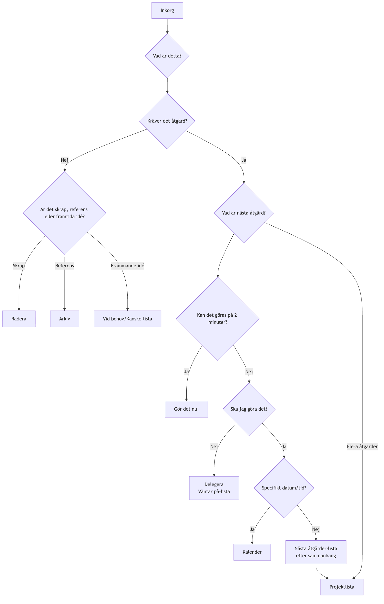

# GTD (Getting Things Done)

Hjärnan är från början en utmärkt "CPU" för att **generera idéer**, men en mycket dålig "hårdvara" för att **lagra information**. När vi försöker använda vår hjärna för att komma ihåg alla våra att-göra-uppgifter, möten, idéer och åtaganden blir den upptagen av dessa "ouppklarade ärenden", vilket leder till stress, ångest och mental oreda, och gör det omöjligt att fokusera på den aktuella uppgiften. **GTD (Getting Things Done)**, skapad av produktivitetsgurun David Allen, är ett globalt erkänt **personligt produktivitetssystem och arbetsmetodik**.

Kärnfilosofin i GTD är att uppnå ett tillstånd av **"hjärna som vatten"** – ett stressfritt, höggradigt fokuserat och effektivt arbetsstillstånd – genom att samla in all oavslutad "information" från hjärnan till ett **externt, tillförlitligt system**, och sedan följa en tydlig och noggrann process för att **organisera och bearbeta** den. Det är inte en enkel tidsstyrningsteknik, utan ett komplett operativsystem som är utformat för att befria din hjärna och låta dig lugnt hantera komplexa arbets- och livssituationer.

## De fem kärnsteegen i GTD

1.  **Samla in**: Flytta omedelbart allt som fångar din uppmärksamhet – oavsett om det är en arbetsuppgift, en personlig syssla, en plötslig inspiration eller ett framtida möte – ut ur din hjärna och in i din "**Inkorg**". Inkorgen kan vara fysisk (som en mapp, ett anteckningsblock) eller digital (som en e-postinkorg, en att-göra-app). Nyckeln är att ha så få inkorgar som möjligt och att de är 100 % tillförlitliga och kan tömmas.

2.  **Bearbeta**: Töm regelbundet (minst en gång per dag) din "**inkorg**". Följ strikt **en punkt i taget**-principen, ta upp varje "information" i inkorgen en i taget, och ställ dig en kärnfråga: "**Vad är detta? Kräver det någon åtgärd?**"
    *   Om **ingen åtgärd krävs**: Det är antingen **skräp** (radera direkt), **information som kan behövas i framtiden** (lägg i en referensfil), eller ett **idé som är under utveckling** (lägg i en "Vid behov/Kanske"-lista).
    *   Om **åtgärd krävs**: Gå vidare till nästa organisatoriska steg.

3.  **Organisera**: För objekt som kräver åtgärd, lägg dem i olika "hinkar" beroende på deras karaktär.
    *   **"Två-minuters-regeln"**: Om åtgärden kan slutföras **inom två minuter**, **utför den omedelbart**, utan ytterligare organisering.
    *   **Delegera till andra**: Om uppgiften bör utföras av någon annan, **delegera** den omedelbart och lägg den i en "**Väntar på**"-lista för att följa upp.
    *   **Kalender**: För åtgärder med ett **specifikt datum eller tid** (t.ex. möten, avtalade samtal), lägg dem i din **kalender**.
    *   **Nästa åtgärder-lista**: För åtgärder som kräver din personliga uppmärksamhet, mer än ett steg, och saknar ett specifikt datum, dela upp dem i den **första, konkreta, synliga fysiska åtgärden**, och lägg dem i olika "Nästa Åtgärder-Listor" beroende på **sammanhang**. Sammanhang kan vara "@dator," "@kontor," "@telefon," "@livsmedel," etc.
    *   **Projektlista**: Alla resultat som kräver **fler än en åtgärd** för att slutföras bör definieras som ett "**projekt**" och läggas i "Projektlistan". Denna lista registrerar endast projektnamnet; de specifika nästa åtgärderna lagras i motsvarande nästa åtgärder-lista.

4.  **Granska**: För att upprätthålla systemets tillförlitlighet måste du göra **regelbundna granskningar**.
    *   **Daglig granskning**: Bläddra snabbt igenom din kalender och nästa åtgärder-lista varje dag för att planera dagsverket.
    *   **Veckovis granskning**: Detta är en **avgörande del av GTD**. En gång i veckan (vanligtvis på helgerna), lägg undan 1–2 timmar för att göra en omfattande och noggrann granskning, uppdatering och rensning av hela systemet, och se till att alla projekt är under kontroll och att alla listor är uppdaterade.

5.  **Utför**: I varje given stund, när du behöver besluta "Vad bör jag göra nu?", kan du göra ett klokt och lugnt val från din åtgärdslista baserat på följande kriterier:
    *   **Sammanhang**: Var är du just nu? Vilka verktyg har du tillgängliga? (t.ex., om du är på kontoret, titta på "@kontor"-listan)
    *   **Tillgänglig tid**: Hur mycket ledig tid har du just nu? (t.ex., om du bara har 10 minuter, välj en uppgift som kan slutföras snabbt)
    *   **Tillgänglig energi**: Vilken är din nuvarande energinivå? (t.ex., om du är energisk, ta dig an en uppgift som kräver hög koncentration)
    *   **Prioritet**: Under de ovanstående förutsättningarna, vilken uppgift är viktigast?

### GTD arbetsflödesdiagram

<!-- mermaid 源文件：GTD-Tutorial-sv-mermaid-live-1.mmd -->

## Användningsfall

**Fall 1: En upptagen avdelningschef**

*   **Samla in**: Hans inkorg kan inkludera: e-postinkorg, WeChat-meddelanden, anteckningar från möten, och plötsliga idéer som dyker upp i huvudet.
*   **Bearbeta och organisera**:
    *   Ett e-brev "angående meddelande om nästa kvartals budget" -> Ingen åtgärd krävs -> **Arkivera** till "Företagsfinans"-referensmapp.
    *   En idé "påminna underordnad Xiao Zhang om att lämna in veckorapport" -> Kan göras på 2 minuter -> **Omedelbart** skicka ett meddelande till Xiao Zhang.
    *   En uppgift "förbereda årets teambuilding" -> Kräver flera steg -> Lägg till "Teambuilding" i "**Projektlistan**"; lägg den första åtgärden "Kommunicera med HR för att få en lista på eventuella lokaler" i "**@Kontor**"-nästa åtgärder-lista.
    *   Ett möte "möte med kund nästa onsdag kl. 15" -> **Lägg i kalendern**.
*   **Utför**: När han är på kontoret, har en timmes ledig tid och känner sig energisk kan han öppna "@Kontor"-listan och välja att arbeta med "Kommunicera med HR."

**Fall 2: En frilansares projektstyrning**

*   **Projektlista**: Kan inkludera "Kund A:s webbplatsdesignprojekt", "Omförmning av personlig blogg", "Lär mig ett nytt programmeringsspråk", etc.
*   **Nästa åtgärder-lista**:
    *   **@Telefon**: Ring Kund A för att bekräfta feedback på designförslag.
    *   **@Dator-Design**: Justera webbplatsens startsida baserat på feedback.
    *   **@Dator-Skrivande**: Skriv en bloggpost om "responsiv design."
    *   **@Läs/Lär**: Titta på kapitel 3 i programmeringskursen.
*   **Veckovis granskning**: På fredagseftermiddagen kontrollerar han framsteg i alla projekt, säkerställer att varje projekt har minst en "nästa åtgärd", och planerar prioriteterna för nästa vecka.

**Fall 3: En student som hanterar studier och liv**

*   **Inkorg**: Meddelanden från kursens WeChat-grupper, läxor från lärare, idéer om klubbaktiviteter, en inköpslista för vardagsbehov.
*   **Projektlista**: "Färdigställ historieuppsats", "Förbered tentor", "Planera mottagningen för nya studenter."
*   **Nästa åtgärder-lista**:
    *   **@Bibliotek**: Låna tre referensböcker om uppsatsämnet.
    *   **@Hem**: Organisera matematikanteckningarna från lektionerna.
    *   **@Livsmedel**: Köp tandkräm och schampo.
*   **GTD-systemet** hjälper honom att tydligt skilja akademiska uppgifter från vardagsuppgifter och säkerställer att rätt saker görs vid rätt tidpunkt och på rätt plats.

## Fördelar och utmaningar med GTD

**Kärnfördelar**

*   **Minskar mental stress, frigör hjärnkapacitet**: Genom att flytta alla "ouppklarade ärenden" utanför hjärnan minskas minnesbelastningen och den kontinuerliga ångesten som uppstår av "rädsla för att glömma".
*   **Förbättrar kontrollkänsla och lugn**: Ett tillförlitligt system ger dig trygghet att allt är under kontroll, vilket låter dig närma dig aktuella uppgifter med lugn och fokus.
*   **Säkerställer att "viktiga saker" inte glöms bort**: Den avgörande **veckovisa granskningen** säkerställer kontinuerlig uppmärksamhet och framsteg för alla viktiga projekt och långsiktiga mål.
*   **Hög anpassningsbarhet och flexibilitet**: GTD förutsätter inte några prioriteringar, utan erbjuder en ram som låter dig dynamiskt och flexibelt välja den mest lämpliga åtgärden beroende på det aktuella sammanhanget.

**Potentiella utmaningar**

*   **Hög inledande kostnad för att sätta upp systemet**: Första gången du "samlar in" och sätter upp hela listsystemet kan det ta flera timmar eller till och med en hel dag.
*   **Kräver strikt självdisciplin och vanor**: Framgången med GTD beror mycket på om du lyckas utveckla de kärnvanor som krävs för **fortlöpande insamling** och **regelbundna granskningar**. Om systemet inte längre är tillförlitligt eller uppdateras kommer det snabbt att kollapsa.
*   **Verktygsvalsdilemma**: Det finns många GTD-program och verktyg på marknaden, och nybörjare kan lätt hamna i fällan att jaga det "perfekta verktyget" i onödan och samtidigt förbise metoden själv.

## Utökningar och kopplingar

*   **Eisenhowers matris**: Kan användas i GTD:s steg "**Utför**" som en effektiv modell för att bedöma "prioritet".
*   **Pomodoro-tekniken**: Är en utmärkt specifik taktik för att utföra uppgifter från GTD:s "**Nästa åtgärder-lista**" som kräver hög koncentration.

---
*Referens: David Allens globala bästsäljare "Getting Things Done: The Art of Stress-Free Productivity" är den enda och mest auktoritativa källan för att förstå GTD-metodens fullständiga filosofi, process och bästa praxis.*