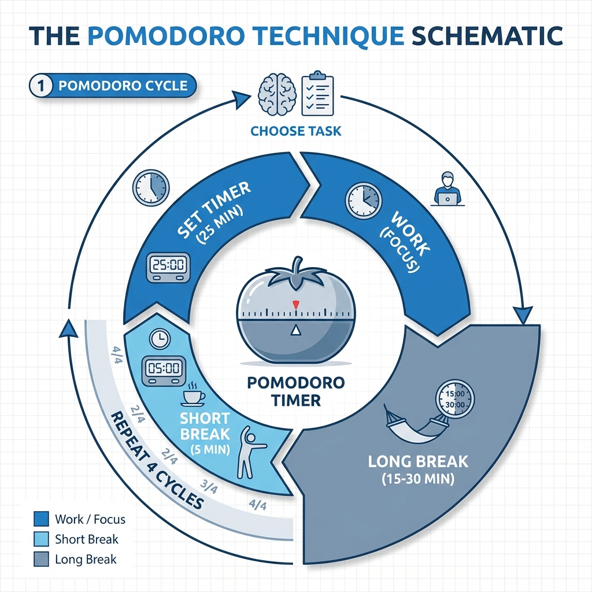

# Pomodoro-tekniken

Vi har alla varit där: att stå inför en skrämmande och komplex uppgift och dröja med att börja; eller medan vi arbetar irrar tankarna iväg och vi lätt störs av varje mobiltelefonens vibration eller en slumpmässig konversation med en kollega. Resultatet blir att vi avslutar dagen trötta men med låg effektivitet. **Pomodoro-tekniken** är en otroligt enkel men mycket effektiv tidsstyrningsmetod som är utformad för att lösa detta vanliga dilemma.

Den kräver inga komplexa verktyg eller djupgående teorier. Kärnan ligger i att använda en timer för att dela upp arbetstiden i flera 25-minutersperioder med hög koncentration, så kallade "Pomodoros", med korta pauser emellan. Denna rytmiska cykel av "fokus-paus" syftar till att hjälpa oss att överkomma procrastinering, motstå störningar och upprätthålla ett hållbart och högt arbetsflöde.

## Den centrala cykeln i Pomodoro-tekniken

"Pomodoro" betyder "tomat" på italienska, ett namn som kommer från den tomatformade kökstimern som metoden uppkallades efter av dess skapare, Francesco Cirillo, under hans studietid. Arbetsflödet är enkelt och elegant och bildar en komplett sluten loop.

Den centrala filosofin i denna cykel är:

*   **Lägre startbarriär**: Jämfört med det stora målet "Jag ska arbeta hela dagen" är åtagandet att "Jag ska fokusera i 25 minuter först" tydligt enklare att komma igång med.
*   **Skyddar koncentrationen**: Under ett "Pomodoro" är koncentration helig och oantastlig. En störning innebär att Pomodorot misslyckas och måste börja om. Detta tvingar oss att lära oss säga "nej" till störningar.
*   **Gör pauser till en nödvändighet**: Till skillnad från mångas vanliga sätt att arbeta rakt igenom betonar Pomodoro-tekniken pausers värde. Korta pauser är ingen tidsförspillning; de är för att ladda om inför nästa koncentrerade period och hålla hjärnan skarp och effektiv.

### Flödesschema för Pomodoro-tekniken

## Att praktisera Pomodoro-tekniken: Steg-för-steg-guide

Att integrera Pomodoro-tekniken i din dagliga rutin kräver bara att du följer dessa enkla steg:

1.  **Planera och välj**
    Innan du börjar din dag eller en arbetsenhet, gå igenom din att-göra-lista. Baserat på prioritet väljer du de uppgifter du kommer att ägna "Pomodoros" åt idag.

2.  **Starta det första Pomodorot**
    Välj den första uppgiften på listan, ställ in din timer (mobilapp, datorprogram eller en riktig kökstimer) på 25 minuter och dyka direkt ner i arbetet.

3.  **De heliga 25 minuterna**
    Under dessa 25 minuter finns det bara en uppgift i världen. Detta är en avsiktlig träning av din koncentration.
    *   **Hur hanterar man inre störningar?** När en orelaterad tanke plötsligt dyker upp (t.ex. "Åh, jag måste komma ihåg att köpa mjölk"), följ inte upp den. Skriv snabbt ner tanken på ett papper bredvid dig och återgå omedelbart till uppgiften.
    *   **Hur hanterar man yttre störningar?** Om en kollega kommer för att prata kan du hövligt säga: "Jag är mitt i en koncentrerad session, kan jag hitta dig om fem minuter?" Om det är ett telefonsamtal kan du lägga på eller sätta telefonen på tyst läge. Nyckeln är att försvara Pomodorots integritet. Om störningen är brådskande och oumbärlig är Pomodorot ogiltigt; efter att ha hanterat det brådskande ärendet måste du starta ett nytt Pomodoro från början.

4.  **Obligatorisk kort paus**
    När timern ringer, oavsett var du befinner dig i uppgiften, måste du omedelbart sluta. Markera det just slutförda Pomodorot på din uppgiftslista (t.ex. med ett "X"). Sedan tar du en 5-minuters kort paus. Denna paus är obligatorisk; du bör stiga upp, sträcka på dig, drick lite vatten eller titta ut genom fönstret. Nyckeln är att låta hjärnan släppa den höga koncentrationsnivå den varit i.

5.  **Cykla och lång paus**
    Efter den korta pausen startar du direkt nästa Pomodoro. Efter varje fyra Pomodoros tar du en längre paus, cirka 15 till 30 minuter. Du kan använda den här tiden till att ta en promenad, svara på icke-brådskande meddelanden eller göra något som är helt avslappnande. Denna långa paus är avgörande för att återställa energin och konsolidera minnet.

## Användningsfall för Pomodoro-tekniken

**Scenario 1: Programutvecklare som arbetar med en komplex funktion**

En utvecklare behöver skriva en komplex datasyncroniseringsmodul för en ny applikation. Uppgiften verkar skrämmande. Han kan använda Pomodoro-tekniken för att dela upp den:

*   **Pomodoro 1-2**: Studera teknisk dokumentation, designa modulens arkitektur. (Efter en 20-minuters lång paus)
*   **Pomodoro 3**: Skriv kärnkoden för datatransfer.
*   **Pomodoro 4**: Skriv koden för datavalidering.
*   På detta sätt omvandlar han en vag, stor uppgift till en serie tydliga, genomförbara koncentrerade sessioner.

**Scenario 2: Student som förbereder sig inför tentor**

En student behöver repetera en hel lärobok i makroekonomi. Att direkt börja kan kännas överväldigande på grund av mängden innehåll.

*   **Pomodoro 1**: Snabbgenomgång av första kapitlet för att förstå dess struktur.
*   **Pomodoro 2**: Läs och förstå första avsnittet i första kapitlet i djupet, och gör anteckningar.
*   **Pomodoro 3**: Lös övningarna för första avsnittet.
*   Denna metod hjälper studenten att upprätthålla kontinuerlig inlärningsmotivation och säkerställer en balans mellan studier och vila, vilket undviker långa perioder av ineffektiv läsning.

**Scenario 3: Designer som slutför en affischdesign**

En designer behöver slutföra en affisch för en händelse på en eftermiddag. Designprocessen är full av osäkerheter.

*   **Pomodoro 1**: Samla inspiration och material.
*   **Pomodoro 2**: Brainstorma och skissa tre olika layoutförslag.
*   **Pomodoro 3**: Välj ett förslag, förfinna och färglägg det.
*   **Pomodoro 4**: Justera detaljer och textlayout.
*   Pauserna mellan Pomodoros hjälper designern att ta ett steg tillbaka från detaljerna och se sitt arbete med nya ögon.

## Fördelar och tillämplighet med Pomodoro-tekniken

**Kärnafördelar**

*   **Överkommer procrastinering**: Minskar den psykologiska börda som finns i att påbörja ett arbete.
*   **Förbättrar koncentrationen**: Tränar avsiktligt förmågan att motstå störningar inom en bestämd tid.
*   **Mäter ansträngning**: Genom att registrera antalet Pomodoros kan du tydligt se din investering i varje uppgift.
*   **Minskar ångest**: Delar upp stora uppgifter i mindre delar, vilket ger en större känsla av kontroll.

**Tillämplighet och begränsningar**

*   **Idealiska scenarier**: Mycket lämplig för självständiga uppgifter som kan tydligt delas upp och kräver hög koncentration, såsom skrivande, programmering, granskning, bearbetning av rapporter m.m.
*   **Utmanande scenarier**: För kreativt arbete som kräver långa perioder av oupphållande tänkande (vilket kan avbryta "flow"), eller roller som kräver frekvent samarbete och ständig återkoppling, kan en strikt 25-minuters cykel inte vara lämplig. I dessa fall kan Pomodorots längd flexibelt justeras (t.ex. 50 minuters fokus, 10 minuters vila).

## Utökningar och kopplingar

Pomodoro-tekniken kan perfekt kombineras med andra metoder för tidsstyrning och effektivitet:

*   **GTD (Getting Things Done)**: GTD hjälper dig att tömma huvudet och organisera din uppgiftslista; Pomodoro-tekniken är en utmärkt taktik för att exekvera specifika uppgifter på den listan.
*   **Eisenhower-matrisen**: När du bestämmer vilka uppgifter du ska slutföra idag kan du använda denna matris för att hjälpa dig att prioritera och bestämma vilka uppgifter som är värda att investera dina värdefulla Pomodoros i.

---
*Referens: Francesco Cirillos officiella bok "The Pomodoro Technique" är den bästa källan för att förstå den fullständiga filosofin och praktiska detaljerna bakom denna metod.*