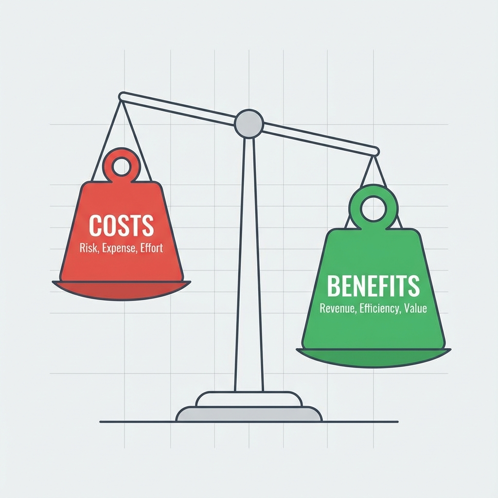

# Kostnads-nyttoanalys

I affärsvärlden och till och med inom offentlig politik, döljer nästan varje beslut en grundläggande avvägning: hur mycket **kostnad** är vi villiga att betala för att få en viss **nütta**? **Kostnads-nyttoanalys (CBA)** är precis en sådan systematisk beslutsfattande ram som förenas av monetära termer. Dess kärnobjektiv är att omfattande identifiera, kvantifiera och jämföra alla kostnader och nytta med ett projekt eller beslut för att avgöra om projektet är "värt att göra" och för att ge en rationell ekonomisk grund för att välja bland flera alternativ.

Logiken i kostnads-nyttoanalys är enkel: om **totala nyttan av ett projekt överstiger dess totala kostnader**, är det ekonomiskt genomförbart och effektivt. Den tvingar beslutsfattare att gå bortom vag kvalitativ beskrivning och omvandla alla relevanta positiva och negativa effekter till jämförbara monetära värden så långt det är möjligt. Från att utvärdera ett nytt infrastrukturprojekt för en regering till att ett företag beslutar om det ska investera i ett nytt IT-system, är kostnads-nyttoanalys ett oumbärligt rationellt verktyg för resursallokering och investeringsbeslut.

## Komponenter av kostnader och nytta

För att genomföra en omfattande kostnads-nyttoanalys krävs identifiering av alla relevanta kostnader och nytta, inklusive både explicita och implicita.

## Hur man genomför en kostnads-nyttoanalys

1.  **Steg ett: Definiera projektet och alternativen**
    Definiera tydligt vilket projekt eller beslut du utvärderar. Om det finns flera alternativ behöver varje alternativ genomgå en separat kostnads-nyttoanalys.

2.  **Steg två: Identifiera alla kostnader och nytta**
    Samarbeta med alla relevanta intressenter för att lista alla möjliga positiva och negativa effekter av projektet. I detta steg bör särskild uppmärksamhet ägnas åt omvärderade kostnader och indirekta nytta som lätt kan förbises.

3.  **Steg tre: Monetärisera kostnader och nytta**
    Detta är det mest utmanande steget i CBA. Du behöver tilldela ett rimligt monetärt värde till varje kostnad och nytta på listan. För direkta kostnader och nytta är detta relativt enkelt. Men för omvärderade kostnader och nytta (t.ex. "förbättrad kundnöjdhet") krävs vissa värderingstekniker, såsom att uppskatta hur mycket kunder är villiga att betala för bättre service genom marknadsundersökningar, eller att beräkna de förluster som minskad kundomsättning kan återta.

4.  **Steg fyra: Tidvärdet och diskontering**
    Eftersom pengar i framtiden är mindre värda än pengar idag, måste framtida kostnader och nytta för projekt som sträcker sig över flera år diskonteras till sitt **nuvärde** med hjälp av en förutbestämd **diskonteringsränta**. Detta säkerställer att alla kostnader och nytta är jämförbara över tiden.

5.  **Steg fem: Beräkna nyckelmått och jämför**
    Summera nuvärdena för alla kostnader och nytta och beräkna ett eller flera av följande nyckelmått:
    *   **Nuvärde (NPV)**: **Nuvärdet av totala nytta - Nuvärdet av totala kostnader**. Om NPV > 0 är projektet ekonomiskt genomförbart. Bland flera alternativ väljs ofta det med högst NPV.
    *   **Nyttokostnadsförhållande (BCR)**: **Nuvärdet av totala nytta / Nuvärdet av totala kostnader**. Om BCR > 1 är projektet genomförbart. Detta förhållande är användbart vid jämförelse av projekt med olika storlekar.
    *   **Avkastning på investering (ROI)**: **(Totala nytta - Totala kostnader) / Totala kostnader × 100%**. Visar investeringens lönsamhet tydligt.
    *   **Återbetalningstid**: Den tid som krävs för att de ackumulerade projektnyttorna ska motsvara den ursprungliga investeringen.

6.  **Steg sex: Känslighetsanalys och rekommendationer**
    Eftersom många uppskattningar (särskilt för omvärderade objekt och val av diskonteringsränta) innebär osäkerhet krävs **känslighetsanalys**. Detta innebär att ändra vissa nyckelantaganden (t.ex., "Vad om försäljningsökningen är 20 % lägre än förväntat?") och observera deras påverkan på slutresultatet (t.ex., NPV). Slutligen, baserat på alla analyser, ge tydliga, datastödda rekommendationer till beslutsfattare.

## Användningsfall

**Fall 1: Företag som överväger att uppgradera sitt ERP-system**

*   **Kostnader**:
    *   Direkta kostnader: Programvarulicensavgifter, hårdvaruuppgraderingskostnader, externa rådgivnings- och implementeringsavgifter, medarbetarutbildningskostnader.
    *   Omvärderade kostnader: Tillfällig produktivitetsminskning under systemmigreringen, motstånd från medarbetare mot det nya systemet.
*   **Nytta**:
    *   Direkt nytta: Besparingar i arbetskostnader genom processautomatisering, minskad kapitalbindning i lager genom optimering.
    *   Indirekt nytta: Förbättrad datakorrekthet, ökad beslutsfattareffektivitet.
    *   Omvärderad nytta: Snabbare hantering av kundorder, förbättrad kundnöjdhet.
*   **Analys**: Genom att monetärisera och diskontera ovanstående poster över de kommande 5 åren beräknas projektets NPV. Om NPV är positiv är investeringen värd att göra.

**Fall 2: Stat som utvärderar att bygga en ny motorväg**

*   **Kostnader**:
    *   Direkta kostnader: Markanskaffningsavgifter, byggnadskostnader, underhållskostnader under årtionden.
    *   Omvärderade kostnader: Skador på den naturliga miljön längs vägsträckningen, sociala problem orsakade av omflyttningar, buller och trafikstockningar under byggnationen.
*   **Nytta**:
    *   Direkt nytta: Intäkter från vägtull.
    *   Indirekt nytta: Tids- och kostnadsbesparingar i transport för invånare och företag längs vägsträckningen, stimulerad regional ekonomisk utveckling och jobbökning.
    *   Omvärderad nytta: Värdet av liv som räddas på grund av minskade trafikolyckor.
*   **Analys**: CBA för offentliga projekt är särskilt komplex eftersom det kräver professionella uppskattningar av "livets värde", "miljövärde" etc., inom offentlig politik. Det slutliga nyttokostnadsförhållandet (BCR) är en nyckelgrund för att besluta om projektet ska påbörjas.

**Fall 3: Individ som överväger att läsa ett heltids-MBA**

*   **Kostnader**:
    *   Direkta kostnader: Hög avgift för utbildning, böcker, levnadskostnader.
    *   Alternativkostnader: All lön som går förlorad under MBA-studietiden (ofta två år), vilket ofta är den största kostnaden.
*   **Nytta**:
    *   Direkt nytta: Betydande ökning av förväntad lön efter examen.
    *   Omvärderad nytta: Förvärvad kunskap och färdigheter, starkt alumni-nätverk, förbättrad personlig varumärkesbild.
*   **Analys**: Kandidaten kan uppskatta sin totala karriärkassaflöde (med MBA vs utan MBA) och beräkna dess nuvärde för att avgöra om denna "självinvestering" är värd att göra.

## Fördelar och utmaningar med kostnads-nyttoanalys

**Kärnafördelar**

*   **Rationell och datadriven**: Ger en tydlig, rationell ekonomisk jämförelseram för beslutsfattande, vilket minskar subjektiv bias.
*   **Omfattande**: Tvingar beslutsfattare att överväga alla positiva och negativa effekter av ett projekt, inte bara de mest uppenbara.
*   **Resursoptimering**: Hjälper till att allokera begränsade resurser till projekt som genererar störst nettovinster.

**Potentiella utmaningar**

*   **Svårigheter att monetärisera**: Den största utmaningen ligger i att tilldela ett rättvist och trovärdigt monetärt värde till omvärderade, icke-marknadsbaserade objekt (t.ex. "varumärkesreputation", "miljöskydd", "livets värde"). Denna process är ofta kontroversiell.
*   **Exakthet i prognoser**: Analysresultaten är starkt beroende av prognoser för framtida kostnader och nytta, och dessa prognoser i sig är fyllda med osäkerhet.
*   **Bortser från rättvisefrågor**: CBA fokuserar främst på övergripande ekonomisk effektivitet och kan ibland bortse från om fördelningen av kostnader och nytta mellan olika grupper är rättvis.

## Utökningar och kopplingar

*   **Beslutsmatris**: När beslutskriterier inte kan fullt ut monetäriseras erbjuder en beslutsmatris ett mer flexibelt alternativ.
*   **Kostnadseffektivitetsanalys (CEA)**: När projektens nytta är svår att monetärisera (t.ex. inom hälso- och sjukvård), men deras effektivitet kan mätas med en enhetlig icke-monetär enhet (t.ex. "antal framgångsrikt botade patienter", "livsår vunna"), kan CEA användas. Den beräknar "hur mycket det kostar att uppnå en enhet effekt".

---
*Referens: Begreppet kostnads-nyttoanalys kan spåras tillbaka till den franske ingenjören Jules Dupuit på 1800-talet och hans utvärdering av offentliga byggeprojekt. Under 1900-talet användes den allmänt inom offentlig politik i länder som Storbritannien och USA, och blev ett centralt verktyg inom projektledning och företagsinvesteringar.*