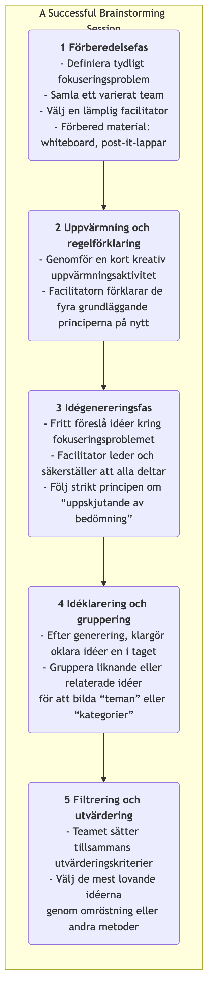

# Brainstorming

När man strävar efter innovation och löser komplexa problem är vår största fiende ofta de djupt rotade, begränsande mentalmodellerna i våra egna hjärnor. **Brainstorming** är en klassisk, kraftfull och mycket populär **gruppteknik för idégenerering** som är utformad för att bryta dessa mentala kedjor. Den föreslogs av reklamexekutiven Alex F. Osborn på 1940-talet, och dess kärnemål är att uppmuntra deltagare att generera så många nya, varierade och till och med till synes orimliga idéer som möjligt inom en kort tidsperiod, genom att skapa en helt öppen, fri och icke-dömande diskussionsatmosfär.

Essensen i brainstorming ligger i **"kvantitet först, kvalitet sedan."** Den tror fast på att idéernas kvalitet kan främjas genom ackumulering av kvantitet. Genom att skjuta på bedömning och uppmuntra galna idéer kan brainstorming effektivt växla ett teams kreativitet från en "kritisk modus" till en "generativ modus", vilket gör det möjligt att utforska olika okända möjligheter i en trygg miljö och samtidigt tillhandahålla rika, varierade råvaror för efterföljande filtrering och fördjupning.

## Fyra grundläggande principer för brainstorming

För att säkerställa att brainstorming uppnår sina avsedda resultat måste följande fyra grundläggande principer som föreslogs av Osborn följas strikt. De är grunden för att skapa en trygg och fri miljö.

1.  **Uppskjutande av bedömning**: Detta är den mest centrala och oupphörliga principen. Under brainstorming är **absolut ingen** kritik, frågande eller bedömning tillåten för någon idé som föreslås, oavsett hur absurt eller orimligt den kan låta. Bedömning kommer att genomföras i efterföljande filtreringssteg.

2.  **Uppmuntra galna idéer**: Uppmana deltagare att tänka utanför boxen. Idéer som verkar tokiga eller logiska kan ofta bryta mentala stelbentligheter och inspirera andra att generera fler banbrytande idéer.

3.  **Sträva efter kvantitet**: Sätt ett tydligt och utmanande kvantitativt mål (t.ex. "Generera 100 idéer på 20 minuter"). Ju fler idéer, desto större är sannolikheten att högkvalitativa idéer dyker upp.

4.  **Bygg vidare på andras idéer**: Detta kallas också för "piggybacking" eller "snowballing". Uppmana deltagare att lyssna noga på andras idéer och fundera på hur de kan kombineras, förbättras eller utsträckas, för att generera nya, mer förfinade idéer. Detta speglar den synergistiska effekten av "1+1>2."

### Brainstorming-processen

<!-- mermaid 源文件：Brainstorming-Tutorial-sv-mermaid-live-1.mmd -->

## Hur man organiserar en effektiv brainstorming-session

1.  **Omsorgsfull förberedelse**
    *   **Definiera ett tydligt fokuseringsproblem**: Problemet bör inte vara för brett eller för smalt. Exempelvis kan den alltför breda frågan "Hur ökar vi företagsvinsten?" förfinas till "Hur kan vi öka återkommande köp av existerande kunder med 20%?"
    *   **Samla ett varierat team**: Bjud in 5-10 personer med olika bakgrunder och funktioner att delta. Olika perspektiv kan leda till rikare idéer.
    *   **Välj en utmärkt facilitator**: Facilitatorn bidrar inte direkt med idéer; rollen är att leda processen, hantera tiden, uppmuntra deltagande och bestämt stoppa all dömande beteende.

2.  **Skapa rätt atmosfär**
    *   Välj en avslappnad, bekväm miljö och förbered verktyg som whiteboards, post-it-lappar och whiteboardpennor.
    *   Innan den officiella starten kan man använda korta kreativa uppvärmningsövningar (t.ex. "100 användningsområden för en gem") för att hjälpa deltagarna att slappna av och gå in i ett kreativt tänkandetillstånd.

3.  **Generera och dokumentera idéer**
    *   Facilitatorn meddelar starten och sätter en tydlig tidsgräns (vanligtvis 15-30 minuter).
    *   Uppmana deltagare att högt uttrycka alla idéer som dyker upp, eller skriva ner dem på post-it-lappar och klistra upp dem på väggen. Facilitatorn eller en utnämnd dokumentator behöver snabbt dokumentera alla idéer utan någon modifiering eller borttagning.

4.  **Konvergera och utvärdera**
    *   Efter genereringsfasen går man över till konvergeringsfasen. Först leder facilitatorn gruppen till en snabb genomgång av alla idéer och klargör eventuella oklarheter.
    *   Kategorisera och slå ihop liknande idéer till ett fåtal kärnteman.
    *   Slutligen sätter teamet tillsammans ett antal utvärderingskriterier (t.ex. "genomförbarhet", "nyhetsvärde", "användarvärde") och genom omröstning (t.ex. att varje person får några små pricklappar) väljs 2-3 mest erkända och lovande idéer ut för vidare fördjupning.

## Användningsfall

**Fall 1: Namnge en ny app**

*   **Fokuseringsproblem**: "Kom på ett fängslande, lätt att komma ihåg namn för vår sociala app som fokuserar på 'matdelning.'"
*   **Användning**: Marknadsteamet höll en 30 minuter lång brainstorming-session. De genererade över 80 kandidatnamn, bland annat "Foodie Notes," "Taste Buddies," och "Snap & Eat." I efterföljande filtrering valde de till slut ett namn som speglade både produktens egenskaper och sociala attribut.

**Fall 2: Lösning av kundklagomål**

*   **Fokuseringsproblem**: "Hur kan vi minska kundklagomål om 'långsam logistikleverans' med 50%?"
*   **Användning**: Ett tvärfunktionellt team bestående av kundtjänst, drift och logistikpersonal brainstormade tillsammans. Idéer som genererades inkluderade: "Samarbeta med snabbare fraktfirmor," "Upprätta förläggervaruhus," "Optimera förpackningsprocesser," och "Erbjud rabattkuponger vid försenade ordrar." Dessa idéer gav en rik startpunkt för att utarbeta konkreta lösningar.

**Fall 3: Designa en marknadsföringskampanj**

*   **Fokuseringsproblem**: "Hur kan vi planera en kreativ online-marknadsföringskampanj för vårt juicevarumärke till den kommande sommaren?"
*   **Användning**: Teammedlemmarna lät fantasin flöda fritt och föreslog olika idéer såsom: "Arrangera en 'Sommarspecial'-UGC-tävling," "Samarbeta med populära ö-resenärsbloggare för livesändningar," "Lansera förpackning som kan frysas till popsicles," och "Starta en sociala medier-utmaning om sommarsmakens smak." Dessa idéer, efter kombinering och förfining, blev till slut en komplett marknadsföringsplan.

## Fördelar och utmaningar med brainstorming

**Kärnafördelar**

*   **Effektiv idégenerering**: Kan snabbt generera ett stort antal varierade idéer på kort tid.
*   **Främjar teamarbete och sammanhållning**: Skapar en jämlik, trygg miljö som hjälper till att förbättra teamets sammanhållning och kollektiv kreativitet.
*   **Bryter mentala stelbentligheter**: Genom att uppmuntra galna idéer och uppskjuta bedömning hjälper det effektivt teamet att bryta sig loss från konventionellt tänkande.

**Potentiella utmaningar**

*   **Risk för "grupptänkande"**: Om inte korrekt handled, kan ett fåtal individers åsikter dominera diskussionen, eller så kan människor tendera att föreslå "säkrare" idéer.
*   **"Frittågare"-fenomen**: I ett team kan vissa individer vara mindre aktiva och helt enkelt "åka gratis", och bidra med färre idéer.
*   **Svårigheter i praktiken**: Att strikt följa principen om "uppskjutande av bedömning" kräver hög kompetens hos facilitatorn och en mognad i teamkulturen.
*   **Brister i uppföljning**: Brainstorming i sig ansvarar endast för att generera idéer. Utan efterföljande, systematiska filtrerings-, utvärderings- och exekveringsmekanismer förblir till och med de bästa idéerna som slott i luften.

## Utvidgningar och kopplingar

*   **Omvänd brainstorming**: En intressant variation. Istället för att fråga "Hur kan vi lyckas?" frågar man "Hur kan vi totalt förstöra detta?" Genom att identifiera alla faktorer som kan leda till misslyckande kan teamet sedan tänka baklänges för att utarbeta förebyggande åtgärder.
*   **Brainwriting**: För att förhindra att elokventa talare dominera diskussionen kan man använda skriftliga former. Till exempel 6-3-5-metoden, där 6 deltagare var och en skriver 3 idéer på 5 minuter, och sedan skickar pappret vidare till nästa person för inspiration och utvidgning.
*   **Sex tänkandehattar**: Kan fungera som ett strukturerat verktyg för den efterföljande "utvärderingsfasen" i brainstorming, och leda teamet att omfattande granska filtrerade idéer från olika vinklar.
*   **Mindmapping**: Ett utmärkt visuellt verktyg för att organisera och strukturera brainstormingsresultat.

---
*Referens: Alex F. Osborn beskrev första gången systematiskt principerna och metoderna för brainstorming i sin bok "Applied Imagination" från 1953. Den är fortfarande en av de mest använda idégenereringsteknikerna globalt idag.*