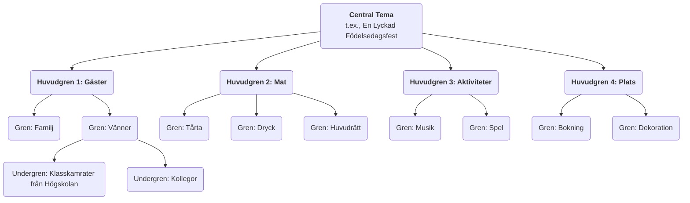

# Tankekartläggning

När våra hjärnor tänker är de inte linjära och raka; istället är de fyllda av hopp, associationer och divergenser. **Tankekartläggning** är precis ett sådant kraftfullt **visuellt tänkverktyg** som djupt ansluter till hjärnans naturliga sätt att fungera. Uppfunnet av den brittiske forskaren Tony Buzan på 1970-talet, består kärnan i att koppla samman nyckelord, idéer, bilder och färger kring ett **centralt tema** i en **radial, progressivt lagerstruktur**, vilket organiserar ett komplext ämne eller en utspridd samling information till en tydlig, ordnad, lätt att komma ihåg och förstå "hjärnakarta".

Fascinationen i tankekartläggning ligger i dess **icke-linjära** karaktär. Den uppmuntrar oss att fritt associatera, fånga flyktiga inspirationer och organisera dem på ett organiskt och sammanlänkat sätt. Det är inte bara ett verktyg för att registrera information utan också en kraftfull tankepartner som stimulerar kreativitet, klargör logik och förbättrar minnet. Från planering och anteckningar vid läsning till att förbereda presentationer och brainstorming, kan tankekartläggning avsevärt förbättra vårt tänkandeffektivitet och djup.

## Kärnkomponenter i en tankekartläggning

En standardiserad tankekartläggning följer några enkla men avgörande ritningsregler.

1.  **Central bild/tema**: I mitten av arbetsytan, använd en slående bild eller nyckelord för att representera ditt kärntema. Detta är utgångspunkten för allt tänkande.
2.  **Huvudgrenar**: Tjocka, böjda linjer som strålar ut direkt från centraltemat, representerar de viktigaste första nivåernas grenar eller kategorier av temat. Varje huvudgren bör ha ett nyckelord.
3.  **Undergrenar**: Tunnare linjer som sträcker sig från huvudgrenarna, representerar ytterligare bearbetning och utveckling av innehållet i huvudgrenen. Grenar kan förgrenas oändligt, och bildar en hierarkisk trädstruktur.
4.  **Nyckelord**: På varje gren, använd endast ett kortfattat nyckelord eller en kort fras som sammanfattar den centrala idén, snarare än fullständiga meningar. Detta hjälper till att stimulera fler associationer.
5.  **Färger**: Använd olika färger för olika huvudgrenar och deras undergrenar. Färger kan hjälpa oss att kategorisera och organisera, och starkt stimulera det visuella minnet.
6.  **Bilder**: Använd så mycket som möjligt små ikoner, symboler och enkla teckningar på olika delar av kartan. Som man säger, "en bild säger mer än tusen ord"; bilder kan avsevärt förbättra kartans intressevärde och minnesvärde.

### Exempel på tankekartläggningsstruktur

<!--

-->

## Hur man ritar en tankekartläggning

1.  **Steg ett: Börja från centrum**
    Ta ett tomt papper och placera det horisontellt. I mitten ritar du en bild som representerar ditt kärntema, eller skriver ner nyckelordet.

2.  **Steg två: Rita huvudgrenar**
    Rita flera tjocka, böjda linjer som strålar ut från centraltemat som huvudgrenar. Varje huvudgren representerar en kärnkategori. Skriv motsvarande nyckelord ovanför linjen.

3.  **Steg tre: Lägg till grenar och nyckelord**
    Fortsätt att rita tunnare grenar från varje huvudgren, och skriv mer specifika nyckelord ovanför linjerna. Behåll linjelängd och textens storlek konsekvent. Denna process liknar ett stort träd som får nya kvistar.

4.  **Steg fyra: Använd färger och bilder**
    Tilldela olika färger till olika huvudgrensystem. Rita enkla små ikoner eller symboler där du tycker det passar för att göra din karta "levande".

5.  **Steg fem: Fri association, kontinuerlig expansion**
    Begränsas inte av ordning; låt tankarna fritt hoppa mellan olika grenar. När du får en ny idé, hitta omedelbart den kategori den tillhör och lägg till en ny gren. Hela processen bör vara avslappnad och njutbar.

## Användningsfall

**Fall 1: Anteckningar vid läsning**

*   **Scenario**: Efter att ha läst en bok om "effektiva vanor", vill du organisera och komma ihåg kärninnehållet.
*   **Användning**:
    *   **Centraltema**: Boktiteln "Effektiva Vanor".
    *   **Huvudgrenar**: Kan vara kapitelrubrikerna i boken, såsom "Makten i vanor", "Vanecykeln", "Hur man bygger goda vanor", "Hur man bryter dåliga vanor".
    *   **Undergrenar**: Under varje huvudgren, använd nyckelord för att registrera kärnargument, nyckelövningar och specifika metoder i kapitlet. Till exempel, under huvudgrenen "Vanecykeln", kan du förgrena till "Signal", "Rutin" och "Belöning".
    *   På detta sätt är den logiska strukturen och kärninformationen i hela boken komprimerad till en tydlig diagram, vilket är mycket praktiskt för repetition och memorering.

**Fall 2: Förbereda en presentation eller rapport**

*   **Scenario**: Du behöver hålla en 20 minuters rapport inför ledningen om "Företagets års marknadsplan".
*   **Användning**:
    *   **Centraltema**: "Års marknadsplan".
    *   **Huvudgrenar**: "Marknadsanalys", "Målgrupp", "Kärnstrategier", "Budgetallokering", "Förväntade KPI:er".
    *   **Undergrenar**: Under varje huvudgren, fördjupa dig i punkterna som ska förklaras. Till exempel, under "Kärnstrategier", kan du förgrena till "Innehållsmarknadsföring", "Sociala medier", "Offlineaktiviteter", etc.
    *   Denna tankekartläggning bildar hela dispositionen för din presentation. Under presentationen kan du titta på kartan för att säkerställa att din logik är tydlig och att inga viktiga punkter glöms bort.

**Fall 3: Organisera en team-brainstorming session**

*   **Scenario**: Ett team behöver generera kreativa idéer för "Hur man förbättrar produktens användarupplevelse".
*   **Användning**:
    *   **Centraltema**: "Förbättra användarupplevelse".
    *   **Huvudgrenar**: Kan förinställas som aspekter av användarupplevelse, såsom "Prestanda", "Användarvänlighet", "Visuell design", "Kundsupport".
    *   **Process**: Teammedlemmar föreslår fritt idéer kring dessa huvudgrenar, och facilitatorn lägger till dessa idéer i motsvarande grenar i tankekartläggningen i realtid som nyckelord. Den visuella och sammanlänkade naturen hos tankekartläggningen kan starkt stimulera teammedlemmar att "rida på varandras idéer", vilket genererar fler associationer och kreativitet.

## Fördelar och utmaningar med tankekartläggning

**Kärnfördelar**

*   **Ansluter till hjärnans tänkande**: Den radiala strukturen efterliknar kopplingarna mellan hjärnans nervceller, vilket gör tänkande och associationer mer naturliga och flytande.
*   **Stimulerar kreativitet**: Den icke-linjära karaktären uppmuntrar fritt associationer, vilket hjälper till att bryta gränserna för linjärt tänkande och generera fler idéer.
*   **Förbättrar minnet**: Genom att kombinera nyckelord, färger, bilder och andra element, aktiveras både vänster och höger hjärnhalva, vilket starkt förbättrar minneseffekterna.
*   **Överskådlig på en glimt**: Kan presentera stora mängder komplex information i en mycket komprimerad och tydligt strukturerad form, vilket gör det lätt att snabbt förstå helheten.

**Potentiella utmaningar**

*   **Hög grad av personlig tolkning**: Tankekartor ritade av individer kan ha stark subjektivitet i logiken och val av nyckelord, och andra kan behöva någon förklaring för att fullt ut förstå dem från början.
*   **Inte lämplig för att presentera slutgiltiga, formella dokument**: Det är ett utmärkt verktyg för tänkande och konceptualisering, men dess handritade, icke-linjära stil är generellt inte lämplig för slutgiltiga, formella affärsrapporter eller akademiska artiklar som kräver strikt formatering.
*   **Verktygsbegränsningar**: Även om det finns många tankekartläggningsprogram, anses handritning generellt vara det mest kreativitetsstimulerande sättet. Dock är handritade kartor mindre praktiska att ändra och dela jämfört med elektroniska versioner.

## Utvidgningar och kopplingar

*   **Brainstorming**: Tankekartläggning är ett idealiskt verktyg för att genomföra och organisera brainstorming-resultat. De utspridda idéerna som genereras under brainstorming kan kategoriseras och struktureras i realtid med hjälp av en tankekartläggning.
*   **Konceptkarta**: Liknar en tankekartläggning, men fokuserar mer på att exakt uttrycka de **specifika relationerna** mellan olika begrepp (t.ex. använda text på förbindelselinjer för att förklara "A orsakar B" eller "B är en del av C"). Den är logiskt mer rigorös, medan tankekartor fokuserar mer på fri association och brainstorming.

---
*Referens: Tony Buzan är känd som "tankekartläggningsfadern". Hans bok "The Mind Map Book" är den auktoritativa bibeln för denna metod, och beskriver i detalj dess principer, regler och breda användningsområden inom olika fält.*