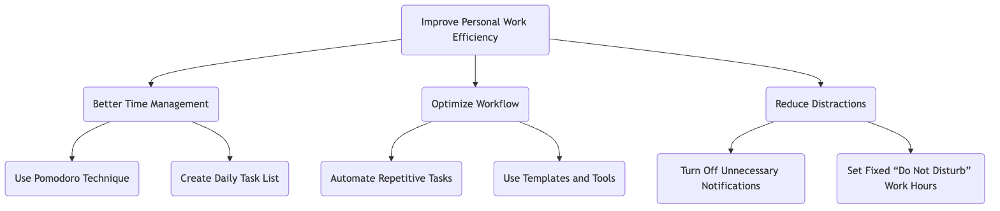

# Logikanalys med trädstruktur - En introduktion

## 1. Vad är ett logikträd?

**Logikträd** är ett kraftfullt, visuellt analysverktyg som används för att systematiskt bryta ner ett komplext problem eller en fråga till mindre, mer hanterbara delar. Dess grundläggande princip är **MECE (ömsesidigt uteslutande, gemensamt uttömmande)**, vilket innebär att de nedbrutna delarna inte får överlappa och inga viktiga aspekter får utelämnas.

Ett logikträd hjälper oss att bygga en tydlig struktur för tänkande och säkerställer att analysen är noggrann och omfattande.

## 2. Huvudtyper av logikträd

Logikträd delas huvudsakligen in i två typer, som används för att lösa problem av olika slag:

### a. Problemträd (diagnostiskt träd)

-   **Syfte**: Används för att diagnostisera och utforska **varför** ett problem uppstår.

-   **Struktur**: Utgår från ett centralt problem (roten) och bryts kontinuerligt ner för att identifiera potentiella orsaker till problemet. Varje lager av grenar är en djupare förklaring till problemet i föregående lager.

-   **Användningsfall**: Rotorsaksanalys, diagnostisering av prestandafall, felsökning etc.

### b. "Hur"-träd (lösningsträd)

-   **Syfte**: Används för att konceptualisera och planera **hur** man kan uppnå ett mål eller lösa ett problem.
-   **Struktur**: Utgår från ett övergripande mål (roten) och bryts ner till specifika, genomförbara strategier eller handlingsplaner.
-   **Användningsfall**: Strategisk planering, målformulering, projektplanering, sökande efter lösningar etc.

## 3. Hur bygger man ett logikträd?

### Steg ett: Definiera tydligt kärnproblemet eller målet

-   **Problemträd**: Formulera tydligt vilket "problem" som ska analyseras. Till exempel: "Varför ökar vår webbplats användaravgång?"
-   **"Hur"-träd**: Definiera tydligt vilket "mål" som ska uppnås. Till exempel: "Hur kan vi öka webbplatsens månatliga aktiva användare med 20%?"
-   Använd detta problem eller mål som utgångspunkt (roten) i logikträdet.

### Steg två: Utför den första nivån av uppdelning (tillämpa MECE-principen)

-   **Brainstorming**: Runt kärnproblemet/målet, fundera på vilka huvudkomponenter det kan delas upp i.
-   **Tillämpa MECE-principen**: Säkerställ att grenarna på den första nivån är ömsesidigt uteslutande (ingen överlappning) och gemensamt uttömmande (inga viktiga aspekter utelämnas).
    -   **Exempel (Problemträd)**: Ökad användaravgång kan delas upp i: "Avgång bland nya användare" och "Avgång bland befintliga användare."
    -   **Exempel ("Hur"-träd)**: Ökad månatlig användaraktivitet kan delas upp i: "Få nya användare," "Öka aktiviteten hos befintliga användare," och "Återvinna avgångna användare."

### Steg tre: Bryt ner lager för lager

-   **Ställ kontinuerligt frågor**: För varje gren, fortsätt att ställa frågan "Varför sker detta?" (Problemträd) eller "Hur kan detta göras exakt?" ("Hur"-träd), för att gå djupare i uppdelningen.
-   **Behåll tydlig struktur**: Fortsätt att tillämpa MECE-principen på varje nivå tills problemet är uppdelat till en tillräckligt specifik nivå som kan verifieras med data eller direkt åtgärdas.

### Steg fyra: Validera hypoteser och prioritera

-   **Validering med data**: För problemträd, samla in data för att bekräfta vilka grenar som är de verkliga orsakerna.
-   **Utvärdera lösningar**: För "Hur"-träd, utvärdera genomförbarheten, kostnaden och den förväntade effekten för varje handlingsplan.
-   **Identifiera den kritiska vägen**: Identifiera de viktigaste orsakerna eller åtgärderna som har störst påverkan på att lösa problemet eller uppnå målet, och prioritera dessa.

## 4. Praktiska exempel

### Exempel 1: Problemträd - Analys av "Varför sjunker restaurangens vinst?"

<!-- mermaid 源文件：Logic-Tree-Tutorial-sv-mermaid-src-1.mmd -->

**Analys**: Genom detta träddiagram kan chefer tydligt se de huvudsakliga drivkrafterna bakom vinstsjunkningen och kan samla in data för varje gren (t.ex. "Färre kunder") för vidare analys.

### Exempel 2: "Hur"-träd - Planering av "Hur kan man förbättra sin personliga arbetsproduktivitet?"

<!-- mermaid 源文件：Logic-Tree-Tutorial-sv-mermaid-live-1.mmd -->

**Analys**: Detta träddiagram bryter ner ett abstrakt mål till en serie konkreta, genomförbara steg, vilket hjälper individen att skapa tydliga förbättningsplaner.

Logikträd är en av de kärnkompetenser som är avgörande för konsulter, produktchefer och strateger, eftersom de starkt förbättrar tänkandets djup och bredd.