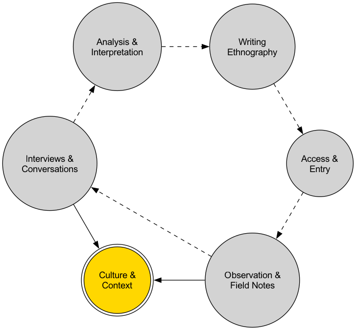

# Etnografi

För att verkligen förstå en kultur räcker det långt ifrån att enbart lita på enkäter eller intervjuer; du måste personligen "hoppa ner i den floden och simma". **Etnografi** är precis en sådan djupgående kvalitativ forskningsmetod som kräver att forskare fördjupar sig och visar empati. Den har sitt ursprung i kulturanropologin och dess kärna ligger i att få en **helhetsförståelse** av en viss gemenskaps kultur, social struktur och beteendemönster genom att utföra **deltagande observation** i deras dagliga liv under en relativt lång tid.

Etnografiska forskare strävar efter en "tjock beskrivning" (thick description), där de inte bara dokumenterar vad människor "gör", utan också försöker avslöja vad dessa beteenden "betyder" inom specifika kulturella sammanhang. Det handlar inte om att "studera" en grupp människor utifrån, utan snarare att försöka förstå deras världsbild utifrån. När du vill utforska en underkulturs interna regler, en organisations dolda kultur eller en gemenskaps verkliga liv, erbjuder etnografi en oöverträffad nivå av djup och autenticitet.

## Kärnkoncept och egenskaper hos etnografi

*   **Fördjupning och delaktighet**: Forskare är inte längre avlägsna observatörer utan agerar "lärande" eller "lärlingar", lever och arbetar i verkliga, naturliga miljöer under lång tid och deltar i gemenskapens dagliga aktiviteter.

*   **Helhetsperspektiv**: Etnografi försöker se kultur som en komplex och sammanlänkad helhet. Den fokuserar på hur språk, sedvänjor, övertygelser, interpersonella relationer, den materiella miljön och alla andra aspekter samverkar för att forma människors liv.

*   **Emiskt perspektiv**: Forskningens slutgiltiga mål är att förstå och tolka världen utifrån ett "insidarperspektiv", snarare än att tvinga på den externa teoretiska ramverk.

*   **Fältanteckningar**: Detta är den primära formen av data inom etnografi. Forskare måste kontinuerligt, noggrant och reflekterande dokumentera allt de iakttar – från konkreta beskrivningar av händelser till personliga känslor och teoretiska reflektioner.

### Etnografisk forskningsprocess

## Hur man genomför en etnografisk studie

1.  **Definiera forskningsmiljön och frågan**
    Välj en specifik gemenskap eller kulturell miljö som du vill förstå djupare, och formulera en preliminär, öppen forskningsfråga. Till exempel: "Hur formas och upprätthålls 'övertidskulturen' i ett stort internetföretag?"

2.  **Inträde i fältet och byggande av förtroende**
    Detta är ett avgörande och utmanande steg. Forskaren måste hitta sätt att komma in i gemenskapen (t.ex. via "portvakter") och lägga ner betydande tid på att bygga relationer och förtroende med medlemmarna. Din ärlighet, respekt och tålamod är nycklar till framgång.

3.  **Utför deltagande observation**
    När tillstånd har beviljats kan du börja din immersiva erfarenhet. Deltag i så många gemenskapsaktiviteter som möjligt samtidigt som du behåller skarpa observationsförmågor. Observera hur människor interagerar, hur de talar, hur de använder verktyg och de "outtalade" reglerna.

4.  **Dokumentera fältanteckningar**
    Varje dag bör du avsätta tid till att skriva detaljerade fältanteckningar. Anteckningarna bör inkludera:
    *   **Objektiva beskrivningar**: Specifika tider, platser, personer, händelser, konversationer.
    *   **Subjektiva känslor**: Dina egna känslor, förvirringar och intryck.
    *   **Analytiska reflektioner**: Preliminär analys och teoretiska associationer kring observerade fenomen.

5.  **Kontinuerlig analys och tolkning**
    Analysprocessen i etnografi sker samtidigt som insamlingen av data. Du måste ständigt gå igenom dina anteckningar, leta efter återkommande mönster, teman, nyckelord och motsägelser, och gradvis utveckla en djupare förståelse för kulturen.

6.  **Skriv etnografirapporten**
    Den slutliga produkten är en berättande och detaljerad etnografirapport. Den presenterar vanligtvis dina fynd och kulturella tolkningar för läsaren genom berättande, så att de får känslan av att själva ha upplevt fältarbetet.

## Användningsfall

**Fall 1: William Foote Whytes "Street Corner Society"**

*   **Sammanhang**: Detta är en av sociologins mest klassiska etnografiska studier. För att förstå den interna sociala strukturen i en italiensk-amerikansk slum, flyttade sociologen Whyte in i gemenskapen.
*   **Tillämpning**: Han bodde där i tre och ett halvt år, umgicks med lokala ungdomar (särskilt gängmedlemmar) och deltog i deras dagliga aktiviteter. Genom långvarig deltagande observation avslöjade han att bakom denna till synes kaotiska gemenskap fanns ett komplext, informellt system av social hierarki, skyldigheter och återgivande. Denna studie förändrade helt folks uppfattning om "desorganisation" i slumområden.

**Fall 2: Intels affärsetnografi**

*   **Sammanhang**: I början av 2000-talet ville halvledartillverkaren Intel hitta nya tillväxtområden för sina framtida produkter.
*   **Tillämpning**: Företaget anställde en grupp antropologer för att göra etnografiska studier av olika familjer världen över. Forskarna besökte vanliga hem, observerade hur de använde tekniska produkter, hur de nöjde sig själva och kommunicerade. Genom dessa studier upptäckte de att "hemmet" blev ett nytt datoriserat centrum, och att det fanns ett stort outnyttjat behov av hemmabaserad anslutning, underhållning och hälsostöd. Dessa insikter påverkade direkt Intels strategiska inriktning inom områdena smarta hem och digital hälsa.

**Fall 3: Studie av organisationskultur på ett sjukhus**

*   **Sammanhang**: En forskare ville förstå hur den högst spända samarbetsrelationen mellan läkare och sjuksköterskor i ett operationsrum etableras och upprätthålls.
*   **Tillämpning**: Hon utförde sex månaders deltagande observation i ett operationsrum på ett sjukhus. Hon bar operationskläder, observerade hundratals operationer och förde informella intervjuer med sjukvårdspersonal i personalrummet. Hon upptäckte att i denna högtrycksmiljö var ett unikt, koncist och effektivt "jargong"-språk och nonverbal förståelse, samt en strikt hierarki, de kulturella mekanismer som var avgörande för operationernas framgång.

## Fördelar och utmaningar med etnografi

**Kärnafördelar**

*   **Oöverträffad djupgående förståelse**: Kan ge en djup, kontextualiserad och nyanserad förståelse av kultur.
*   **Avslöjar "tyst kunskap"**: Kan uppdaga underliggande regler och antaganden som till och med gemenskapsmedlemmarna själva tar för givna och inte kan uttrycka tydligt.
*   **Hög ekologisk validitet**: Forskningen genomförs i verkliga, naturliga miljöer, och slutsatserna ligger mycket nära verkligheten.

**Potentiella utmaningar**

*   **Extremt tidskrävande och arbetsintensiv**: Kräver att forskare investerar månader eller till och med år av sin tid.
*   **Forskarens subjektivitet**: Forskarens bakgrund, fördomar och tolkningsförmåga har en avgörande påverkan på forskningsresultatet.
*   **Svårigheter att få tillträde och etiska frågor**: Att komma in i vissa slutna gemenskaper är mycket svårt, och forskningsprocessen innebär många etiska dilemman (t.ex. integritet, informerat samtycke, konflikt mellan forskarroll och deltagarroll).
*   **Svårt att generalisera**: Forskningsresultaten gäller vanligtvis endast för den specifika studerade gemenskapen och går inte direkt att generalisera till andra grupper.

## Utvidgningar och kopplingar

*   **Kvalitativ forskning**: Etnografi är en av de mest representativa metoderna inom kvalitativ forskning, med fokus på immersiv erfarenhet.
*   **Deltagande design**: Inom design används ofta etnografiska insikter som grund för att bjuda in användare att delta i designprocessen.
*   **Grundad teori**: Den stora mängd fältanteckningar som samlas in genom etnografi är ett utmärkt underlag för att systematiskt generera nya teorier med hjälp av metoden grundad teori.

---
*Källreferens: Etnografiens fäder är kulturanthropologerna Bronisław Malinowski och Franz Boas. Clifford Geertz bok "The Interpretation of Cultures", särskilt dess diskussion om "tjock beskrivning", är en klassisk grundtext för att förstå modern etnografisk tanke.*