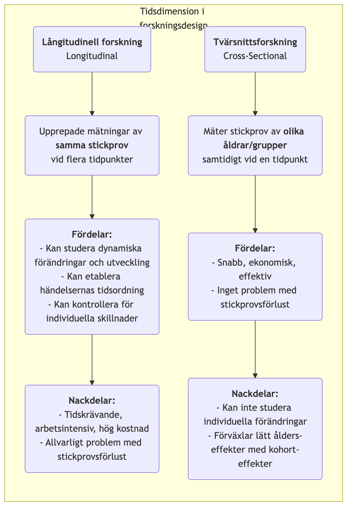

# Långitudinell forskning

När vi utforskar den långa väven av mänsklig utveckling, social förändring och sjukdomarnas evolution, behöver vi en forskningsmetod som kan fånga den avgörande dimensionen "tid". **Långitudinell forskning** är exakt en sådan "kamera", som upprepade och kontinuerliga observationer och mätningar av **samma stickprov** under en längre period. Dess kärnemål är att avslöja hur fenomen **förändras, utvecklas och utvecklas** över tid, samt att undersöka de långsiktiga effekterna av tidiga händelser på senare utfall.

Till skillnad från tvärsnittsstudier, som endast erbjuder en "stills" vid en viss tidpunkt, erbjuder långitudinell forskning en "dokumentär". Den gör det möjligt för oss att observera individuell tillväxt, begreppsförändringars process och sjukdomarnas hela förlopp från början till full utveckling. Detta gör det möjligt för oss att tydligare etablera händelsernas tidsordning när vi utforskar kausala relationer. När du vill besvara dynamiska frågor om processer och utveckling, såsom "Hur påverkar läsvanor i barndomen inkomstnivåer som vuxen?" eller "Vilken långvarig effekt har en politisk reform haft under det senaste årtiondet?", blir långitudinell forskning ett oumbärligt och kraftfullt verktyg.

## Kärnkaraktäristika och typer av långitudinell forskning

Gemensamt för alla långitudinella studier är deras spårning av "tid", men de kan huvudsakligen delas in i tre typer beroende på vad som spåras:

*   **Kohortstudie**: Detta är den vanligaste typen. Forskare väljer en specifik grupp människor (en "kohort") som delar en gemensam egenskap eller upplevelse (t.ex. "alla barn födda år 2000" eller "anställda som började på ett visst företag 2010") och följer denna kohort kontinuerligt över flera årtionden.
*   **Panelstudie**: Liknar en kohortstudie, men den följer exakt samma **individ** i stickprovet. Varje undersökning besöker samma grupp människor, vilket gör att forskare kan analysera varje individs förändringsbana exakt.
*   **Trendstudie**: Denna typ av forskning fokuserar på förändringar i en "population" över tid, men de enskilda stickproven som används i varje undersökning är olika. Till exempel kan en forskningsinstitution slumpmässigt välja ett nytt stickprov av personer landet runt vart femte år för att undersöka förändringar i folks attityder till miljöfrågor.

### Jämförelse mellan långitudinell och tvärsnittsforskning

<!-- mermaid 源文件：Longitudinal-Research-Tutorial-sv-mermaid-live-1.mmd -->

## Hur man genomför en långitudinell studie

1.  **Ställa upp långsiktiga forskningsmål**
    Definiera tydligt vilka förändringar eller utvecklingar du vill spåra och vilka potentiella påverkansfaktorer du är intresserad av. Långitudinell forskning är en långsiktig investering och måste stödjas av tydliga och viktiga forskningsmål.

2.  **Definiera och välj din kohort eller panel**
    Definiera ditt studieområde exakt och använd lämpliga urvalsmetoder för att välja det ursprungliga stickprovet. Kvaliteten och representativiteten i det ursprungliga stickprovet är avgörande.

3.  **Genomför en basundersökning**
    I början av studien genomförs den första omfattande datinsamlingen (basundersökning) för att mäta alla variablers initiala tillstånd.

4.  **Designa och genomför efterföljande uppföljningsundersökningar**
    Bestäm tidsintervallen för efterföljande uppföljningsundersökningar (t.ex. årligen, vart femte år) och designa enhetliga mätinstrument. Att upprätthålla kontakt med stickprovet och minska förlusten är bland de största utmaningarna under en lång forskningsperiod.

5.  **Datamanagement och analys**
    Långitudinella datastrukturer är komplexa och kräver professionella databaser för hantering. Vid analys använder forskare avancerade statistiska modeller (t.ex. tillväxtkurvemodeller, överlevnadsanalys) för att analysera variablernas förändringsbanor över tid och deras påverkansfaktorer.

## Klassiska tillämpningsfall

**Fall 1: Harvard Study of Adult Development**

*   **Scenario**: En av de längsta långitudinella studierna i historien, som startade 1938 och följde 724 män i nästan 80 år.
*   **Tillämpning**: Forskare samlade regelbundet in data om deras arbete, familj, hälsa och andra aspekter genom frågeformulär, intervjuer, medicinska journaler osv. Den mest kända slutsatsen från denna studie är att goda, varma personliga relationer är den viktigaste faktorn för att förutsäga långvarig lycka och hälsa, till och med mer än rikedom, berömmelse och gener. Denna slutsats kunde endast dras genom livslång spårning.

**Fall 2: UK Millennium Cohort Study**

*   **Scenario**: En nationell födelsekohortstudie som följer cirka 19 000 brittiska barn födda mellan 2000 och 2002.
*   **Tillämpning**: Studien samlade in omfattande data vid flera åldrar (t.ex. 9 månader, 3, 5, 7, 11, 14, 17 år), som täcker allt från hälsa, kognition och beteende till familjemiljö. Denna studie tillhandahöll massiv och extremt värdefull evidens för att regeringen skulle kunna utforma barn- och familjepolitik, till exempel visade den den långvariga negativa effekten av fattigdom på tidig barndomsutveckling.

**Fall 3: Kohortanalys av produktanvändares avgång**

*   **Scenario**: Ett SaaS-företag (Software as a Service) vill förstå ny användarbeholdning.
*   **Tillämpning**: De använde **kohortanalys**-metoden. De betraktade "nya användare som registrerades varje månad" som en kohort (t.ex. "januarikohorten", "februarikohorten"). Sedan spårade de bevarandet av varje kohort under den första månaden, andra månaden, tredje månaden... efter registreringen. Genom att jämföra bevarandekurvorna för olika kohorter kunde de utvärdera om deras produktförbättringar och marknadsaktiviteter hade en positiv effekt på ny användares långsiktiga behållning.

## Fördelar och utmaningar med långitudinell forskning

**Kärnfördelar**

*   **Förmåga att studera dynamiska processer**: Det är den mest effektiva metoden för att studera "utveckling" och "förändring" i sig.
*   **Kan etablera tidsordning**: Kan tydligt fastställa händelsernas tidsordning, vilket är en viktig förutsättning för att dra slutsatser om orsakssamband (men man måste fortfarande vara noga med att hantera förvirrande variabler).
*   **Kontrollera för individuella skillnader**: Eftersom samma individer följs kan inre individuella skillnader som inte förändras över tid (t.ex. IQ, personlighet) uteslutas som störande faktorer.

**Potentiella utmaningar**

*   **Hög kostnad**: Kräver långvarigt ekonomiskt stöd, ett stabilt forskarlag och stora administrationskostnader.
*   **Tidskrävande**: Forskningsresultatens produktionscykel är mycket lång, kan ta år eller till och med decennier.
*   **Stickprovsförlust**: Detta är den största "naturfienden" i långitudinell forskning. Med tiden kan vissa deltagare lämna studien på grund av flytt, kontaktbortfall, död eller förlorad intresse vilket kan leda till bias i det slutliga stickprovet.
*   **Effekter av upprepade mätningar**: Att upprepade gånger genomgå samma tester eller frågeformulär kan påverka deltagarnas beteenden eller svar, vilket kallas för "övningseffekt".

## Utvidgningar och kopplingar

*   **Tvärsnittsforskning**: Ofta används som ett lågkostnads- och snabbt alternativ till långitudinell forskning. Det är dock viktigt att vara medveten om dess oförmåga att skilja mellan ålders- och kohorteffekter.
*   **Överlevnadsanalys**: En statistisk metod som ofta används inom långitudinell forskning, särskilt för att analysera tiden tills en händelse inträffar (t.ex. återhämtning, avgång, död) och dess påverkansfaktorer.

---
*Referens: Långitudinell forsknings designidé har en lång historia inom epidemiologi och samhällsvetenskap. Glen H. Elder Jr:s teori om livsloppet tillhandahåller en viktig teoretisk ram för modern långitudinell forskning.*