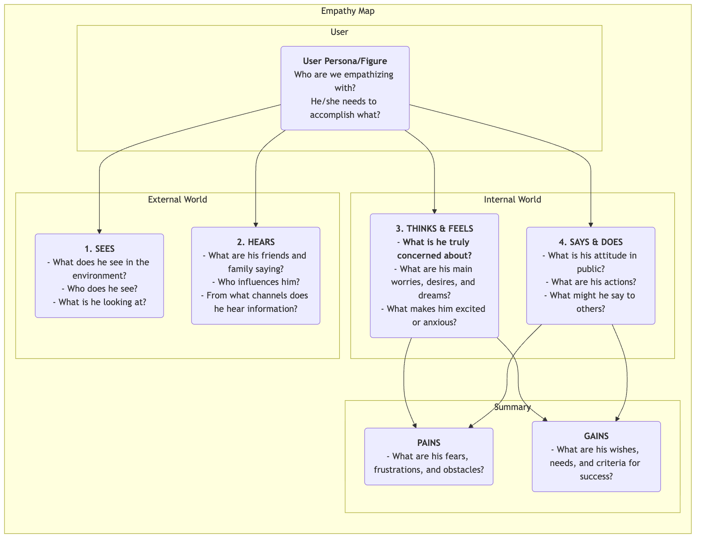

# Empathikarta

Inom produktutveckling och användarforskning är "empathi" en kärnegenskap som ofta nämns men som är extremt svår att verkligen uppnå. Hur kan vi på riktigt "gå i användarens skor" och uppleva deras värld från första hand? **Empathikartan** är ett enkelt, intuitivt men extremt kraftfullt **kollaborativt empativerktyg** som är utformat just för detta syfte. Den syftar till att hjälpa team att gå bortom ytan av användarbeteenden och fördjupa sig i deras djupare värld av **sinnen, tankar och känslor**, och därmed skapa en mer omfattande och mångsidig förståelse för användaren.

Kärnan i Empathikartan ligger i att systematiskt organisera alla spridda, kvalitativa observationer och intervjuer om användare till en visuell struktur. Denna struktur är vanligtvis uppdelad i fyra huvudkvadranter: **Ser, Hör, Tänker & Känner samt Säger & Gör**. Genom att tillsammans fylla i denna karta tvingas teammedlemmarna att anta användarens perspektiv och gemensamt bygga en delad förståelse för användarens inre värld och yttre miljö. Det är en spegel som tydligt reflekterar användarens verkliga situation och en katalysator för att utveckla kollektiv empati inom teamet.

## Komponenter i en Empathikarta

En klassisk Empathikarta är användarcentrerad och utvecklas kring fyra kärnkvadranter av yttre och inre upplevelser.

<!-- mermaid 源文件：Empathy-Map-Tutorial-sv-mermaid-live-1.mmd -->

*   **Ser**: Beskriver vad användaren ser med sina egna ögon i sin omgivning. Till exempel, vad gör de människor som omger honom/henne? Vilken marknadsinformation stöter de på dagligen?
*   **Hör**: Beskriver den information som användaren får från den yttre världen. Vad säger hans/v hennes vänner, familj och kollegor? Vilka åsiktsledare eller medier påverkar honom/henne?
*   **Tänker & Känner**: Detta är kärnan i kartan, och försöker utforska användarens inre värld. Vad är egentligen viktigt för honom/henne (även om de aldrig säger det högt)? Vilka bekymmer, oro, hopp och drömmar har de?
*   **Säger & Gör**: Beskriver användarens ord och handlingar i offentlighet. Vad berättade de för oss i en intervju? Vad är deras faktiska beteenden när de använder produkten? Här krävs särskild uppmärksamhet på eventuella motsättningar mellan "säger" och "tänker".
*   **Smärtor** och **Vinster**: Efter att ha analyserat de fyra ovan nämnda kvadranterna, sammanfatta användarens inre kamp och önskemål. Smärtor representerar de hinder och negativa känslor de möter, medan Vinster representerar de mål och önskemål de verkligen vill uppnå.

## Hur man använder en Empathikarta

En Empathikarta fungerar bäst i en workshop i grupp.

1.  **Steg 1: Definiera omfattning och mål**
    *   **Välj din användare**: Definiera tydligt vilken specifik användarpersona eller figur som Empathikartan gäller. Ge helst personen ett namn och en bakgrund.
    *   **Klarityd mål**: Definiera de mål ni vill uppnå genom denna övning. Är det att bättre förstå existerande användare, eller att utforska potentiella användare för en ny produkt?

2.  **Steg 2: Samla in forskningsmaterial**
    En Empathikarta måste bygga på riktiga undersökningar, inte på fiktion. Förbered all relevant användarforskningsmaterial såsom: inspelade intervjuer och transkript, användbarhetstest-videor, öppna svar från undersökningar, användarfoton, etc.

3.  **Steg 3: Fyll i kartan tillsammans**
    *   Rita en stor Empathikarta på en whiteboard eller använd ett online-samarbetsverktyg.
    *   Teammedlemmarna skriver tillsammans ner sina observationer från forskningsmaterialet på post-it-lappar, en i taget, och placerar dem i rätt kvadrant på kartan. Till exempel, när man lyssnar på en intervjuinspelning kan en medlem skriva "Användaren säger att han jobbar övertid varje vecka (Säger)", medan en annan medlem kan skriva "Jag känner att han låter trött och har förlorat sitt engagemang för arbetet (Känner)."
    *   Uppmuntra teammedlemmar att läsa upp innehållet på post-it-lapparna högt och förklara varför de placerade dem i den kvadranten.

4.  **Steg 4: Fördjupa dig och syntetisera**
    När all information är på plats, leda teamet i en djupare diskussion.
    *   "Vilka motsättningar ser vi? Till exempel, är användarens ord och handlingar inkonsistenta?"
    *   "Vad är det egentligen de bryr sig om bakom allt detta, men inte uttryckt?"
    *   "Vad var något oväntat som vi lärde oss?"
    *   Sammanfatta till slut användarens mest centrala **Smärtor** och **Vinster** tillsammans.

5.  **Steg 5: Dela och använd**
    Organisera och dela den färdiga Empathikartan och använd den som viktig input för efterföljande design och beslutsfattande.

## Användningsfall

**Fall 1: Design av en smartphone för äldre**

*   **Användare**: Farfar Wang, 70 år gammal, har precis fått en smartphone av sina barn.
*   **Ser**: Ikonerna på skärmen är små och många, svåra att se; unga människor använder alla mobilbetalningar och chattar.
*   **Hör**: Barnen säger, "Det är väldigt enkelt, du lär dig snabbt"; gamla vänner säger, "Den där grejen är för komplicerad, jag kan inte lära mig det."
*   **Tänker & Känner**: Känner sig väldigt **besviken**, rädd för att bli lämnad av tekniken; men **ivrig** att lära sig hur man gör videokonferens med barnbarnen på telefonen.
*   **Säger & Gör**: Säger, "Jag behöver inte det här", men försöker i smyg att låsa upp skärmen gång på gång.
*   **Smärtor**: Rädsla för att göra fel och orsaka förluster; känsla av att bli övergiven av tekniken.
*   **Vinster**: Hoppas kunna hålla kontakt med familjen; hoppas kunna självständigt utföra vissa dagliga uppgifter (t.ex. kolla bussrutter).
*   **Designinspiration**: Den centrala designprincipen för den här telefonen bör inte vara "kraftfulla funktioner", utan "ingen frustration". Måste erbjuda funktioner som "extra stort textläge", "familjens fjärrhjälp" och liknande.

**Fall 2: Design av en jobbsökare-app för universitetsstudenter**

*   **Användare**: Li Xue, 22 år gammal, student som snart ska ta examen.
*   **Ser**: Jobbsökningssajter är fyllda med information, svårt att skilja sanning från lögn; klasskamrater runt henne har fått flera jobberbjudanden.
*   **Hör**: Äldre studenter säger, "Första jobbet är väldigt viktigt"; föräldrar säger, "Att hitta ett stabilt jobb är det viktigaste."
*   **Tänker & Känner**: Känner sig väldigt **förvirrad och orolig** inför framtiden; vet inte vilket jobb som passar henne; **rädd** för att göra dåligt ifrån sig i intervjuer.
*   **Säger & Gör**: Har skickat iväg hundratals CV; har om och om igen reviderat sitt CV.
*   **Smärtor**: Saknar riktning i jobbsökningen; informationsasymmetri; bristande självförtroende.
*   **Vinster**: Hoppas hitta ett jobb hon verkligen är intresserad av och som har goda framtidsutsikter; hoppas få professionell vägledning och råd.
*   **Designinspiration**: Appens centrala funktion bör inte bara vara att visa jobbannonser, utan bör lägga till moduler som "karaktärstest för karriär", "online-rådgivning med branschmentor", "övningar för intervjuer" och liknande.

**Fall 3: Design av ett skrivverktyg för innehållsskapare**

*   **Användare**: Zhang Wei, en deltidsskribent.
*   **Ser**: Andra bloggare uppdaterar med högkvalitativa artiklar dagligen; hans egna artiklar får samma antal visningar.
*   **Hör**: Läsare kommenterar, "Bra skrivet, jag ser fram emot uppdateringar"; vänner säger, "Det är svårt att tjäna pengar som bloggare."
*   **Tänker & Känner**: Känner sig väldigt **smärtsamt** när inspirationen tar slut; **längtar** efter läsarnas erkännande och samklang; **kämpar** mellan att förfölja sina ideal och att få inkomster.
*   **Säger & Gör**: Lägger mycket tid på att samla material och strukturera innehållet; skriver ofta sent på natten.
*   **Smärtor**: Skrivprocessen avbryts, låg effektivitet; bristande motivation för kontinuerlig skapande.
*   **Vinster**: Hoppas få ett verktyg som kan hjälpa till att organisera tankar och ge inspiration; hoppas bygga djupare kopplingar med läsarna.
*   **Designinspiration**: Förutom grundläggande redigeringsfunktioner bör skrivverktyget också erbjuda specialfunktioner som "inspirationskort", "tankekarta-läge", "analys av läsarens interaktion" och liknande.

## Fördelar och utmaningar med Empathikarta

**Centrala fördelar**

*   **Snabb och effektiv**: En effektiv metod för att snabbt bygga teamempathi (vanligtvis inom 60 minuter).
*   **Främjar samarbete i teamet**: Dess kollaborativa natur kan bryta ner avdelningsmässiga silor och leda till en enhetlig och djupare förståelse för användaren i hela teamet.
*   **Upptäcker dolda behov**: Genom att fokusera på användarens inre värld hjälper den till att upptäcka potentiella behov och problem som användaren själv kanske inte har uttryckt tydligt.

**Potentiella utmaningar**

*   **Ersätter inte användarpersonor**: En Empathikarta fokuserar vanligtvis på en användares situation i ett specifikt scenario, medan en användarpersona beskriver en mer komplett och varaktig karaktär. En Empathikarta är ett utmärkt underlag för att skapa användarpersonor men kan inte fullt ut ersätta dem.
*   **Kräver verkliga data**: Precis som alla användarforskningsverktyg, utan verkliga forskningsdata kan en Empathikarta bli en "fiktionsövning" baserad på teammedlemmarnas subjektiva antaganden.

## Utökningar och kopplingar

*   **Användarpersona**: Empathikartan är ett **nyckelsteg** i att bygga en levande, känslomässigt rik användarpersona. Genom analysen av Empathikartan kan den ge extremt levande material för "Smärtor", "Mål" och andra delar av en användarpersona.
*   **Användarresa**: I varje steg i användarresan kan en mini Empathikarta användas för att djupare analysera användarens tankar, känslor och handlingar i just det steget, och därmed mer exakt identifiera smärtpunkter i varje steg.

---
*Källa: Empathikartan föreslogs ursprungligen av Dave Gray, grundare av XPLANE (numera en del av Deloitte), och har använts i stor utsträckning inom Design Thinking och Agile-utvecklingspraxis. Det är ett grundläggande och centralt empativerktyg i användarcentrerade designprocesser.*