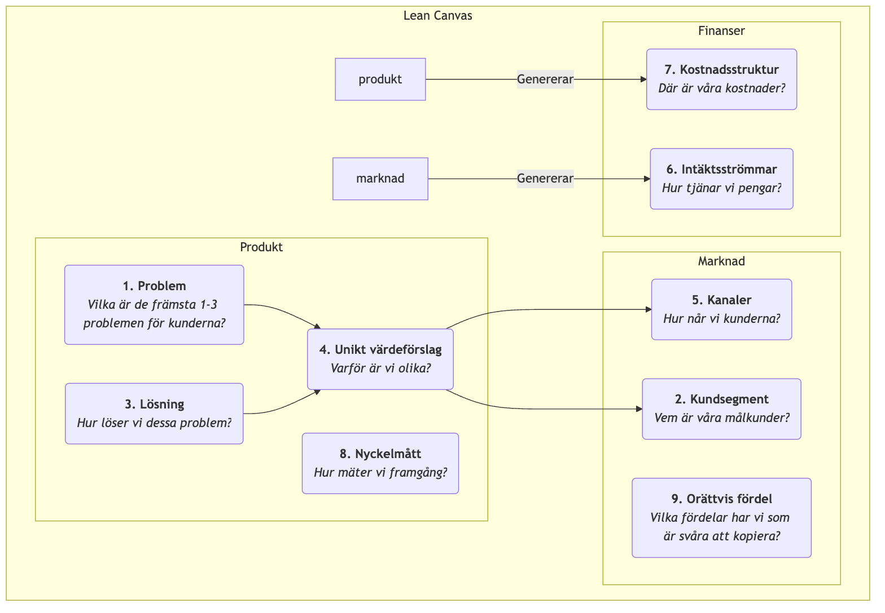

# Lean Canvas

I en startups tidiga skeden är den största risken ofta inte "kan vi bygga produkten?" utan "kommer någon verkligen att vilja ha den produkt vi bygger?" Traditionella affärsplaner och affärsmodell-canvas är utmärkta verktyg för etablerade företag, men för startups som verkar i hög osäkerhet kan de vara överkomplexa och inte tillräckligt fokuserade på de mest kritiska riskerna. **Lean Canvas** skapades för att lösa detta problem; det är en lysande anpassning av Affärsmodell Canvas, anpassad specifikt för **entreprenörer i tidiga skeden**.

Lean Canvas, föreslagen av Ash Maurya i hans bok *Running Lean*, ärver enkelheten och intuitiviteten i Affärsmodell Canvas men flyttar fokus från en "fullständig beskrivning av affärsmodellen" till **"systematisk identifiering och validering av de mest riskfyllda hypoteserna för en startup."** Den fokuserar på **Problem-Lösning** och lägger till uppmärksamhet på nyckelmått och konkurrensfördelar, och förankrar därmed djupare "bygg-mät-lär"-cykeln från Lean Startup. Det är en riskfokuserad slagkarta som guider entreprenörer genom dimman.

## De nio blocken i Lean Canvas

Lean Canvas behåller de nio blocken från Affärsmodell Canvas men ersätter fyra av dem för att göra den mer handlingsorienterad och riskfokuserad.

<!-- mermaid 源文件：Lean-Canvas-Tutorial-sv-mermaid-live-1.mmd -->

**Skillnader från Affärsmodell Canvas:**

*   **Problem** ersätter "Nyckelpartner": Detta är den viktigaste förändringen. Den tvingar entreprenörer att först tydligt definiera de främsta 1-3 problemen som deras målkunder brådskande behöver lösa.
*   **Lösning** ersätter "Nyckelaktiviteter": Efter att problemet har definierats föreslår man sedan sin lösning (vanligtvis kärnfunktionaliteten i produkten) specifikt för detta.
*   **Nyckelmått** ersätter "Nyckelresurser": För en startup är det inte de resurser den äger som är viktigast, utan hur man mäter hälsan och tillväxten i verksamheten. Nyckelmått är käppen som driver alla handlingar.
*   **Orättvis fördel** ersätter "Kundrelationer": Detta kallas också för "orättvis fördel" eller "vallgrav", och syftar på kärnkompetens som inte lätt kan kopieras eller köpas av konkurrenter. Det är avgörande för affärsmodellens långsiktiga överlevnad.

## Så använder du Lean Canvas

Processen att använda Lean Canvas är en kontinuerlig cykel av validering och iteration.

1.  **Rita din "Plan A"-canvas**
    Innan du pratar med några kunder, fyll snabbt i en Lean Canvas med alla dina initiala idéer och hypoteser för startup-projektet. Det tar vanligtvis bara 15-20 minuter. Detta är din "Plan A", en samling av alla dina hypoteser som ska valideras.

2.  **Identifiera de mest riskfyllda hypoteserna**
    Granska din första version av canvasen och identifiera de delar som har högst risk och osäkerhet. Vanligtvis är de mest riskfyllda hypoteserna för ett nytt projekt, i ordning:
    *   **Problem-Kund-hypotes**: Existerar detta problem verkligen? Är dessa människor verkligen dina målkunder?
    *   **Problem-Lösnings-hypotes**: Kan din lösning verkligen lösa deras problem?
    *   **Pris-Värdeförslag-hypotes**: Är kunder villiga att betala för din lösning?

3.  **Systematisk validering av hypoteser**
    Designa och exekvera en serie "minimally viable experiments" (vanligtvis **problemintervjuer** och **lösningintervjuer**) för att systematiskt validera dina hypoteser med hög risk. Till exempel:
    *   **Utför problemintervjuer**: Gå ut och prata med dina målkunder, men prata inte om din produkt. Ditt enda syfte är att djupare förstå deras problem, existerande beteenden och smärtor för att validera "Problem"- och "Kundsegment"-blocken på canvasen.
    *   **Utför lösningintervjuer**: Efter att ha validerat att problemet verkligen existerar, visa din lösning (som kan vara en prototyp eller demo) för kunder för att validera din "Lösning" och "Värdeförslag", och testa deras betalningsvilja ("Intäktsströmmar").

4.  **Iterera din canvas**
    Uppdatera och iterera kontinuerligt din Lean Canvas baserat på insikter från intervjuer och experiment. Vissa hypoteser valideras, andra förkastas. Canvasen är som en experimentjournal, som dokumenterar hela utvecklingsvägen för ditt startup-projekt från den ursprungliga idén till att hitta "produktmarknadsanpassning".

## Användningsfall

**Fall 1: Dropbox (molnlagringstjänst) tidig canvas**

*   **Problem**: Att synka filer mellan flera enheter är besvärligt; att skicka stora filer via USB-minnen eller e-post är smärtsamt; att glömma att säkerhetskopiera leder till dataförlust.
*   **Kundsegment**: Teknologientusiaster med flera datorer, frilansare.
*   **Unikt värdeförslag**: "Lägg dina filer i en 'magisk ficka', tillgänglig var som helst, aldrig förlorad."
*   **Lösning**: Ett skrivbordsprogram som körs sömlöst i bakgrunden, som automatiskt synkar innehållet i en specifik mapp.
*   **Nyckelmått**: Antal användarregistreringar, **filuppladdningslyckandegrad**, antal aktiva användare.
*   **Orättvis fördel**: Nätverkseffekt – ju fler som använder det, desto lättare blir det att dela och samarbeta.
*   **Validering**: Grundaren Drew Houston skapade en enkel produkt-demovideo och lade upp den i en teknologientusiastcommunity. Under natten ökade väntelistan från 5 000 till 75 000 personer, vilket starkt validerade "problem-lösnings"-matchningen.

**Fall 2: En planerad "hälsosam måltidsleverans"-tjänst**

*   **Problem**: Kontorsarbetare har svårt att äta hälsosam, balanserad lunch; att förbereda måltider själv är för tidskrävande; snabbmat är generellt fet.
*   **Kundsegment**: Hälsosamhetsmedvetna unga yrkespersoner med träningsvanor.
*   **Unikt värdeförslag**: "Av nutritionister utformade, färska träningsmåltider, levererade i tid till ditt kontor."
*   **Lösning**: Erbjuda veckoplanerade lunchmåltider, med menyerna uppdaterade varje vecka, och med kalori- och näringsinformation angiven.
*   **Nyckelmått**: **Veckovis återköpsfrekvens**, kundlivslängdsvärde.
*   **Orättvis fördel**: Exklusiva partnerskap med högkvalitativa råvaruleverantörer, professionellt nutritionistteam.
*   **Validering**: Grundaren kunde initialt undvika att utveckla en app och istället ta emot beställningar via en WeChat-grupp eller undersökningsplattform, och manuellt leverera luncher till de första 20 användarna för att validera hela processen och användarnas behov.

**Fall 3: Airbnbs tidiga canvas**

*   **Problem**: Under populära konferenser är stadshotell dyra och fullbokade.
*   **Kundsegment**: Designers som deltar i designkonferenser med begränsad budget.
*   **Lösning**: Erbjuda en plattform för lokala invånare (värdar) att hyra ut sina extra luftmadrasser till dessa designers.
*   **Unikt värdeförslag**: Få boende till ett lägre pris och ha möjlighet att interagera med lokala invånare.
*   **Validering**: Grundarna själva satte tre luftmadrasser i sitt hem och hyrde ut dem framgångsrikt till designers som deltog i konferensen, och validerade därmed personligen hela affärsmodellens hållbarhet.

## Värde och begränsningar i Lean Canvas

**Kärnavärde**

*   **Riskfokus**: Tvingar entreprenörer att möta de mest riskfyllda hypoteserna direkt.
*   **Hastighet och iteration**: Mycket lämplig för att snabbt skissa, diskutera och iterera affärsmodeller, perfekt anpassad till Lean Startup.
*   **Problemcentrerad**: Säkerställer att företagets utgångspunkt är att lösa ett verkligt, värdefullt kundproblem.

**Potentiella begränsningar**

*   **Otillräcklig uppmärksamhet på den yttre miljön**: Precis som Affärsmodell Canvas inkluderar den inte i sig analys av konkurrens och makromiljö.
*   **Inte tillämplig på alla företag**: Den är mest lämplig för startups i hög osäkerhet. För etablerade företag med validerade affärsmodeller kan Affärsmodell Canvas vara ett mer omfattande verktyg.

## Utvidgningar och kopplingar

*   **Affärsmodell Canvas**: Lean Canvas är en viktig variation och utveckling av Affärsmodell Canvas i kontexten av Lean Startup.
*   **Kundutveckling**: En metodik föreslagen av Steve Blank, som betonar att "gå utanför kontoret" för att validera hypoteser, vilket fungerar som en styrande princip för Lean Canvas på handlingsnivå.
*   **Värdeförslags Canvas**: Kan fungera som ett fördjupningsverktyg för blocken "Problem", "Lösning" och "Unikt värdeförslag" i Lean Canvas, och hjälpa entreprenörer att mer exakt förfinna produktmarknadsanpassningen.

---
*Referens: Ash Mauryas "Running Lean" är den mest auktoritativa källan för Lean Canvas, och beskriver i detalj hur man använder och itererar Lean Canvas steg för steg tillsammans med kundutveckling. Denna metod har djupt påverkats av Eric Ries "Lean Startup" och Steve Blanks kundutvecklingsmodell.*