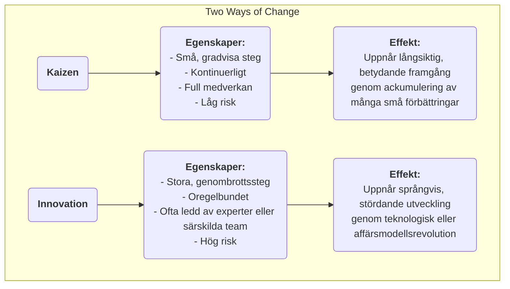

# Kaizen

I många organisationer uppfattas "förbättring" ofta som ett stort "projekt" som kräver betydande investeringar, leds av experter och drivs top-down. Det finns dock en managementfilosofi som tror på att sann, kraftfull och varaktig utveckling kommer från de till synes obetydliga **små och kontinuerliga förbättringar** som görs varje dag av varje anställd. Detta är kärnan i **Kaizen**. Kaizen är ett japanskt ord som betyder "förändring till det bättre", och det är både en kulturell filosofi som strävar efter perfektion och en praktisk metod som uppmuntrar full medverkan och kontinuerlig förbättring från botten upp.

Kärnoidén i Kaizen är **inte att sträva efter revolutionerande genombrott över en natt, utan att eftersträva en oändlig gradvis optimering**. Den tror på att medarbetare i frontlinjen är experter som bäst förstår den faktiska situationen i sina arbetsroller och att de besitter oändlig vishet och kreativitet. Genom att etablera en kultur som uppmuntrar problemlösning, belönar små innovationer och tolererar misslyckanden kan organisationer utnyttja varje individs kraft och skapa en oförstoppable, kontinuerligt stigande drivkraft. Det är inte ett komplext managementverktyg, utan ett enkelt, anspråkslöst men djupt effektivt sätt att arbeta och tänka.

## Kärnprinciper för Kaizen

*   **Kontinuerlig**: Kaizen är inte en engångsaktivitet, utan en oavbruten, ackumulerande process.
*   **Alla**: Från VD till städare uppmuntras och förväntas alla i organisationen delta i förbättringsaktiviteter.
*   **Låg kostnad, hög vishet**: Kaizen förlitar sig inte på stora kapitalinvesteringar utan betonar användningen av medarbetares vishet och kreativitet för att lösa problem och eliminera slöseri till låg kostnad.
*   **Processfokus**: Fokus i Kaizen ligger på att optimera arbetsprocesser, inte att skylla på individer.
*   **Visuell styrning**: Betonar att göra problem, standarder och processer "synliga" så att avvikelser syns direkt.
*   **"Gå till Gemba"**: Chefer måste gå till arbetsplatsen (Gemba) för att observera verkliga situationer och tala med medarbetare, istället för att föreställa sig saker från kontoret.

### Kaizen vs. Innovation

*   **Relation**: Kaizen och innovation utesluter inte varandra; snarare är de två förmågor som en utmärkt organisation måste besitta samtidigt. Kaizen ansvarar för att kontinuerligt optimera och konsolidera befintliga system, medan innovation ansvarar för att skapa helt nya system.

## Hur man praktiserar Kaizen i en organisation

Nyckeln till att praktisera Kaizen är att skapa en kultur och mekanismer som uppmuntrar kontinuerlig förbättring.

1.  **Inrätta ett Kaizen-förslagssystem**
    Sätt upp en enkel och bekväm kanal (t.ex. förslång, onlineformulär) så att alla anställda kan lämna in problem eller förbättringsförslag när som helst. Det är viktigt att svara på och följa upp varje förslag samt ge offentlig och tidig uppskattning till godkända och genomförda förslag (belöningar behöver inte vara materiella; offentlig beröm, ett certifikat m.m. är ofta mer effektiva andliga incitament).

2.  **Genomför "Kaizen-veckor" eller "Kaizen Blitzes"**
    Organisera regelbundet tvärfunktionella team för att fokusera på en specifik process eller arbetsområde under en koncentrerad period (vanligtvis 3–5 dagar), använd lean- och kvalitetsverktyg (t.ex. värdeströmsanalys, 5S) för att genomföra en snabb, intensiv förbättringsstorm och omedelbart implementera lösningar.

3.  **Främja PDCA-cykeln som ett tänkande verktyg**
    Göra **PDCA-cykeln (Planera-Göra-Kontrollera-Åtgärda)** till en standardiserad tänkram för alla anställda för att lösa problem. Uppmuntra medarbetare att följa denna vetenskapliga cykel:
    *   **P**lanera: Identifiera problemet, analysera orsaken och utveckla en liten förbättringsplan.
    *   **G**öra: Försök att utföra planen.
    *   **K**ontrollera: Verifiera om resultatet av försöket uppfyllde förväntningarna.
    *   **A**tgärda: Om framgångsrik, standardisera den som en ny process; om inte, lära sig och starta en ny PDCA-cykel.

4.  **Förändring i chefsrollen**
    I en Kaizen-kultur förändras chefsrollen från "befälhavare" och "övervakare" till "**coach**" och "**stödare**". Deras huvuduppgifter är: att inspirera och uppmuntra medarbetare att identifiera problem, ge resurser och stöd för medarbetares förbättringsaktiviteter och hjälpa dem att ta bort hinder.

## Exempel på tillämpning

**Exempel 1: Toyotas "en-centimeter-förbättring"**

*   **Situation**: På Toyotas produktionslinje är Kaizen en del av dess DNA.
*   **Tillämpning**: En produktionsarbetare märkte att varje gång han tog en skruv från delbehållaren måste hans handled göra en liten men onaturlig vridning. Han föreslog att delbehållaren skulle lutas 15 grader. Denna till synes obetydliga förbättring sparade några sekunder per dag och minskade risken för skador på handleden. När denna "en-centimeter-förbättring" tillämpades på tusentals arbetsstationer i hela företaget blev den ackumulerade tidsbesparingen och förbättrad säkerhet imponerande.

**Exempel 2: En sjuksköterskas station på sjukhus**

*   **Problem**: Sjuksköterskor klagade över att de ägnade mycket tid åt att söka efter vanliga medicinska artiklar (t.ex. gasa, tejp).
*   **Kaizen-tillämpning**: Översköterskan organiserade en liten Kaizen-aktivitet. Teammedlemmarna använde **5S-metoden** för att grundligt **Sortera** (kassera onödiga föremål), **Stiga** (placera ofta använda föremål på lättillgängliga platser och märka dem tydligt), **Skölja**, **Standardisera** och **Säkra** förvaringsutrymmena på sjuksköterskans station. Aktiviteten tog bara en eftermiddag men minskade betydligt sjuksköterskornas söktid, vilket gjorde att de kunde lägga mer energi på patientvård.

**Exempel 3: Tillämpning i privatlivet**

*   **Problem**: En person glömde alltid att ta med sig nycklarna när han lämnade huset.
*   **Kaizen-tillämpning**: Istället för att skylla sig själv för "dåligt minne" tänkte han på hur han kunde **förbättra processen**. Han beslutade att lägga alla saker han behövde ta med nästa dag (nycklar, plånbok, arbetsid) på skokassen vid dörren kvällen innan. Denna lilla vaneförändring är ett typiskt exempel på personlig Kaizen, som löser problemet genom att optimera processen.

## Fördelar och utmaningar med Kaizen

**Kärnfördelar**

*   **Låg kostnad, låg risk**: De flesta förbättringar kommer från visheten hos medarbetare i frontlinjen, kräver nästan ingen extra investering och kostnaden för att testa och felsöka är mycket låg.
*   **Förbättrar medarbetarnas engagemang och tillhörighet**: När medarbetares förslag tas på allvar och antas känner de sig respekterade och förvandlas från "passiva utförare" till "aktiva tänkare".
*   **Främjar teamarbete**: Många Kaizen-aktiviteter kräver tvärfunktionellt och tvärvuxet samarbete, vilket hjälper till att bryta ner avdelningsbarriärer.
*   **Skapar stark kulturell tröghet**: När en kultur av kontinuerlig förbättring etableras får organisationen en kraftfull inre drivkraft för självutveckling och kontinuerlig utveckling.

**Potentiella utmaningar**

*   **Långsam effekt, svår att märka**: Jämfört med radikala "innovationer" är effekterna av Kaizen gradvisa och ackumulerande och kanske inte synliga på kort sikt, vilket kräver att chefer har tålamod och långsiktig vision.
*   **Kräver verklig full medverkan**: Om det bara förblir en slogan eller endast några få deltar kan Kaizen-aktiviteter inte upprätthållas.
*   **Kan hamna i "lokal optimim"**: Att fokusera för mycket på små förbättringar av befintliga processer kan ibland leda till att större möjligheter för stördande, revolutionerande innovation förbises.

## Utökningar och kopplingar

*   **Lean Operations**: Kaizen är en av de centrala pelarna i lean-tänkande och det grundläggande sättet att uppnå principen om "strävan efter perfektion".
*   **Total kvalitetsstyrning (TQM)**: Kaizen är den mest direkta och levande förkroppsligandet av principen om "kontinuerlig förbättring" i TQM.
*   **PDCA-cykel**: Det är den mest använda och grundläggande vetenskapliga tänkramen och handlingsmodellen vid praktisering av Kaizen.

---
*Källhänvisning: Kaizen, som en managementfilosofi, har djupa rötter i japansk kultur och managementpraxis, särskilt populär inom Toyotas produktionssystem (TPS). Masaaki Imais bok "Kaizen: The Key to Japan's Competitive Success" introducerade detta begrepp systematiskt till västvärlden och har haft stor påverkan.*