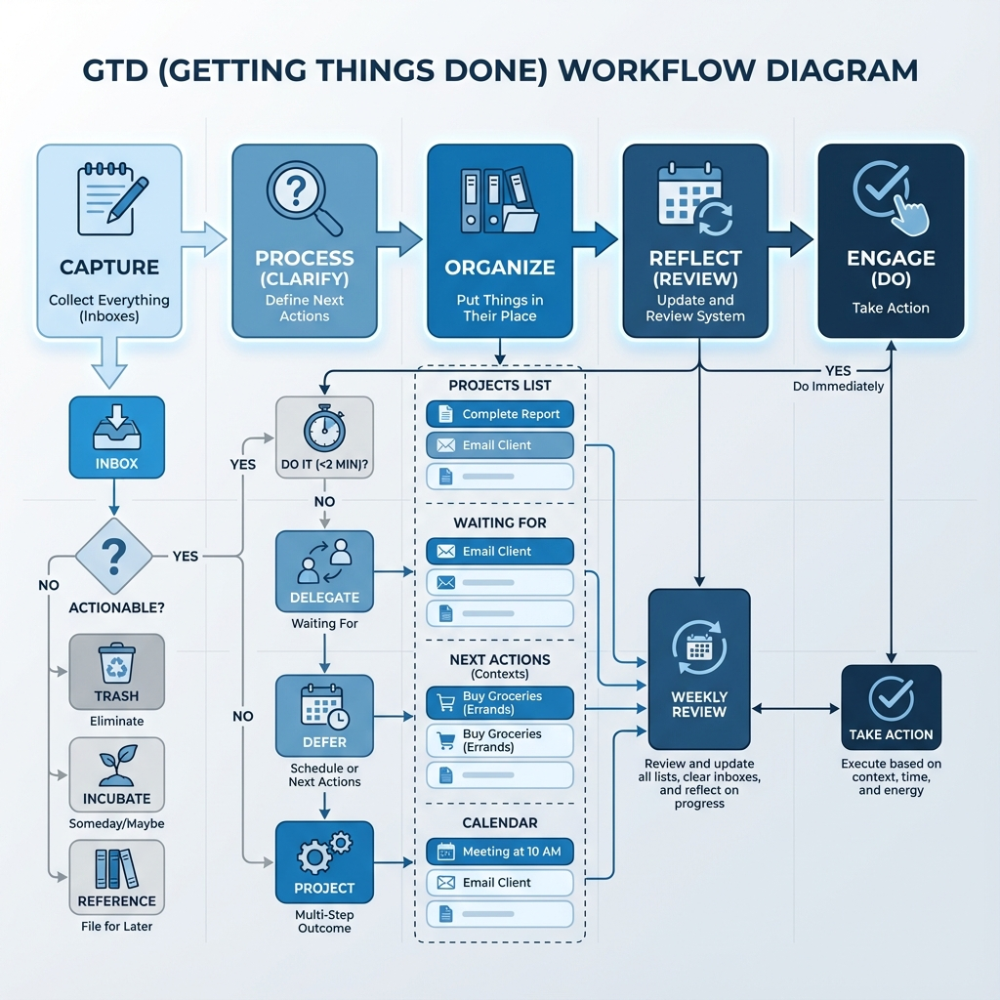
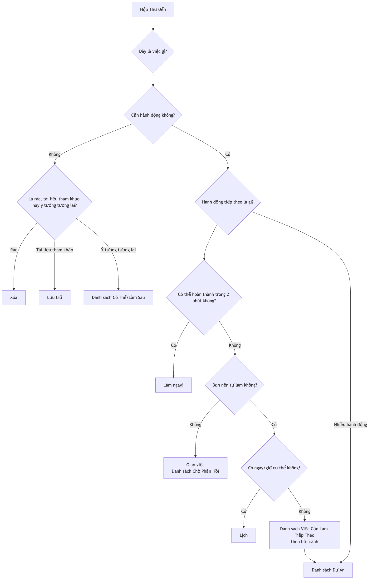

# GTD (Hoàn Thành Công Việc)

Bộ não của chúng ta về bản chất là một "CPU" tuyệt vời để **sản sinh ý tưởng**, nhưng lại là một "ổ cứng" cực kỳ kém để **lưu trữ thông tin**. Khi chúng ta cố gắng sử dụng bộ não để ghi nhớ tất cả các việc cần làm, lịch hẹn, ý tưởng và cam kết, nó sẽ bị chiếm giữ bởi những "việc chưa hoàn thành" này, dẫn đến căng thẳng, lo lắng và rối loạn tư duy, khiến ta không thể tập trung vào công việc đang thực hiện. **GTD (Getting Things Done)**, do chuyên gia năng suất David Allen sáng tạo, là một hệ thống quản lý năng suất cá nhân và quy trình làm việc nổi tiếng toàn cầu.

Triết lý cốt lõi của GTD là đạt được trạng thái làm việc **"Tâm Trí Như Nước"** (Mind Like Water) không căng thẳng, tập trung cao độ và hiệu quả bằng cách ghi lại toàn bộ những việc đang chờ xử lý từ trong đầu bạn vào một **hệ thống bên ngoài đáng tin cậy**, sau đó tuân theo một quy trình rõ ràng và nghiêm ngặt để **sắp xếp và xử lý**. GTD không phải là một mẹo quản lý thời gian đơn giản, mà là một hệ điều hành hoàn chỉnh được thiết kế để giải phóng tâm trí, giúp bạn bình tĩnh xử lý công việc và cuộc sống phức tạp.

## Năm Bước Cốt Lõi Của GTD

1.  **Thu Thập**: Ngay lập tức ghi lại bất kỳ điều gì thu hút sự chú ý của bạn — dù là công việc, việc cá nhân, cảm hứng bất ngờ hay lịch hẹn tương lai — ra khỏi đầu bạn và vào "**Hộp Thư Đến**" (Inbox). Hộp thư đến có thể là vật lý (như khay hồ sơ, sổ tay) hoặc kỹ thuật số (như hộp thư email, ứng dụng việc cần làm). Mấu chốt là đảm bảo bạn có càng ít hộp thư đến càng tốt và có thể hoàn toàn tin tưởng vào chúng, đồng thời có thể dọn dẹp hết nội dung trong đó.

2.  **Xử Lý**: Thường xuyên (ít nhất mỗi ngày một lần) "**dọn dẹp**" hộp thư đến của bạn. Tuân thủ nghiêm ngặt nguyên tắc **một việc một lần**, lần lượt xử lý từng "việc" trong hộp thư đến và tự hỏi một câu hỏi cốt lõi: "**Đây là việc gì? Có cần hành động không?**"
    *   Nếu **không cần hành động**: Đó có thể là **rác** (xóa trực tiếp), **thông tin có thể cần trong tương lai** (lưu vào thư mục tham khảo), hoặc một **ý tưởng đang ấp ủ** (đưa vào danh sách "Có Thể/Làm Sau").
    *   Nếu **cần hành động**: Tiến hành bước tổ chức tiếp theo.

3.  **Tổ Chức**: Đối với các việc cần hành động, hãy phân chúng vào các "ngăn" khác nhau tùy theo bản chất của việc đó.
    *   **Quy Tắc Hai Phút**: Nếu việc đó có thể hoàn thành **trong vòng hai phút**, hãy **làm ngay lập tức**, không cần tổ chức thêm.
    *   **Giao việc cho người khác**: Nếu việc đó nên do người khác làm, hãy **giao việc** ngay và đưa vào danh sách "**Chờ Phản Hồi**" để theo dõi.
    *   **Lịch**: Đối với các hành động có **ngày hoặc giờ cụ thể** (ví dụ: họp, lịch hẹn), hãy đưa vào **lịch** của bạn.
    *   **Danh Sách Việc Cần Làm Tiếp Theo**: Đối với các việc cần bạn trực tiếp xử lý, gồm nhiều bước và không có ngày cụ thể, hãy chia nhỏ thành **hành động cụ thể, rõ ràng và có thể thực hiện ngay**, rồi đưa vào các danh sách "Việc Cần Làm Tiếp Theo" khác nhau theo **bối cảnh**. Các bối cảnh có thể là "@máy tính," "@văn phòng," "@điện thoại," "@siêu thị," v.v.
    *   **Danh Sách Dự Án**: Bất kỳ kết quả nào cần **nhiều hơn một hành động** để hoàn thành đều được xác định là một "**Dự Án**" và đưa vào "Danh Sách Dự Án." Danh sách này chỉ ghi tên dự án; các hành động tiếp theo cụ thể của nó được lưu trong danh sách việc cần làm tương ứng.

4.  **Phản Tư**: Để duy trì độ tin cậy của hệ thống, bạn phải thực hiện **các cuộc xem xét định kỳ**.
    *   **Xem xét hàng ngày**: Duyệt nhanh qua lịch và danh sách việc cần làm tiếp theo mỗi ngày để lập kế hoạch cho ngày làm việc.
    *   **Xem xét hàng tuần**: Đây là **phần quan trọng nhất của GTD**. Mỗi tuần một lần (thường vào cuối tuần), dành 1-2 giờ để thực hiện một cuộc xem xét toàn diện, cập nhật và dọn dẹp toàn bộ hệ thống, đảm bảo mọi dự án đều được kiểm soát và tất cả các danh sách đều cập nhật.

5.  **Hành Động**: Tại bất kỳ thời điểm nào, khi bạn cần quyết định "Bây giờ tôi nên làm gì?", bạn có thể đưa ra lựa chọn khôn ngoan và bình tĩnh từ danh sách hành động của mình dựa trên các tiêu chí sau:
    *   **Bối cảnh**: Bạn đang ở đâu? Bạn có những công cụ nào? (ví dụ: nếu ở văn phòng, hãy xem danh sách "@văn phòng")
    *   **Thời Gian Có Sẵn**: Bạn có bao nhiêu thời gian trống lúc này? (ví dụ: nếu chỉ có 10 phút, hãy chọn một việc có thể hoàn thành nhanh chóng)
    *   **Năng Lượng Có Sẵn**: Mức năng lượng hiện tại của bạn thế nào? (ví dụ: nếu bạn đầy năng lượng, hãy làm một việc đòi hỏi tập trung cao độ)
    *   **Ưu Tiên**: Trong các điều kiện trên, việc nào là quan trọng nhất?

### Sơ Đồ Quy Trình Xử Lý GTD

<!-- mermaid 源文件：GTD-Tutorial-vi-mermaid-live-1.mmd -->

## Các Trường Hợp Ứng Dụng

**Trường hợp 1: Một Trưởng Phòng Bận Rộn**

*   **Thu Thập**: Hộp thư đến của anh ấy có thể bao gồm: hộp thư email, tin nhắn WeChat, ghi chú trong các cuộc họp, và ý tưởng phát sinh bất ngờ.
*   **Xử Lý và Tổ Chức**:
    *   Một email "thông báo ngân sách quý tới" -> Không cần hành động -> **Lưu trữ** vào thư mục tham khảo "Tài Chính Công Ty".
    *   Một ý tưởng "nhắc nhở nhân viên Xiao Zhang nộp báo cáo tuần" -> Có thể làm trong 2 phút -> **Ngay lập tức** nhắn tin cho Xiao Zhang.
    *   Một công việc "chuẩn bị cho hoạt động team building năm nay" -> Cần nhiều bước -> Thêm "Team Building" vào "**Danh Sách Dự Án**"; đưa hành động đầu tiên "Liên hệ với phòng nhân sự để lấy danh sách địa điểm" vào danh sách việc cần làm "**@Văn Phòng**".
    *   Một lịch hẹn "họp với khách hàng vào thứ Tư tuần sau lúc 3 giờ chiều" -> **Đưa vào Lịch**.
*   **Hành Động**: Khi anh ấy ở văn phòng, có 1 giờ rảnh và cảm thấy đầy năng lượng, anh ấy có thể mở danh sách "@Văn Phòng" và chọn làm "Liên hệ với phòng nhân sự."

**Trường hợp 2: Quản Lý Dự Án Của Một Người Làm Tự Do**

*   **Danh Sách Dự Án**: Có thể bao gồm "Dự án thiết kế website cho khách hàng A," "Thiết kế lại blog cá nhân," "Học một ngôn ngữ lập trình mới," v.v.
*   **Danh Sách Việc Cần Làm Tiếp Theo**:
    *   **@Điện Thoại**: Gọi cho khách hàng A để xác nhận phản hồi về bản thiết kế.
    *   **@Máy Tính-Thiết Kế**: Dựa trên phản hồi, chỉnh sửa lại trang chủ website.
    *   **@Máy Tính-Viết**: Viết bài đăng blog về "thiết kế đáp ứng."
    *   **@Đọc/Học**: Xem chương ba của khóa học lập trình.
*   **Xem xét hàng tuần**: Vào chiều thứ Sáu, anh ấy kiểm tra tiến độ của tất cả các dự án, đảm bảo mỗi dự án đều có ít nhất một "việc cần làm tiếp theo," và lập kế hoạch ưu tiên cho tuần tới.

**Trường hợp 3: Sinh Viên Quản Lý Học Tập Và Cuộc Sống**

*   **Hộp Thư Đến**: Thông báo từ các nhóm WeChat của lớp, bài tập do giáo viên giao, ý tưởng về hoạt động câu lạc bộ, danh sách mua sắm đồ dùng hàng ngày.
*   **Danh Sách Dự Án**: "Hoàn thành bài luận môn Lịch Sử," "Ôn tập cho kỳ thi cuối kỳ," "Lên kế hoạch cho tiệc chào đón tân sinh viên."
*   **Danh Sách Việc Cần Làm Tiếp Theo**:
    *   **@Thư Viện**: Mượn ba cuốn sách tham khảo về đề tài bài luận.
    *   **@Ký Túc**: Sắp xếp lại ghi chú môn Toán.
    *   **@Siêu Thị**: Mua kem đánh răng và dầu gội đầu.
*   **Hệ thống GTD** giúp anh ta phân biệt rõ ràng giữa việc học và việc nhà, đảm bảo làm đúng việc vào đúng thời điểm và đúng địa điểm.

## Ưu Điểm Và Thách Thức Của GTD

**Ưu Điểm Cốt Lõi**

*   **Giảm căng thẳng tinh thần, giải phóng trí não**: Bằng cách đưa tất cả các "việc chưa hoàn thành" ra ngoài, hệ thống này giảm đáng kể gánh nặng ghi nhớ và lo lắng liên tục do "sợ quên" của bộ não.
*   **Tăng cảm giác kiểm soát và bình tĩnh**: Một hệ thống đáng tin cậy đảm bảo rằng mọi việc đều trong tầm kiểm soát, giúp bạn tiếp cận các công việc hiện tại một cách bình tĩnh và tập trung hơn.
*   **Đảm bảo không bỏ sót việc quan trọng**: Cuộc **xem xét hàng tuần** quan trọng đảm bảo rằng bạn liên tục theo dõi và tiến triển trên tất cả các dự án quan trọng và mục tiêu dài hạn.
*   **Rất thích ứng và linh hoạt**: GTD không tự đặt ra các ưu tiên, mà cung cấp một khuôn khổ giúp bạn lựa chọn linh hoạt và động các hành động phù hợp nhất dựa trên bối cảnh hiện tại.

**Thách Thức Có Thể Gặp Phải**

*   **Chi phí ban đầu cao để thiết lập hệ thống**: Lần đầu tiên bạn "thu thập" và thiết lập toàn bộ hệ thống danh sách, có thể mất vài giờ hoặc thậm chí cả ngày.
*   **Yêu cầu kỷ luật nghiêm ngặt và hình thành thói quen**: Thành công của GTD phụ thuộc rất nhiều vào việc bạn có thể hình thành các thói quen cốt lõi là **thu thập liên tục** và **xem xét định kỳ** hay không. Một khi hệ thống không còn được tin tưởng và cập nhật, nó sẽ nhanh chóng sụp đổ.
*   **Vấn đề lựa chọn công cụ**: Trên thị trường có rất nhiều phần mềm và công cụ GTD, người mới bắt đầu dễ rơi vào bẫy quá chú trọng vào việc tìm kiếm "công cụ hoàn hảo" mà bỏ qua phương pháp thực sự.

## Mở Rộng Và Liên Kết

*   **Ma Trận Eisenhower**: Có thể được sử dụng trong bước "Hành Động" của GTD như một mô hình tư duy hiệu quả để xác định "ưu tiên."
*   **Kỹ Thuật Pomodoro**: Là một chiến thuật tuyệt vời để thực hiện các việc trong "Danh Sách Việc Cần Làm Tiếp Theo" của GTD đòi hỏi sự tập trung cao độ.

---
*Tham khảo: Cuốn sách bán chạy toàn cầu của David Allen "Getting Things Done: The Art of Stress-Free Productivity" là nguồn duy nhất và có thẩm quyền nhất để hiểu toàn bộ triết lý, quy trình và các thực hành tốt nhất đằng sau phương pháp GTD.*