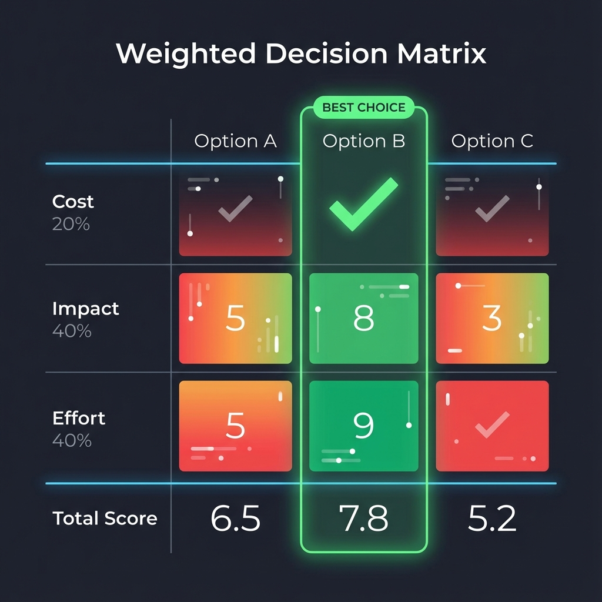

# Ma trận Quyết định

Trong cuộc sống cá nhân và quản lý doanh nghiệp, chúng ta thường xuyên đối mặt với tình huống khó khăn khi phải lựa chọn giữa nhiều phương án đều có vẻ tốt: Nên chọn nhà cung cấp nào? Nên ưu tiên tính năng sản phẩm nào để phát triển? Nên tuyển dụng ứng viên nào? Khi các quyết định liên quan đến nhiều tiêu chí phức tạp với mức độ quan trọng khác nhau, việc chỉ dựa vào trực giác hay danh sách đơn giản liệt kê ưu điểm và nhược điểm thường khiến ta khó đưa ra quyết định hợp lý và thuyết phục nhất. **Phân tích Ma trận Quyết định** (Decision Matrix Analysis) là một công cụ ra quyết định trực quan, có hệ thống được thiết kế để giải quyết những vấn đề như vậy.

Ý tưởng cốt lõi của nó là xác định phương án tối ưu theo cách rõ ràng về mặt logic và tương đối khách quan bằng cách đánh giá chéo tất cả các phương án khả thi (Options) và tất cả các tiêu chí quyết định quan trọng (Criteria) trong một ma trận hai chiều, đồng thời gán trọng số tương ứng cho từng tiêu chí, cuối cùng tính ra tổng điểm có trọng số cho mỗi phương án. Nó biến một bài toán ra quyết định đa tiêu chí phức tạp, mơ hồ thành một bài toán toán học rõ ràng, có thể lượng hóa được, từ đó nâng cao tính minh bạch và lý trí trong quá trình ra quyết định.

## Các thành phần của một Ma trận Quyết định

Một ma trận quyết định tiêu chuẩn chủ yếu gồm các phần sau:

*   **Các phương án (Options)**: Những lựa chọn bạn cần so sánh và chọn ra phương án tối ưu. Ví dụ, ba nhà cung cấp điện thoại di động khác nhau là A, B và C.
*   **Các tiêu chí (Criteria)**: Những yếu tố quan trọng bạn dùng để đánh giá các phương án này. Ví dụ, giá cả, tính năng, dịch vụ khách hàng, độ tin cậy, v.v.
*   **Trọng số (Weights)**: Không phải tất cả các tiêu chí đều có tầm quan trọng như nhau. Bạn cần gán cho mỗi tiêu chí một trọng số (ví dụ, từ 1 đến 5 hoặc 1 đến 10) để phản ánh mức độ quan trọng tương đối của nó trong quyết định cuối cùng.
*   **Điểm số (Scores)**: Với mỗi tiêu chí, hãy chấm điểm cho từng phương án (ví dụ, từ 1 đến 10, với 10 là phù hợp nhất với tiêu chí đó).
*   **Điểm có trọng số (Weighted Scores)**: Điểm cuối cùng của mỗi phương án trên một tiêu chí đơn lẻ, được tính bằng: **Điểm × Trọng số**.
*   **Tổng điểm (Total Score)**: Tổng điểm cuối cùng thu được bằng cách cộng các điểm có trọng số của mỗi phương án trên tất cả các tiêu chí. Phương án có tổng điểm cao nhất là phương án tối ưu theo lý thuyết.

### Mẫu Ma trận Quyết định

## Cách Sử dụng Ma trận Quyết định

1.  **Bước Một: Liệt kê Tất cả Các Phương án**
    Xác định rõ ràng tất cả các phương án khả thi mà bạn đang xem xét.

2.  **Bước Hai: Xác định Tất cả Các Tiêu chí Quyết định Liên quan**
    Thảo luận nhóm để liệt kê càng đầy đủ càng tốt tất cả các yếu tố quan trọng sẽ ảnh hưởng đến quyết định này. Đảm bảo các tiêu chí cụ thể và có thể đo lường được.

3.  **Bước Ba: Gán Trọng số cho Mỗi Tiêu chí**
    Đây là bước rất quan trọng. Nhóm cần thảo luận và thống nhất về mức độ quan trọng tương đối của từng tiêu chí. Bạn có thể đặt tổng trọng số (ví dụ, 100 điểm) rồi phân bổ, hoặc đơn giản chỉ dùng hệ thống đánh giá (ví dụ, từ 1 đến 5 điểm). Việc gán trọng số trực tiếp phản ánh sở thích và các ưu tiên chiến lược của bạn trong việc ra quyết định.

4.  **Bước Bốn: Chấm điểm cho Mỗi Phương án theo Mỗi Tiêu chí**
    Đánh giá mức độ phù hợp của từng phương án với từng tiêu chí và gán điểm khách quan. Để đảm bảo công bằng, tốt nhất nên đặt các chuẩn mực rõ ràng cho việc chấm điểm. Ví dụ, với tiêu chí "Chi phí", bạn có thể quy định rằng "chi phí hàng năm dưới 5000 USD được 10 điểm, trên 20.000 USD được 1 điểm."

5.  **Bước Năm: Tính các Điểm có Trọng số và Tổng điểm**
    Tính điểm có trọng số cho từng ô (= điểm của ô đó × trọng số của tiêu chí tương ứng). Sau đó, cộng các điểm có trọng số của từng phương án (từng cột) để có tổng điểm cuối cùng của phương án đó.

6.  **Bước Sáu: Phân tích Kết quả và Ra Quyết định**
    Phương án có tổng điểm có trọng số cao nhất là lựa chọn tối ưu dựa trên các tiêu chí và trọng số bạn đã xác định. Tuy nhiên, ma trận quyết định chỉ là công cụ hỗ trợ, không phải mệnh lệnh tuyệt đối. Trước khi đưa ra quyết định cuối cùng, bạn cũng nên thực hiện phân tích độ nhạy (kết quả sẽ thay đổi thế nào nếu một trọng số nào đó thay đổi?) và áp dụng phán đoán thông thường.

## Các Trường hợp Ứng dụng

**Trường hợp 1: Chọn Địa điểm Du lịch**

*   **Các phương án**: A. Đảo (ví dụ, Maldives); B. Thành phố Lịch sử (ví dụ, Rome); C. Cảnh quan Thiên nhiên (ví dụ, New Zealand).
*   **Các tiêu chí và trọng số**: Ngân sách (5), Mức độ thư giãn (4), Trải nghiệm văn hóa (3), Ẩm thực (3), Thời gian bay (2).
*   **Phân tích**: Qua việc chấm điểm và tính toán, bạn có thể thấy rằng mặc dù Rome đạt điểm cao nhất về trải nghiệm văn hóa và ẩm thực, nhưng xét đến trọng số lớn của ngân sách và mức độ thư giãn, chuyến đi đến một hòn đảo có thể lại đạt tổng điểm cao nhất. Quá trình này giúp bạn nhìn rõ sở thích thực sự của mình.

**Trường hợp 2: Doanh nghiệp Chọn Địa điểm Văn phòng**

*   **Các phương án**: A. Văn phòng trung tâm thành phố; B. Khu công nghệ vùng ngoại ô; C. Không gian làm việc chung linh hoạt.
*   **Các tiêu chí và trọng số**: Chi phí thuê hàng tháng (5), Tiện lợi giao thông (5), Thu hút nhân tài (4), Diện tích và khả năng mở rộng (3), Tiện ích xung quanh (2).
*   **Phân tích**: Một ma trận quyết định có thể giúp doanh nghiệp so sánh định lượng các ưu điểm và nhược điểm tổng thể của ba phương án. Ví dụ, mặc dù khu công nghệ vùng ngoại ô có chi phí thuê thấp, nhưng có thể điểm kém về giao thông và thu hút nhân tài, dẫn đến tổng điểm thấp hơn văn phòng trung tâm thành phố.

**Trường hợp 3: Ưu tiên Công việc trong Quản lý Dự án**

*   **Các phương án**: Năm tính năng sản phẩm cần phát triển: A, B, C, D, E.
*   **Các tiêu chí và trọng số**: Đóng góp cho giá trị người dùng (5), Tiềm năng ảnh hưởng đến doanh thu (4), Nỗ lực phát triển (trọng số âm -3), Khó khăn kỹ thuật (trọng số âm -2).
*   **Phân tích**: Qua ma trận này, các quản lý sản phẩm có thể vượt qua cách tiếp cận đơn giản là "danh sách tính năng" và đưa ra quyết định chiến lược hơn về trọng tâm của chu kỳ phát triển tiếp theo, đồng thời rõ ràng giải thích cơ sở ra quyết định của họ cho nhóm và ban lãnh đạo.

## Ưu điểm và Thách thức của Ma trận Quyết định

**Ưu điểm Cốt lõi**

*   **Quy trình Rõ ràng và Minh bạch**: Chia nhỏ quá trình ra quyết định phức tạp thành các bước rõ ràng, khiến cơ sở ra quyết định trở nên dễ thấy, dễ giải thích và bảo vệ trước người khác.
*   **Giảm Thiểu Định kiến Cảm xúc**: Nhờ việc lượng hóa, nó làm giảm các định kiến trong quá trình ra quyết định do cảm xúc cá nhân, trực giác hoặc các sự kiện gần đây gây ra.
*   **Thúc đẩy Đồng thuận Nhóm**: Cung cấp một khuôn khổ có cấu trúc để nhóm cùng thảo luận và thương lượng về các tiêu chí và trọng số của quyết định, từ đó đạt được sự đồng thuận.

**Thách thức Tiềm ẩn**

*   **"Khách quan Giả tạo"**: Kết quả cuối cùng của một ma trận quyết định phụ thuộc rất nhiều vào các đầu vào chủ quan về trọng số và điểm số. Nếu việc xác định ban đầu về tiêu chí và trọng số đã có định kiến, thì toàn bộ ma trận chỉ đơn thuần "toán học hóa" định kiến đó.
*   **Khó khăn trong Việc Chọn Tiêu chí**: Việc chọn một tập hợp đầy đủ, phù hợp và không chồng chéo các tiêu chí quyết định là điều vốn rất khó khăn.
*   **Nguy cơ Đơn giản Hóa Quá mức**: Đối với các quyết định chiến lược phức tạp và không chắc chắn cao độ, việc chấm điểm có trọng số đơn giản có thể bỏ qua các tương tác động lực học, phi tuyến giữa các yếu tố.

## Mở rộng và Liên kết

*   **Phân tích Chi phí - Lợi ích (Cost-Benefit Analysis)**: Khi các tiêu chí quyết định chủ yếu có thể phân loại thành "chi phí" và "lợi ích", ma trận quyết định phát triển thành phân tích chi phí - lợi ích cụ thể hơn.
*   **Quy trình Phân tích Thứ bậc (Analytic Hierarchy Process - AHP)**: Một phương pháp phân tích quyết định đa tiêu chí phức tạp và chính xác hơn. Nó xác định trọng số thông qua so sánh từng cặp và thực hiện kiểm tra tính nhất quán, phù hợp với các tình huống ra quyết định có độ rủi ro cao và mang tính trọng đại.

---
*Tham khảo: Khái niệm về ma trận quyết định, còn được gọi là Ma trận Pugh, Bảng quyết định (Decision Grid) hay Bảng chọn vấn đề (Problem Selection Matrix), là một công cụ cơ bản và thực tiễn trong quản lý chất lượng và khoa học ra quyết định, với tư tưởng bắt nguồn từ lĩnh vực Phân tích Quyết định Đa tiêu chí (MCDA).*