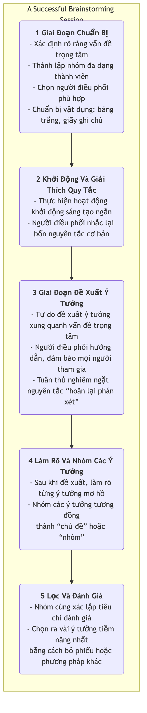

# Brainstorming

Khi tìm kiếm sự đổi mới và giải quyết các vấn đề phức tạp, kẻ thù lớn nhất của chúng ta thường là những mô hình tư duy hạn chế, ăn sâu trong tâm trí. **Brainstorming** (thảo luận nhóm để tìm ý tưởng mới) là một kỹ thuật cổ điển, mạnh mẽ và phổ biến rộng rãi để **tạo ra ý tưởng theo nhóm**, được thiết kế để phá vỡ những xiềng xích tư duy này. Phương pháp này được Alex F. Osborn, một chuyên gia quảng cáo, đề xuất vào những năm 1940, với mục tiêu cốt lõi là khuyến khích người tham gia đưa ra càng nhiều ý tưởng mới mẻ, đa dạng, thậm chí là phi thực tế trong một khoảng thời gian ngắn, bằng cách tạo ra một bầu không khí hoàn toàn cởi mở, tự do và không phán xét.

Bản chất của brainstorming nằm ở nguyên tắc **"số lượng trước, chất lượng sau."** Nó tin tưởng chắc chắn rằng chất lượng ý tưởng có thể được phát triển thông qua việc tích lũy số lượng. Bằng cách hoãn lại sự phán xét và khuyến khích những ý tưởng táo bạo, brainstorming có thể hiệu quả chuyển đổi khả năng sáng tạo của nhóm từ chế độ "phê bình" sang chế độ "sản sinh", từ đó khám phá nhiều khả năng chưa biết trong một môi trường an toàn và cung cấp nguồn nguyên liệu phong phú cho việc lọc và phát triển sâu hơn.

## Bốn Nguyên Tắc Cơ Bản Của Brainstorming

Để đảm bảo brainstorming đạt được kết quả mong muốn, bốn nguyên tắc cơ bản sau đây do Osborn đề xuất phải được tuân thủ nghiêm ngặt. Đây là nền tảng để tạo ra một môi trường an toàn và tự do.

1.  **Hoãn Lại Phán Xét**: Đây là nguyên tắc cốt lõi và bất khả xâm phạm nhất. Trong quá trình brainstorming, **không được phép** đưa ra bất kỳ sự chỉ trích, chất vấn hay phán xét nào đối với bất kỳ ý tưởng nào, dù có vẻ điên rồ hay phi thực tế đến đâu. Việc phán xét sẽ được thực hiện ở giai đoạn lọc ý tưởng sau đó.

2.  **Khuyến Khích Ý Tưởng Táo Bạo**: Khuyến khích người tham gia suy nghĩ vượt khỏi khuôn khổ. Những ý tưởng có vẻ điên rồ hoặc phi logic thường có thể phá vỡ sự cứng nhắc trong tư duy và truyền cảm hứng cho người khác đưa ra những ý tưởng đột phá hơn.

3.  **Theo Đuổi Số Lượng**: Đặt ra mục tiêu định lượng rõ ràng, thách thức (ví dụ: "Đưa ra 100 ý tưởng trong 20 phút"). Số lượng ý tưởng càng nhiều thì khả năng xuất hiện những ý tưởng chất lượng càng lớn.

4.  **Xây Dựng Trên Ý Tưởng Của Người Khác**: Còn được gọi là "piggybacking" hoặc "snowballing". Khuyến khích người tham gia lắng nghe kỹ các ý tưởng của người khác và suy nghĩ về cách kết hợp, cải tiến hoặc mở rộng chúng, từ đó tạo ra những ý tưởng mới, tinh tế hơn. Điều này thể hiện hiệu ứng cộng hưởng "1+1>2."

### Quy Trình Brainstorming

<!-- mermaid 源文件：Brainstorming-Tutorial-vi-mermaid-live-1.mmd -->

## Cách Tổ Chức Một Buổi Brainstorming Hiệu Quả

1.  **Chuẩn Bị Kỹ Lưỡng**
    *   **Xác Định Rõ Vấn Đề Trọng Tâm**: Vấn đề không nên quá rộng hoặc quá hẹp. Ví dụ, thay vì câu hỏi quá chung chung "Làm thế nào để tăng lợi nhuận công ty?", hãy cụ thể hóa thành "Làm thế nào để tăng tỷ lệ mua hàng lặp lại của khách hàng hiện tại lên 20%?"
    *   **Thành Lập Nhóm Đa Dạng**: Mời từ 5-10 người đến từ các lĩnh vực và chức năng khác nhau tham gia. Quan điểm đa dạng sẽ dẫn đến ý tưởng phong phú hơn.
    *   **Chọn Người Điều Phối Xuất Sắc**: Người điều phối không trực tiếp đưa ra ý tưởng; vai trò của họ là dẫn dắt quy trình, quản lý thời gian, khuyến khích sự tham gia và kiên quyết ngăn chặn mọi hành vi phán xét.

2.  **Tạo Môi Trường Phù Hợp**
    *   Chọn một không gian thoải mái, thư giãn và chuẩn bị các công cụ như bảng trắng, giấy ghi chú, bút viết.
    *   Trước khi bắt đầu chính thức, bạn có thể sử dụng các trò chơi khởi động sáng tạo ngắn (ví dụ: "100 cách dùng cho một cái kẹp giấy") để giúp người tham gia thư giãn và bước vào trạng thái tư duy sáng tạo.

3.  **Đề Xuất Và Ghi Nhận Ý Tưởng**
    *   Người điều phối thông báo bắt đầu và đặt ra giới hạn thời gian rõ ràng (thường là 15-30 phút).
    *   Khuyến khích người tham gia nói to bất kỳ ý tưởng nào họ nghĩ ra, hoặc viết lên giấy ghi chú và dán lên tường. Người điều phối hoặc người ghi chép cần nhanh chóng ghi lại tất cả các ý tưởng mà không chỉnh sửa hay xóa bỏ bất kỳ điều gì.

4.  **Tập Trung Và Đánh Giá**
    *   Sau giai đoạn đề xuất, chuyển sang giai đoạn tập trung. Trước tiên, người điều phối dẫn dắt mọi người nhanh chóng xem lại tất cả các ý tưởng, làm rõ những ý tưởng còn mơ hồ.
    *   Sau đó, phân loại và gộp các ý tưởng tương đồng thành một vài hướng chủ đề cốt lõi.
    *   Cuối cùng, nhóm cùng nhau xác lập một vài tiêu chí đánh giá (ví dụ: "tính khả thi", "tính đổi mới", "giá trị với người dùng") và thông qua việc bỏ phiếu (ví dụ: mỗi người nhận được vài nhãn dán nhỏ), chọn ra 2-3 ý tưởng được công nhận nhiều nhất và có tiềm năng để nghiên cứu sâu hơn.

## Các Trường Hợp Ứng Dụng

**Trường Hợp 1: Đặt Tên Cho Ứng Dụng Mới**

*   **Vấn Đề Trọng Tâm**: "Hãy nghĩ ra một cái tên dễ nhớ, thu hút cho ứng dụng xã hội tập trung vào 'chia sẻ đồ ăn.'"
*   **Ứng Dụng**: Nhóm tiếp thị tổ chức buổi brainstorming kéo dài 30 phút. Họ đưa ra hơn 80 cái tên ứng viên, bao gồm "Foodie Notes," "Taste Buddies," và "Snap & Eat." Trong giai đoạn lọc sau đó, họ cuối cùng chọn được một cái tên phản ánh cả tính năng sản phẩm và yếu tố xã hội.

**Trường Hợp 2: Giải Quyết Khiếu Nại Của Khách Hàng**

*   **Vấn Đề Trọng Tâm**: "Làm thế nào để giảm 50% số khiếu nại của khách hàng về 'giao hàng chậm trễ'?"
*   **Ứng Dụng**: Một nhóm liên phòng ban gồm nhân viên chăm sóc khách hàng, vận hành và logistics cùng thảo luận. Các ý tưởng đưa ra bao gồm: "Hợp tác với các công ty vận chuyển nhanh hơn," "Thiết lập kho hàng trung chuyển," "Tối ưu hóa quy trình đóng gói," và "Cung cấp phiếu giảm giá cho đơn hàng bị trễ." Những ý tưởng này tạo ra điểm khởi đầu phong phú để xây dựng giải pháp cụ thể.

**Trường Hợp 3: Thiết Kế Chiến Dịch Marketing**

*   **Vấn Đề Trọng Tâm**: "Làm thế nào để lên kế hoạch cho một chiến dịch marketing trực tuyến sáng tạo cho thương hiệu nước ép của chúng ta trong mùa hè sắp tới?"
*   **Ứng Dụng**: Các thành viên trong nhóm thả sức tưởng tượng, đề xuất nhiều ý tưởng như: "Tổ chức cuộc thi UGC chủ đề 'Mùa hè đặc biệt'", "Hợp tác với các blogger du lịch nổi tiếng để phát trực tiếp từ các hòn đảo", "Giới thiệu bao bì có thể đông lạnh thành kem que," và "Khởi động thử thách mạng xã hội về hương vị mùa hè." Những ý tưởng này, sau khi kết hợp và tinh chỉnh, cuối cùng hình thành một kế hoạch marketing hoàn chỉnh.

## Ưu Điểm Và Thách Thức Của Brainstorming

**Ưu Điểm Cốt Lõi**

*   **Tạo Ra Nhiều Ý Tưởng Hiệu Quả**: Có thể nhanh chóng tạo ra một lượng lớn ý tưởng đa dạng trong thời gian ngắn.
*   **Thúc Đẩy Hợp Tác Và Đoàn Kết Nhóm**: Tạo ra môi trường bình đẳng, không áp lực, giúp tăng cường sự gắn kết và sáng tạo tập thể.
*   **Phá Vỡ Tư Duy Cứng Nhắc**: Bằng cách khuyến khích ý tưởng táo bạo và hoãn lại phán xét, nó hiệu quả giúp nhóm thoát khỏi lối suy nghĩ thông thường.

**Thách Thức Tiềm Ẩn**

*   **Nguy Cơ "Suy Nghĩ Nhóm" (Groupthink)**: Nếu không được điều phối tốt, ý kiến của một vài cá nhân có thể thống trị cuộc thảo luận, hoặc mọi người có xu hướng đưa ra các ý tưởng "an toàn" hơn.
*   **Hiện Tượng "Ăn Không" (Free-Riding)**: Trong nhóm, một số cá nhân có thể ít chủ động và đơn giản là "ăn không", đóng góp ít ý tưởng.
*   **Khó Thực Hiện**: Việc nghiêm túc tuân thủ nguyên tắc "hoãn lại phán xét" đòi hỏi kỹ năng cao từ người điều phối và văn hóa nhóm trưởng thành.
*   **Thiếu Giai Đoạn Theo Sau**: Bản thân brainstorming chỉ chịu trách nhiệm tạo ra ý tưởng. Nếu không có cơ chế lọc, đánh giá và thực thi hệ thống sau đó, ngay cả những ý tưởng tốt nhất cũng chỉ là những lâu đài trên không.

## Mở Rộng Và Liên Kết

*   **Reverse Brainstorming**: Một biến thể thú vị. Thay vì hỏi "Làm thế nào để thành công?", hãy hỏi "Làm thế nào để hoàn toàn thất bại?" Bằng cách xác định tất cả các yếu tố có thể dẫn đến thất bại, nhóm sau đó có thể suy nghĩ ngược lại để đề ra các biện pháp phòng ngừa.
*   **Brainwriting**: Để tránh tình trạng những người nói giỏi thống trị cuộc thảo luận, có thể sử dụng hình thức viết. Ví dụ, phương pháp 6-3-5, trong đó 6 người tham gia mỗi người viết 3 ý tưởng trong 5 phút, sau đó chuyển giấy cho người tiếp theo để lấy cảm hứng và phát triển.
*   **Six Thinking Hats**: Có thể được sử dụng như một công cụ có cấu trúc cho giai đoạn "đánh giá" sau brainstorming, hướng dẫn nhóm xem xét các ý tưởng đã lọc từ nhiều góc độ khác nhau.
*   **Mind Mapping**: Một công cụ trực quan tuyệt vời để tổ chức và cấu trúc kết quả brainstorming.

---
*Tham khảo: Alex F. Osborn lần đầu tiên trình bày một cách hệ thống các nguyên tắc và phương pháp brainstorming trong cuốn sách "Applied Imagination" năm 1953. Đến nay, đây vẫn là một trong những kỹ thuật tạo ý tưởng được sử dụng rộng rãi nhất trên toàn thế giới.*