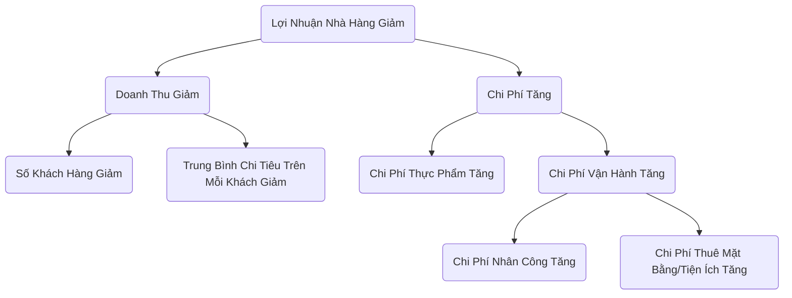
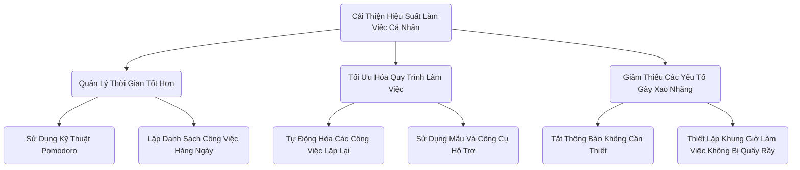

# Hướng Dẫn Phân Tích Cây Logic

## 1. Cây Logic Là Gì?

**Cây logic** là một công cụ phân tích trực quan mạnh mẽ, được sử dụng để chia nhỏ một vấn đề phức tạp hoặc chủ đề lớn thành các phần nhỏ hơn, dễ quản lý hơn. Nguyên tắc cốt lõi của nó là **MECE (Mutually Exclusive, Collectively Exhaustive)**, nghĩa là các phần được phân tách không được chồng chéo và không được bỏ sót.

Cây logic giúp chúng ta xây dựng một khuôn khổ rõ ràng cho tư duy, đảm bảo tính chặt chẽ và toàn diện của phân tích.

## 2. Các Loại Cây Logic Chính

Cây logic chủ yếu được chia thành hai loại, dùng để giải quyết các vấn đề có bản chất khác nhau:

### a. Cây Vấn Đề (Cây Chẩn Đoán)

-   **Mục đích**: Dùng để chẩn đoán và tìm hiểu "**tại sao**" một vấn đề xảy ra.

-   **Cấu trúc**: Bắt đầu từ một vấn đề cốt lõi (gốc cây), liên tục phân tích sâu hơn để tìm ra các nguyên nhân tiềm năng dẫn đến vấn đề. Mỗi lớp nhánh là lời giải thích sâu hơn cho lớp vấn đề trước đó.

-   **Tình huống áp dụng**: Phân tích nguyên nhân gốc rễ, chẩn đoán hiệu suất giảm sút, khắc phục sự cố, v.v.

### b. Cây "Làm Thế Nào" (Cây Giải Pháp)

-   **Mục đích**: Dùng để hình dung và lập kế hoạch "**làm thế nào**" để đạt được mục tiêu hoặc giải quyết vấn đề.
-   **Cấu trúc**: Bắt đầu từ một mục tiêu tổng thể (gốc cây), sau đó phân rã thành các chiến lược cụ thể, có thể hành động được hoặc các kế hoạch hành động.
-   **Tình huống áp dụng**: Lập kế hoạch chiến lược, xác định mục tiêu, lập kế hoạch dự án, tìm kiếm giải pháp, v.v.

## 3. Cách Xây Dựng Cây Logic?

### Bước Một: Xác Định Rõ Vấn Đề Hoặc Mục Tiêu Cốt Lõi

-   **Cây Vấn Đề**: Nêu rõ "vấn đề" cần phân tích. Ví dụ: "Tại sao tỷ lệ rời bỏ người dùng trên website của chúng ta lại tăng?"
-   **Cây "Làm Thế Nào"**: Xác định rõ "mục tiêu" cần đạt được. Ví dụ: "Làm thế nào để tăng số người dùng hoạt động hàng tháng của website lên 20%?"
-   Sử dụng vấn đề hoặc mục tiêu này làm điểm bắt đầu (gốc cây) của cây logic.

### Bước Hai: Thực Hiện Phân Tích Ở Cấp Độ Đầu Tiên (Áp Dụng Nguyên Tắc MECE)

-   **Tư duy mở**: Xung quanh vấn đề/mục tiêu cốt lõi, hãy suy nghĩ về những thành phần chính mà nó có thể được chia nhỏ thành.
-   **Áp dụng nguyên tắc MECE**: Đảm bảo các nhánh ở cấp độ đầu tiên không trùng lặp (không chồng chéo) và bao quát đầy đủ (không bỏ sót khía cạnh quan trọng).
    -   **Ví dụ (Cây Vấn Đề)**: Tăng tỷ lệ rời bỏ người dùng có thể chia thành: "Rời bỏ người dùng mới" và "Rời bỏ người dùng hiện tại."
    -   **Ví dụ (Cây "Làm Thế Nào")**: Tăng số người dùng hoạt động hàng tháng có thể chia thành: "Thu hút người dùng mới," "Tăng mức độ hoạt động của người dùng hiện tại," và "Lôi kéo lại người dùng đã rời bỏ."

### Bước Ba: Tiếp Tục Phân Tích Từng Tầng, Từng Lớp

-   **Tiếp tục đặt câu hỏi**: Với mỗi nhánh, tiếp tục đặt câu hỏi "Tại sao điều này xảy ra?" (Cây Vấn Đề) hoặc "Làm thế nào để thực hiện cụ thể điều này?" (Cây "Làm Thế Nào), để tiếp tục phân tích sâu hơn.
-   **Duy trì cấu trúc rõ ràng**: Tiếp tục áp dụng nguyên tắc MECE ở từng cấp độ cho đến khi vấn đề được phân tích đến mức độ đủ cụ thể để có thể kiểm chứng bằng dữ liệu hoặc hành động trực tiếp.

### Bước Bốn: Xác Minh Giả Thuyết Và Ưu Tiên

-   **Xác minh bằng dữ liệu**: Với cây vấn đề, thu thập dữ liệu để kiểm chứng các nhánh nào là nguyên nhân thực sự.
-   **Đánh giá các giải pháp**: Với cây "làm thế nào", đánh giá tính khả thi, chi phí và hiệu quả kỳ vọng của từng kế hoạch hành động.
-   **Xác định đường dẫn quan trọng**: Nhận diện các nguyên nhân chính hoặc hành động trọng tâm có ảnh hưởng lớn nhất đến việc giải quyết vấn đề hoặc đạt được mục tiêu, và ưu tiên xử lý chúng.

## 4. Các Trường Hợp Thực Tế

### Trường Hợp 1: Cây Vấn Đề - Phân Tích "Tại Sao Lợi Nhuận Nhà Hàng Giảm?"

<!--

-->

**Phân tích**: Thông qua sơ đồ cây này, các nhà quản lý có thể nhìn rõ các yếu tố chính dẫn đến việc lợi nhuận giảm và có thể thu thập dữ liệu cho từng nhánh (ví dụ: "Số Khách Hàng Giảm") để phân tích sâu hơn.

### Trường Hợp 2: Cây "Làm Thế Nào" - Lập Kế Hoạch "Làm Thế Nào Để Cải Thiện Hiệu Suất Làm Việc Cá Nhân?"

**Phân tích**: Sơ đồ cây này chia nhỏ một mục tiêu trừu tượng thành chuỗi các bước cụ thể, có thể hành động được, giúp cá nhân xây dựng kế hoạch cải thiện rõ ràng.

Cây logic là một trong những kỹ năng cốt lõi thiết yếu đối với các chuyên gia tư vấn, quản lý sản phẩm và lập kế hoạch chiến lược, vì nó có thể nâng cao độ sâu và độ rộng của tư duy một cách đáng kể.