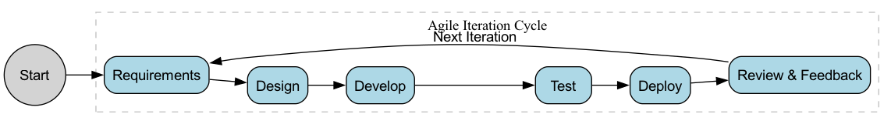

# Phát Triển Linh Hoạt (Agile Development)

Trước thế kỷ 21, việc phát triển phần mềm thường áp dụng mô hình "**Nước Chảy (Waterfall Model)**"—một quy trình tuyến tính, từng giai đoạn rõ ràng, giống như việc xây một cây cầu: dành hàng tháng hoặc thậm chí hàng năm cho phân tích yêu cầu và thiết kế chi tiết, sau đó là giai đoạn phát triển và kiểm thử kéo dài, cuối cùng giao cho khách hàng một sản phẩm "hoàn hảo". Tuy nhiên, trong thời đại internet, khi nhu cầu thay đổi nhanh chóng và thị trường đầy bất định, những điểm yếu của mô hình này ngày càng lộ rõ: phản ứng chậm, rủi ro lớn, và thường dẫn đến việc sản phẩm hoàn thành nhưng đã không còn phù hợp với nhu cầu thực tế của người dùng. **Phát triển linh hoạt (Agile Development)** đã ra đời như một phong trào cách mạng nhằm giải quyết vấn đề này.

Agile không phải là một phương pháp hay quy trình cụ thể, mà là một tập hợp các **giá trị và nguyên tắc** hướng đến việc đón nhận sự thay đổi, gia tăng giá trị cho khách hàng và thúc đẩy hiệu quả hợp tác. Nó bắt nguồn từ "**Tuyên ngôn về Phát triển Phần mềm Linh hoạt (Manifesto for Agile Software Development)**" được công bố vào năm 2001. Ý tưởng cốt lõi của nó là từ bỏ sự ám ảnh về "kế hoạch hoàn hảo", thay vào đó là việc liên tục và nhanh chóng cung cấp phần mềm hoạt động thông qua các quy trình phát triển **ngắn hạn, lặp lại, từng bước tiến triển**. Đồng thời, liên tục thu thập phản hồi và điều chỉnh. Agile chia một dự án lớn, không thể dự đoán trước thành một chuỗi các "sprint" ngắn và dễ quản lý hơn, từ đó duy trì tính linh hoạt và khả năng thích ứng trong một thị trường luôn biến động.

## Tuyên ngôn về Phát triển Phần mềm Linh hoạt (Agile Manifesto)

Tinh thần của Agile được thể hiện rõ ràng qua bốn giá trị cốt lõi và mười hai nguyên tắc hỗ trợ.

**Bốn Giá Trị Cốt Lõi**:

> Chúng tôi đang khám phá ra những cách tốt hơn để phát triển phần mềm thông qua thực hành và hỗ trợ người khác làm điều tương tự. Qua đó, chúng tôi đã học được rằng:
>
> **Cá nhân và tương tác** quan trọng hơn là quy trình và công cụ
> **Phần mềm hoạt động** quan trọng hơn là tài liệu đầy đủ
> **Hợp tác với khách hàng** quan trọng hơn là đàm phán hợp đồng
> **Phản ứng với thay đổi** quan trọng hơn là tuân theo kế hoạch
>
> Tức là, mặc dù các yếu tố ở bên phải cũng có giá trị, nhưng chúng tôi đánh giá cao các yếu tố ở bên trái hơn.

Bốn giá trị này phản ánh sâu sắc bản chất của tư duy Agile: lấy con người làm trung tâm, lấy giá trị làm định hướng, lấy hợp tác làm nền tảng và hướng đến khả năng thích ứng.

### Chu kỳ lặp lại của Phát triển Linh hoạt (Agile Development Iteration Cycle)

## Mười Hai Nguyên Tắc Của Agile

Mười hai nguyên tắc này là những hướng dẫn cụ thể để hiện thực hóa các giá trị Agile, bao gồm:

1.  Mục tiêu cao nhất của chúng ta là làm hài lòng khách hàng bằng cách giao phần mềm có giá trị một cách sớm và liên tục.
2.  Chào đón những thay đổi về yêu cầu, ngay cả khi chúng xảy ra muộn trong quá trình phát triển. Các quy trình Agile tận dụng sự thay đổi để mang lại lợi thế cạnh tranh cho khách hàng.
3.  Giao phần mềm hoạt động thường xuyên, với chu kỳ từ vài tuần đến vài tháng, ưu tiên chu kỳ ngắn hơn.
4.  Người làm kinh doanh và các nhà phát triển phải làm việc cùng nhau hàng ngày trong suốt dự án.
5.  Xây dựng dự án xung quanh những cá nhân có động lực. Cung cấp cho họ môi trường và sự hỗ trợ cần thiết, và tin tưởng họ sẽ hoàn thành công việc.
6.  Phương pháp hiệu quả và trực tiếp nhất để truyền đạt thông tin tới và trong nhóm phát triển là qua cuộc trò chuyện trực tiếp.
7.  Phần mềm hoạt động là thước đo tiến độ chính yếu.
8.  Các quy trình Agile thúc đẩy phát triển bền vững. Những người tài trợ, các nhà phát triển và người dùng nên có thể duy trì nhịp độ công việc này vô hạn định.
9.  Luôn chú trọng vào chất lượng kỹ thuật và thiết kế tốt để tăng cường tính linh hoạt.
10. Đơn giản hóa—nghệ thuật của việc tối đa hóa lượng công việc không cần làm—là điều thiết yếu.
11. Những kiến trúc, yêu cầu và thiết kế tốt nhất đến từ các nhóm tự tổ chức.
12. Vào những khoảng thời gian định kỳ, nhóm tự đánh giá cách để trở nên hiệu quả hơn, sau đó điều chỉnh hành vi của mình tương ứng.

## Các Khung Làm Việc Agile Phổ Biến

Agile là một tập hợp các triết lý, chứ không phải một quy trình cụ thể. Dưới sự dẫn dắt của tư duy Agile, nhiều khung làm việc cụ thể và có thể hành động đã ra đời, trong đó nổi bật nhất bao gồm:

*   **Scrum**: Hiện là khung làm việc Agile phổ biến và được áp dụng rộng rãi nhất. Nó cung cấp một khuôn khổ hợp tác rõ ràng, lặp lại cho các nhóm thông qua việc xác định một loạt vai trò (ví dụ: Product Owner, Scrum Master), sự kiện (ví dụ: Sprint Planning, Daily Scrum), và sản phẩm (ví dụ: Product Backlog).
*   **Kanban**: Một phương pháp Agile tập trung nhiều hơn vào việc trực quan hóa quy trình làm việc và tối ưu hóa hiệu quả giao hàng liên tục. Nó nhấn mạnh việc giới hạn công việc đang thực hiện (WIP) và xử lý công việc theo hệ thống "kéo", nhằm tối đa hóa hiệu quả dòng giá trị.
*   **Extreme Programming (XP)**: Một khung Agile tập trung nhiều hơn vào các thực hành kỹ thuật xuất sắc. Nó đề xướng một loạt các thực hành cụ thể như Phát triển Hướng Kiểm thử (TDD), Lập trình Cặp (Pair Programming), Tích hợp Liên tục (Continuous Integration)... nhằm đảm bảo chất lượng phần mềm cao và bền vững.

## Các Trường Hợp Ứng Dụng Thực Tế

**Ví dụ 1: Phát triển tính năng cho một trang web thương mại điện tử**

*   **Mô hình Nước Chảy Truyền Thống**: Dành 3 tháng phân tích yêu cầu chi tiết, thiết kế một bản kế hoạch hoàn hảo với tất cả các tính năng bao gồm "khuyến nghị cá nhân hóa", "thương mại trực tiếp", và "thử đồ ảo". Sau đó dành 6 tháng phát triển, và cuối cùng khi ra mắt, phát hiện ra rằng tính năng thực sự cần thiết nhất với người dùng lại là một quy trình thanh toán mượt mà hơn.
*   **Mô hình Agile**:
    *   **Sprint 1 (2 tuần)**: Nhóm tập trung vào một việc duy nhất—tối ưu hóa quy trình thanh toán. Sau hai tuần, một phiên bản mới với tốc độ thanh toán nhanh hơn 50% được ra mắt.
    *   **Sprint 2 (2 tuần)**: Dựa trên phản hồi của người dùng, ưu tiên tiếp theo cao nhất là "tìm kiếm sản phẩm". Nhóm dành hai tuần để phát triển và triển khai chức năng tìm kiếm thông minh hơn.
    *   **...Cứ tiếp tục như vậy**: Nhóm cung cấp một phiên bản phần mềm có giá trị thực tế cho người dùng trong mỗi vòng lặp và liên tục điều chỉnh hướng phát triển tiếp theo dựa trên phản hồi từ thị trường.

**Ví dụ 2: Mô hình "Squad" của Spotify**

*   **Tình huống**: Spotify, dịch vụ phát nhạc trực tuyến lớn nhất thế giới, là một ví dụ điển hình về văn hóa tổ chức theo tư duy Agile.
*   **Ứng dụng**: Họ chia toàn bộ nhóm nghiên cứu và phát triển thành nhiều nhóm nhỏ, có kỹ năng cao, đa chức năng và tự tổ chức gọi là "Squads". Mỗi nhóm hoạt động như một công ty khởi nghiệp thu nhỏ, có toàn quyền từ đầu đến cuối về một tính năng hoặc lĩnh vực kinh doanh cụ thể (ví dụ: "chức năng tìm kiếm" hoặc "danh sách phát của người dùng"). Mô hình này đã cải thiện đáng kể hiệu quả phát triển, khả năng đổi mới và cảm giác làm chủ của nhân viên.

**Ví dụ 3: Nhóm khởi nghiệp phần cứng**

*   **Tình huống**: Một nhóm muốn phát triển một chiếc đồng hồ thông minh mới.
*   **Ứng dụng**: Họ không bắt đầu bằng việc thiết kế và sản xuất sản phẩm cuối cùng. Thay vào đó, họ áp dụng phương pháp Agile, đầu tiên sử dụng các linh kiện có sẵn để nhanh chóng tạo ra một **phiên bản phần cứng MVP (Minimum Viable Product)** tối giản có thể kiểm chứng nhu cầu cốt lõi, sau đó lập tức đưa cho người dùng thử nghiệm. Bằng cách quan sát phản hồi thực tế từ người dùng, họ liên tục cải tiến thiết kế phần cứng và tính năng phần mềm, từ đó tránh được những tổn thất lớn về chi phí khuôn mẫu và sản xuất do những quyết định sai lầm ban đầu.

## Ưu Điểm và Thách Thức Của Agile

**Những Ưu Điểm Cốt Lõi**

*   **Tính Thích Ứng và Linh Hoạt Cao Hơn**: Có thể bình tĩnh đón nhận những thay đổi về yêu cầu và phản ứng nhanh với thị trường.
*   **Giao Giá Trị Sớm và Liên Tục Hơn**: Khách hàng có thể sử dụng các tính năng cốt lõi sớm hơn và nhận được các bản cập nhật liên tục.
*   **Mức Độ Hài Lòng Của Khách Hàng Cao Hơn**: Đảm bảo sản phẩm cuối cùng là thứ khách hàng thực sự mong muốn thông qua sự hợp tác chặt chẽ.
*   **Rủi Ro Thấp Hơn**: Các vòng lặp ngắn hạn giúp tránh đầu tư quá nhiều nguồn lực vào hướng sai, giảm đáng kể rủi ro thất bại của dự án.
*   **Tinh Thần Cao Hơn Trong Nhóm Làm Việc**: Trao quyền cho các nhóm tự tổ chức, nâng cao tính tự chủ và cảm giác thành tựu của các thành viên.

**Những Thách Thức Tiềm Ẩn**

*   **Yêu Cầu Về Sự Thay Đổi Văn Hóa và Tư Duy Sâu Rộng**: Thành công của Agile không chỉ đơn thuần là thay đổi quy trình; nó đòi hỏi cả quản lý và thành viên phải chuyển từ tư duy "lệnh và kiểm soát" sang "tin tưởng và trao quyền".
*   **Yêu Cầu Cao Về Cá Nhân**: Thành viên trong nhóm Agile cần có kỹ năng giao tiếp tốt, tinh thần hợp tác cao và khả năng làm việc đa lĩnh vực.
*   **Thiếu Tài Liệu Hướng Dẫn**: Nếu hiểu sai, có thể dẫn đến việc thiếu tài liệu cần thiết, gây khó khăn cho bảo trì và bàn giao sau này.
*   **Khó Dự Đoán Dài Hạn**: Do bản chất đón nhận sự thay đổi, Agile khiến việc đưa ra cam kết chính xác về thời gian và chi phí giao hàng dài hạn ngay từ đầu dự án trở nên khó khăn.

## Mở Rộng và Liên Kết

*   **Lean Startup**: Rất phù hợp với tư duy Agile, vòng lặp phản hồi "xây dựng-đo lường-học hỏi" của Lean Startup có thể được xem như ứng dụng của Agile trong việc xác minh mô hình kinh doanh.
*   **DevOps**: Là sự mở rộng của tư duy Agile trong lĩnh vực phát triển phần mềm (Dev) và vận hành công nghệ thông tin (Ops). Nó nhằm phá bỏ rào cản giữa phát triển và vận hành thông qua thay đổi văn hóa, thực hành và công cụ, đạt được việc giao hàng và triển khai phần mềm nhanh chóng và đáng tin cậy hơn.

---
*Tham khảo: "Tuyên ngôn về Phát triển Phần mềm Linh hoạt" là nguồn chung và hiến chương định hướng cho tất cả các thực hành Agile. Những người ký tên vào tuyên ngôn như Kent Beck, Martin Fowler và Jeff Sutherland là những bậc thầy và nhà tư tưởng quan trọng nhất trong lĩnh vực Agile.*