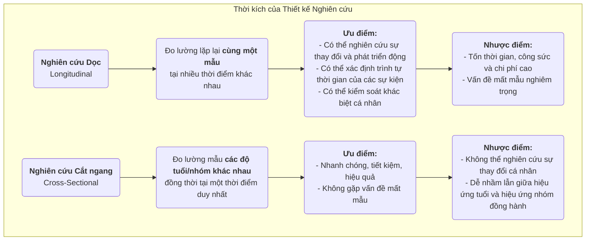

# Nghiên cứu dọc (Longitudinal Research)

Khi khám phá dải dài của sự phát triển con người, biến đổi xã hội và tiến hóa của bệnh tật, chúng ta cần một phương pháp nghiên cứu có khả năng ghi lại được yếu tố quan trọng mang tên "thời gian". **Nghiên cứu dọc** chính là chiếc "máy ảnh" như vậy, liên tục và định kỳ quan sát và đo lường **mẫu nghiên cứu giống nhau** trong một khoảng thời gian dài. Mục tiêu cốt lõi của nó là tiết lộ cách các hiện tượng **thay đổi, phát triển và tiến hóa** theo thời gian, đồng thời điều tra tác động lâu dài của các sự kiện ban đầu lên kết quả sau này.

Không giống như các nghiên cứu cắt ngang (cross-sectional), chỉ cung cấp một "bức ảnh" tại một thời điểm duy nhất, nghiên cứu dọc mang đến cho chúng ta một "bộ phim tài liệu". Nó cho phép quan sát đường đi của sự phát triển cá nhân, quá trình thay đổi nhận thức và toàn bộ diễn tiến của một căn bệnh từ lúc khởi phát đến khi phát triển đầy đủ. Nhờ đó, ta có thể xác lập rõ ràng trình tự thời gian của các sự kiện khi khám phá mối quan hệ nhân quả. Khi bạn muốn trả lời những câu hỏi mang tính động về quá trình và sự phát triển, ví dụ như "Thói quen đọc sách thời thơ ấu ảnh hưởng thế nào đến mức thu nhập trưởng thành?" hay "Một cải cách chính sách đã tạo ra tác động bền vững gì trong thập kỷ tiếp theo?", nghiên cứu dọc trở thành một công cụ mạnh mẽ và không thể thiếu.

## Đặc điểm cốt lõi và các loại nghiên cứu dọc

Điểm chung của tất cả các nghiên cứu dọc là đều theo dõi yếu tố "thời gian", nhưng chúng có thể được chia thành ba loại chính dựa trên bản chất của đối tượng được theo dõi:

*   **Nghiên cứu nhóm đồng hành (Cohort Study)**: Đây là loại phổ biến nhất. Các nhà nghiên cứu chọn một nhóm người cụ thể (gọi là "nhóm đồng hành" hoặc "cohort") chia sẻ cùng một đặc điểm hoặc trải nghiệm chung (ví dụ: "tất cả trẻ sơ sinh sinh năm 2000" hoặc "nhân viên gia nhập một công ty nhất định vào năm 2010") và theo dõi nhóm này liên tục trong nhiều thập kỷ.
*   **Nghiên cứu bảng (Panel Study)**: Tương tự như nghiên cứu nhóm đồng hành, nhưng nó theo dõi chính xác **cùng một mẫu cá nhân** qua thời gian. Mỗi lần khảo sát đều tiếp cận cùng một nhóm người, cho phép các nhà nghiên cứu phân tích chính xác đường đi của sự thay đổi ở từng cá nhân.
*   **Nghiên cứu xu hướng (Trend Study)**: Loại nghiên cứu này tập trung vào sự thay đổi đặc điểm của một "dân số" theo thời gian, nhưng các mẫu cá nhân được chọn cho mỗi khảo sát là khác nhau. Ví dụ, để nghiên cứu sự thay đổi thái độ của công chúng đối với các vấn đề môi trường, một tổ chức nghiên cứu có thể chọn ngẫu nhiên một nhóm mẫu mới trên toàn quốc mỗi năm năm để khảo sát.

### So sánh nghiên cứu dọc và nghiên cứu cắt ngang

## Cách thực hiện một nghiên cứu dọc

1.  **Xác lập mục tiêu nghiên cứu dài hạn**
    Rõ ràng xác định những thay đổi hoặc phát triển bạn muốn theo dõi và các yếu tố ảnh hưởng tiềm năng bạn quan tâm. Nghiên cứu dọc là một đầu tư dài hạn và phải được hỗ trợ bởi các mục tiêu nghiên cứu rõ ràng và có ý nghĩa.

2.  **Xác định và chọn mẫu nhóm đồng hành hoặc mẫu bảng**
    Chính xác xác định dân số nghiên cứu và sử dụng các phương pháp lấy mẫu phù hợp để chọn mẫu ban đầu. Chất lượng và tính đại diện của mẫu ban đầu là yếu tố then chốt.

3.  **Tiến hành khảo sát nền tảng (baseline survey)**
    Tại thời điểm bắt đầu nghiên cứu, thực hiện đợt thu thập dữ liệu toàn diện đầu tiên (khảo sát nền tảng) để đo trạng thái ban đầu của tất cả các biến quan tâm.

4.  **Thiết kế và thực hiện các đợt khảo sát theo dõi tiếp theo**
    Xác định khoảng thời gian cho các đợt khảo sát theo dõi tiếp theo (ví dụ: hàng năm, mỗi năm năm) và thiết kế các công cụ đo lường nhất quán. Duy trì liên lạc với mẫu và giảm tỷ lệ mất mẫu là một trong những thách thức lớn nhất trong suốt quá trình nghiên cứu dài hạn.

5.  **Quản lý và phân tích dữ liệu**
    Cấu trúc dữ liệu dọc phức tạp và đòi hỏi cơ sở dữ liệu chuyên nghiệp để quản lý. Trong phân tích, các nhà nghiên cứu sử dụng các mô hình thống kê nâng cao (như mô hình đường cong tăng trưởng, phân tích sinh tồn) để phân tích đường đi của các biến theo thời gian và các yếu tố ảnh hưởng.

## Các trường hợp ứng dụng kinh điển

**Trường hợp 1: Nghiên cứu Phát triển Người trưởng thành của Đại học Harvard**

*   **Bối cảnh**: Một trong những nghiên cứu dọc lâu đời nhất trong lịch sử, bắt đầu từ năm 1938 và theo dõi 724 nam giới trong gần 80 năm.
*   **Ứng dụng**: Các nhà nghiên cứu định kỳ thu thập dữ liệu về công việc, gia đình, sức khỏe và các khía cạnh khác của họ thông qua bảng hỏi, phỏng vấn, hồ sơ y tế, v.v. Kết luận nổi tiếng nhất của nghiên cứu này là các mối quan hệ cá nhân tốt đẹp và ấm áp là yếu tố quan trọng nhất dự đoán hạnh phúc và sức khỏe dài hạn, thậm chí còn quan trọng hơn cả tiền bạc, danh vọng và yếu tố di truyền. Kết luận này chỉ có thể được rút ra thông qua việc theo dõi trọn đời.

**Trường hợp 2: Nghiên cứu nhóm đồng hành nghìn năm của Anh (UK Millennium Cohort Study)**

*   **Bối cảnh**: Một nghiên cứu nhóm đồng hành quốc gia theo dõi khoảng 19.000 trẻ em Anh sinh trong giai đoạn từ 2000 đến 2002.
*   **Ứng dụng**: Nghiên cứu thu thập dữ liệu toàn diện ở nhiều độ tuổi khác nhau (ví dụ: 9 tháng, 3, 5, 7, 11, 14, 17 tuổi), bao quát từ sức khỏe, nhận thức, hành vi đến môi trường gia đình. Nghiên cứu này đã cung cấp một lượng lớn bằng chứng quý giá giúp chính phủ xây dựng chính sách cho trẻ em và gia đình, ví dụ như tiết lộ tác động tiêu cực lâu dài của nghèo đói đối với sự phát triển thời thơ ấu.

**Trường hợp 3: Phân tích nhóm đồng hành về tỷ lệ rời bỏ người dùng sản phẩm**

*   **Bối cảnh**: Một công ty SaaS (Phần mềm như một Dịch vụ) muốn hiểu rõ về việc giữ chân người dùng mới.
*   **Ứng dụng**: Họ áp dụng phương pháp **phân tích nhóm đồng hành**. Họ coi "người dùng mới đăng ký mỗi tháng" là một nhóm đồng hành (ví dụ: "nhóm tháng Giêng", "nhóm tháng Hai"). Sau đó, họ theo dõi tỷ lệ giữ chân của từng nhóm đồng hành trong tháng đầu, tháng thứ hai, tháng thứ ba... kể từ khi đăng ký. Bằng cách so sánh các đường cong giữ chân của các nhóm đồng hành khác nhau, họ có thể đánh giá liệu các cải tiến sản phẩm và hoạt động tiếp thị có tạo ra tác động tích cực lên việc giữ chân người dùng mới trong dài hạn hay không.

## Ưu điểm và thách thức của nghiên cứu dọc

**Ưu điểm cốt lõi**

*   **Khả năng nghiên cứu các quá trình động**: Là phương pháp hiệu quả nhất để nghiên cứu chính bản thân "sự phát triển" và "thay đổi".
*   **Xác lập trình tự thời gian**: Có thể xác định rõ ràng trình tự thời gian của các sự kiện, đây là điều kiện tiên quyết quan trọng để suy luận nhân quả (nhưng vẫn cần lưu ý đến các biến gây nhiễu).
*   **Kiểm soát khác biệt cá nhân**: Vì theo dõi cùng một cá nhân, nên có thể loại trừ các khác biệt nội tại không thay đổi theo thời gian (ví dụ: chỉ số thông minh, tính cách) khỏi việc làm nhiễu kết quả.

**Thách thức tiềm ẩn**

*   **Chi phí cao**: Yêu cầu nguồn tài chính hỗ trợ dài hạn, đội ngũ nghiên cứu ổn định và chi phí quản lý khổng lồ.
*   **Tốn thời gian**: Chu kỳ công bố kết quả nghiên cứu rất dài, có thể kéo dài hàng năm hoặc thậm chí hàng thập kỷ.
*   **Mất mẫu theo thời gian**: Đây là "kẻ thù tự nhiên" lớn nhất của nghiên cứu dọc. Theo thời gian, một số đối tượng tham gia có thể rời bỏ nghiên cứu do chuyển nơi ở, mất liên lạc, tử vong hoặc mất hứng thú, dẫn đến nguy cơ làm sai lệch mẫu cuối cùng.
*   **Ảnh hưởng của việc đo lường lặp lại**: Việc phải trải qua cùng một bài kiểm tra hoặc bảng hỏi nhiều lần có thể ảnh hưởng đến hành vi hoặc câu trả lời của người tham gia, gọi là hiệu ứng "luyện tập" (practice effect).

## Mở rộng và liên kết

*   **Nghiên cứu cắt ngang (Cross-Sectional Research)**: Thường được sử dụng như một phương án thay thế nhanh chóng và tiết kiệm cho nghiên cứu dọc. Tuy nhiên, cần lưu ý rằng nó không thể phân biệt được giữa hiệu ứng tuổi và hiệu ứng nhóm đồng hành.
*   **Phân tích sinh tồn (Survival Analysis)**: Một phương pháp thống kê thường được sử dụng trong nghiên cứu dọc, cụ thể để phân tích khoảng thời gian cho đến khi một sự kiện xảy ra (ví dụ: hồi phục, rời bỏ, tử vong) và các yếu tố ảnh hưởng đến sự kiện đó.

---
*Tham khảo: Khái niệm thiết kế nghiên cứu dọc có lịch sử lâu đời trong dịch tễ học và khoa học xã hội. Lý thuyết Hành trình Cuộc đời (Life Course Theory) của Glen H. Elder Jr. cung cấp một khuôn khổ lý thuyết quan trọng cho nghiên cứu dọc hiện đại.*