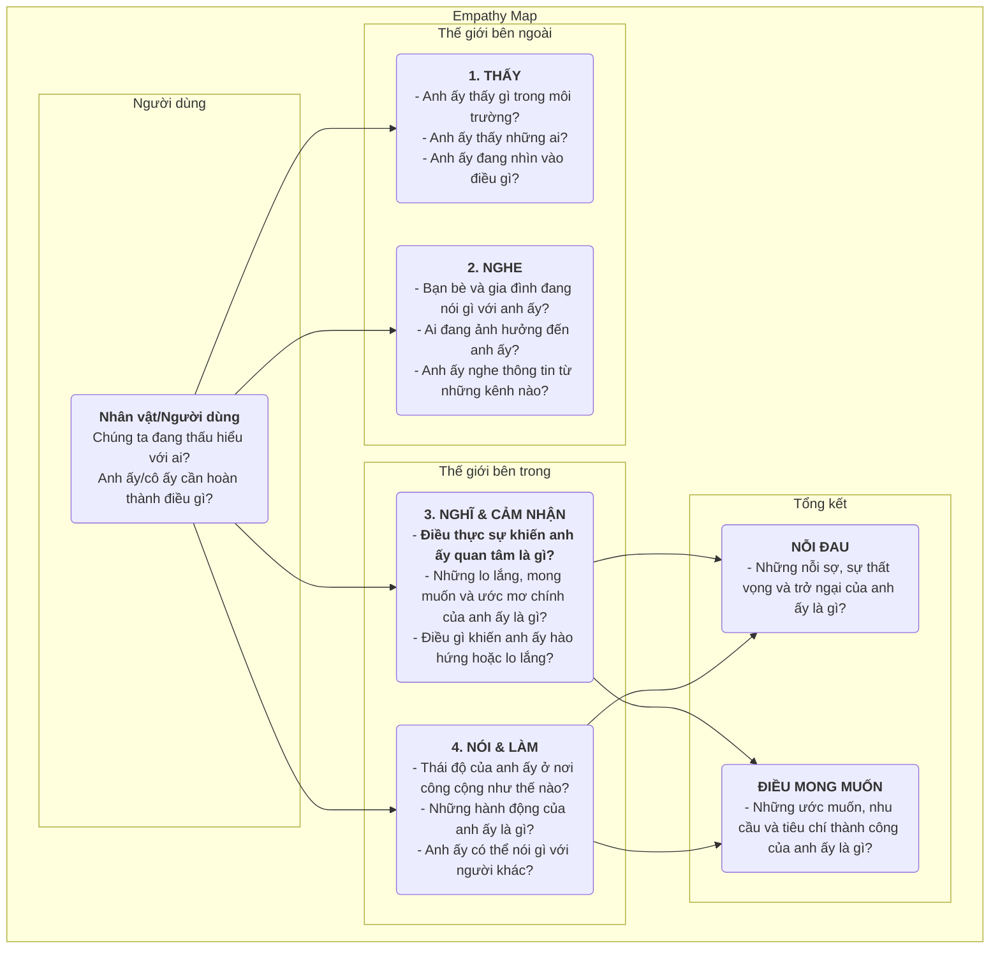

# Sơ đồ Thấu hiểu

Trong thiết kế sản phẩm và nghiên cứu người dùng, "thấu hiểu" là một phẩm chất cốt lõi thường được đề cập nhưng cực kỳ khó để thực sự đạt được. Làm thế nào để chúng ta thực sự "đi bằng đôi giày của người dùng" và trải nghiệm thế giới của họ một cách trực tiếp? **Sơ đồ Thấu hiểu (Empathy Map)** là một **công cụ thấu hiểu cộng tác** đơn giản, trực quan nhưng cực kỳ mạnh mẽ được thiết kế cho mục đích này. Nó nhằm giúp các nhóm vượt qua bề nổi của hành vi người dùng và đi sâu vào thế giới nội tâm của họ về **cảm giác, suy nghĩ và cảm xúc**, từ đó hình thành một sự hiểu biết toàn diện và đa chiều hơn về người dùng.

Cốt lõi của Sơ đồ Thấu hiểu nằm ở việc tổ chức một cách hệ thống tất cả các quan sát định tính và dữ liệu phỏng vấn rời rạc về người dùng thành một khuôn khổ trực quan. Khuôn khổ này thường được chia thành bốn phần tư chính: **Thấy, Nghe, Nghĩ & Cảm nhận, và Nói & Làm**. Bằng cách cùng nhau hoàn thiện sơ đồ này, các thành viên trong nhóm buộc phải đặt mình vào góc nhìn của người dùng, cùng nhau xây dựng một sự hiểu biết chung về thế giới nội tâm và môi trường bên ngoài của họ. Đây là một tấm gương phản chiếu rõ ràng tình trạng thực sự của người dùng và là chất xúc tác để nuôi dưỡng sự thấu hiểu tập thể trong nhóm.

## Các thành phần của Sơ đồ Thấu hiểu

Một Sơ đồ Thấu hiểu cổ điển luôn lấy người dùng làm trung tâm và được triển khai xung quanh bốn phần tư cốt lõi về trải nghiệm bên ngoài và bên trong.

<!--

*   **Thấy**: Mô tả những gì người dùng thấy bằng mắt trong môi trường của họ. Ví dụ, những người xung quanh họ đang làm gì? Họ gặp phải những thông tin thị trường nào hàng ngày?
*   **Nghe**: Mô tả những thông tin mà người dùng nghe từ thế giới bên ngoài. Bạn bè, gia đình và đồng nghiệp đang nói gì? Những người có ảnh hưởng hoặc kênh truyền thông nào đang tác động đến họ?
*   **Nghĩ & Cảm nhận**: Đây là phần trung tâm của sơ đồ, cố gắng khám phá thế giới nội tâm của người dùng. Điều gì thực sự quan trọng đối với họ (kể cả khi họ không nói ra)? Họ có những lo lắng, mong muốn và ước mơ nào?
*   **Nói & Làm**: Mô tả lời nói và hành động của người dùng ở nơi công cộng. Trong buổi phỏng vấn, họ đã nói gì với chúng ta? Hành vi thực tế của họ khi sử dụng sản phẩm là gì? Ở đây, cần đặc biệt lưu ý đến những mâu thuẫn tiềm ẩn giữa "nói" và "nghĩ."
*   **Nỗi đau** và **Điều mong muốn**: Sau khi phân tích bốn phần tư trên, hãy tổng kết những đấu tranh và mong mỏi nội tâm của người dùng. "Nỗi đau" đại diện cho những trở ngại và cảm xúc tiêu cực họ gặp phải, trong khi "Điều mong muốn" đại diện cho những mục tiêu và mong muốn thực sự mà họ muốn đạt được.

## Cách sử dụng Sơ đồ Thấu hiểu

Sơ đồ Thấu hiểu tốt nhất nên được sử dụng dưới dạng buổi làm việc nhóm (workshop).

1.  **Bước 1: Xác định phạm vi và mục tiêu**
    *   **Chọn người dùng của bạn**: Rõ ràng xác định nhân vật/người dùng cụ thể mà Sơ đồ Thấu hiểu này hướng đến. Tốt nhất là đặt tên và mô tả bối cảnh cơ bản cho họ.
    *   **Làm rõ mục tiêu**: Xác định mục tiêu bạn muốn đạt được qua bài tập này. Đó là để hiểu rõ hơn về người dùng hiện tại, hay để khám phá người dùng tiềm năng cho một sản phẩm mới?

2.  **Bước 2: Thu thập tài liệu nghiên cứu**
    Sơ đồ Thấu hiểu phải dựa trên nghiên cứu thực tế, không phải tưởng tượng. Chuẩn bị tất cả tài liệu nghiên cứu liên quan đến người dùng, như: bản ghi và biên bản phỏng vấn người dùng, video kiểm thử khả năng sử dụng, câu trả lời mở trong khảo sát, hình ảnh do người dùng chụp, v.v.

3.  **Bước 3: Cùng nhau điền vào sơ đồ**
    *   Vẽ một mẫu Sơ đồ Thấu hiểu lớn trên bảng trắng, hoặc sử dụng công cụ cộng tác trực tuyến.
    *   Các thành viên trong nhóm cùng nhau ghi lại các phát hiện từ tài liệu nghiên cứu lên những mảnh giấy dính (sticky notes), từng cái một, rồi đặt chúng vào phần tư tương ứng trên sơ đồ. Ví dụ, khi nghe bản ghi phỏng vấn, một thành viên có thể viết "Người dùng nói rằng anh ấy làm việc ngoài giờ mỗi tuần (Nói)", trong khi thành viên khác có thể viết "Tôi cảm thấy anh ấy nói rất mệt mỏi và đã mất đi niềm đam mê công việc (Cảm nhận)."
    *   Khuyến khích các thành viên đọc to nội dung trên các mảnh giấy dính và giải thích tại sao họ đặt chúng vào phần tư đó.

4.  **Bước 4: Khai thác sâu hơn và tổng hợp**
    Khi tất cả thông tin đã được dán lên bảng, hãy hướng dẫn nhóm thảo luận sâu hơn.
    *   "Chúng ta thấy những mâu thuẫn nào? Ví dụ, lời nói và hành vi của người dùng không nhất quán?"
    *   "Phía sau tất cả những chi tiết này, điều thực sự khiến họ quan tâm nhưng chưa bộc lộ là gì?"
    *   "Chúng ta học được điều gì bất ngờ?"
    *   Cuối cùng, cùng nhau tổng kết những **nỗi đau** và **điều mong muốn** cốt lõi nhất của người dùng.

5.  **Bước 5: Chia sẻ và ứng dụng**
    Tổ chức và chia sẻ Sơ đồ Thấu hiểu đã hoàn thành, sử dụng nó như một đầu vào quan trọng cho thiết kế và ra quyết định tiếp theo.

## Các trường hợp ứng dụng

**Trường hợp 1: Thiết kế điện thoại thông minh cho người cao tuổi**

*   **Người dùng**: Ông Vương, 70 tuổi, vừa nhận điện thoại thông minh từ con cái.
*   **Thấy**: Các biểu tượng trên màn hình điện thoại nhỏ và nhiều, khó nhìn rõ; người trẻ đều dùng điện thoại để thanh toán và trò chuyện.
*   **Nghe**: Con cái nói: "Rất đơn giản, ông sẽ học nhanh thôi"; bạn bè nói: "Cái đó quá phức tạp, tôi không học được đâu."
*   **Nghĩ & Cảm nhận**: Cảm thấy rất **thất vọng**, sợ bị công nghệ bỏ lại phía sau; nhưng lại **mong muốn** học cách gọi video với cháu trên điện thoại.
*   **Nói & Làm**: Nói rằng: "Tôi không cần cái này", nhưng lén thử mở khóa màn hình liên tục.
*   **Nỗi đau**: Sợ mắc sai lầm và gây ra tổn thất; cảm giác bị công nghệ lãng quên.
*   **Điều mong muốn**: Mong muốn duy trì liên lạc gần gũi với gia đình; mong muốn tự mình hoàn thành một số công việc hàng ngày (ví dụ: tra cứu lộ trình xe buýt).
*   **Cảm hứng thiết kế**: Nguyên tắc thiết kế cốt lõi cho chiếc điện thoại này không phải là "nhiều tính năng", mà là "không gây thất vọng". Cần cung cấp các chức năng như "chế độ chữ cực lớn", "hỗ trợ từ xa của người thân", v.v.

**Trường hợp 2: Thiết kế ứng dụng tìm việc cho sinh viên đại học**

*   **Người dùng**: Lý Huyết, 22 tuổi, sinh viên đại học năm cuối.
*   **Thấy**: Các trang web tìm việc lộn xộn, khó phân biệt thật giả; bạn bè xung quanh đã nhận được nhiều lời mời làm việc.
*   **Nghe**: Anh/chị khóa trên nói: "Công việc đầu tiên rất quan trọng"; bố mẹ nói: "Tìm một công việc ổn định là quan trọng nhất."
*   **Nghĩ & Cảm nhận**: Cảm thấy rất **bối rối và lo lắng** về tương lai; không biết công việc nào phù hợp với mình; **sợ** không làm tốt trong buổi phỏng vấn.
*   **Nói & Làm**: Gửi hàng trăm hồ sơ xin việc; liên tục chỉnh sửa lại hồ sơ cá nhân.
*   **Nỗi đau**: Thiếu định hướng tìm việc; bất cân xứng thông tin; thiếu tự tin.
*   **Điều mong muốn**: Mong muốn tìm được công việc thực sự yêu thích và có triển vọng; mong muốn nhận được sự hướng dẫn và tư vấn chuyên nghiệp.
*   **Cảm hứng thiết kế**: Chức năng cốt lõi của ứng dụng không chỉ là danh sách việc làm, mà cần bổ sung thêm các chức năng như "kiểm tra tính cách nghề nghiệp", "tư vấn trực tuyến với chuyên gia ngành", "luyện tập mô phỏng phỏng vấn", v.v.

**Trường hợp 3: Thiết kế công cụ viết lách cho người sáng tạo nội dung**

*   **Người dùng**: Trương Vỹ, blogger bán thời gian.
*   **Thấy**: Các blogger khác đều cập nhật bài viết chất lượng hàng ngày; lượng xem bài viết của bản thân không tăng.
*   **Nghe**: Độc giả bình luận: "Viết hay lắm, mong chờ bài mới"; bạn bè nói: "Làm blogger khó kiếm tiền lắm."
*   **Nghĩ & Cảm nhận**: Cảm thấy rất **đau khổ** khi **hết cảm hứng**; **khao khát** được độc giả công nhận và đồng cảm; **lưỡng lự** giữa theo đuổi lý tưởng và thu nhập thực tế.
*   **Nói & Làm**: Dành nhiều thời gian để sưu tầm tài liệu và bố cục nội dung; thường xuyên viết đến tận khuya.
*   **Nỗi đau**: Quá trình viết bị gián đoạn, hiệu suất thấp; thiếu động lực để sáng tạo liên tục.
*   **Điều mong muốn**: Mong muốn có một công cụ giúp tổ chức suy nghĩ và gợi mở cảm hứng; mong muốn xây dựng mối quan hệ sâu sắc hơn với độc giả.
*   **Cảm hứng thiết kế**: Ngoài các chức năng soạn thảo cơ bản, công cụ viết lách còn nên cung cấp thêm các tính năng đặc biệt như "bộ thẻ gợi ý cảm hứng", "chế độ sơ đồ tư duy", "phân tích dữ liệu tương tác với độc giả", v.v.

## Ưu điểm và Thách thức của Sơ đồ Thấu hiểu

**Ưu điểm cốt lõi**

*   **Nhanh chóng và hiệu quả**: Là phương pháp hiệu quả để nhanh chóng xây dựng sự thấu hiểu trong nhóm (thường chỉ trong vòng 60 phút).
*   **Khuyến khích hợp tác nhóm**: Tính chất cộng tác giúp phá vỡ các rào cản giữa các bộ phận, dẫn đến sự hiểu biết thống nhất và sâu sắc về người dùng trong toàn bộ nhóm.
*   **Khám phá nhu cầu ẩn**: Bằng cách tập trung vào thế giới nội tâm của người dùng, nó giúp phát hiện những nhu cầu và điểm đau chưa được người dùng diễn đạt rõ ràng.

**Thách thức tiềm ẩn**

*   **Không thể thay thế Nhân vật người dùng**: Sơ đồ Thấu hiểu thường tập trung vào trạng thái của người dùng trong một tình huống cụ thể, trong khi Nhân vật người dùng mô tả một mô hình nhân vật toàn diện và lâu dài hơn. Sơ đồ Thấu hiểu là đầu vào tuyệt vời để xây dựng Nhân vật người dùng nhưng không thể hoàn toàn thay thế chúng.
*   **Cần có dữ liệu thực tế hỗ trợ**: Giống như mọi công cụ nghiên cứu người dùng khác, nếu không có dữ liệu nghiên cứu thực tế, Sơ đồ Thấu hiểu có thể trở thành một "buổi kể chuyện theo cảm tính" dựa trên các giả định chủ quan của các thành viên trong nhóm.

## Mở rộng và Liên kết

*   **Nhân vật người dùng**: Sơ đồ Thấu hiểu là bước **tiền đề quan trọng** để xây dựng một nhân vật người dùng sống động, giàu cảm xúc. Thông qua phân tích Sơ đồ Thấu hiểu, nó có thể cung cấp những tư liệu rất sinh động cho các phần như "Nỗi đau", "Mục tiêu", v.v. trong nhân vật người dùng.
*   **Sơ đồ hành trình người dùng**: Tại mỗi giai đoạn của sơ đồ hành trình, có thể sử dụng một Sơ đồ Thấu hiểu thu nhỏ để phân tích sâu hơn về suy nghĩ, cảm xúc và hành vi của người dùng tại giai đoạn đó, từ đó xác định chính xác hơn các điểm đau tại từng bước.

---
*Tham khảo: Sơ đồ Thấu hiểu ban đầu được Dave Gray, người sáng lập XPLANE (nay thuộc Deloitte) đề xuất và đã được ứng dụng rộng rãi trong các phương pháp Thiết kế Hướng đến Người dùng (Design Thinking) và Phát triển linh hoạt (Agile). Đây là một công cụ thấu hiểu cơ bản và cốt lõi trong quy trình thiết kế lấy người dùng làm trung tâm.*