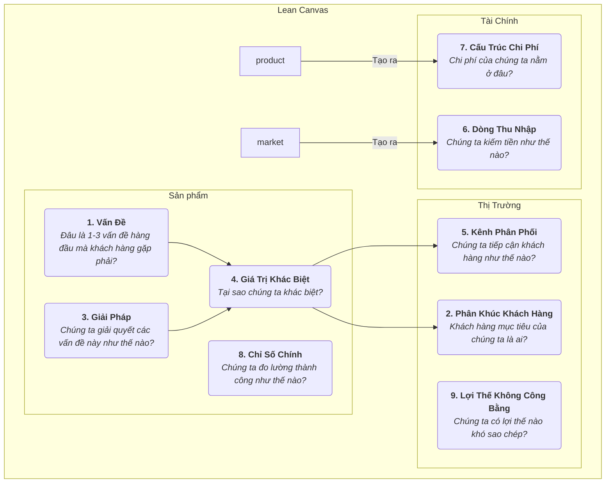

# Bảng Lean Canvas

Trong giai đoạn đầu của một startup, rủi ro lớn nhất thường không phải là "chúng ta có thể xây dựng sản phẩm không?" mà là "liệu có ai thực sự muốn sản phẩm mà chúng ta xây dựng?" Các kế hoạch kinh doanh truyền thống và bảng mô hình kinh doanh (Business Model Canvas) là những công cụ tuyệt vời cho các công ty đã trưởng thành, nhưng đối với các startup hoạt động trong môi trường đầy bất định, chúng có thể quá phức tạp và không đủ tập trung vào những rủi ro quan trọng nhất. **Lean Canvas** được tạo ra để giải quyết vấn đề này; đây là một phiên bản tuyệt vời được chuyển thể từ Business Model Canvas, được thiết kế riêng cho **những người khởi nghiệp ở giai đoạn đầu**.

Lean Canvas, do Ash Maurya đề xuất trong cuốn sách *Running Lean* của ông, kế thừa sự đơn giản và trực quan của Business Model Canvas nhưng chuyển trọng tâm từ "mô tả đầy đủ mô hình kinh doanh" sang **"xác định và kiểm chứng một cách hệ thống các giả định rủi ro nhất của startup."** Nó tập trung vào **Vấn đề - Giải pháp**, đồng thời bổ sung sự chú ý đến các chỉ số chính và lợi thế cạnh tranh, thể hiện rõ hơn chu kỳ "xây dựng - đo lường - học hỏi" (build-measure-learn) của Lean Startup. Đây là một bản đồ chiến lược định hướng rủi ro, giúp các nhà khởi nghiệp vượt qua giai đoạn mù mờ.

## Chín Khối Của Lean Canvas

Lean Canvas giữ lại chín khối của Business Model Canvas nhưng thay thế bốn khối để làm cho nó dễ hành động hơn và tập trung vào rủi ro.

**Những điểm khác biệt so với Business Model Canvas:**

*   **Vấn đề** thay thế cho "Các Đối Tác Chính": Đây là thay đổi quan trọng nhất. Nó buộc các nhà khởi nghiệp phải xác định rõ ràng 1-3 vấn đề hàng đầu mà khách hàng mục tiêu thực sự cần giải quyết.
*   **Giải pháp** thay thế cho "Các Hoạt Động Chính": Sau khi xác định vấn đề, bạn đề xuất giải pháp (thường là các tính năng cốt lõi của sản phẩm) dành riêng cho vấn đề đó.
*   **Chỉ số chính** thay thế cho "Các Nguồn Lực Chính": Đối với một startup, điều quan trọng nhất không phải là những gì bạn sở hữu, mà là cách bạn đo lường sức khỏe và sự tăng trưởng của doanh nghiệp. Các chỉ số chính là công cụ điều khiển mọi hành động.
*   **Lợi thế không công bằng** thay thế cho "Quan hệ khách hàng": Còn được gọi là "lợi thế không công bằng" hoặc "rào cản", đây là các năng lực cốt lõi mà đối thủ khó sao chép hoặc mua được. Đây là yếu tố sống còn cho sự tồn tại lâu dài của mô hình kinh doanh.

## Cách Sử Dụng Lean Canvas

Quy trình sử dụng Lean Canvas là một chu trình liên tục kiểm chứng và lặp lại.

1.  **Vẽ Bảng "Kế Hoạch A" Của Bạn**
    Trước khi nói chuyện với bất kỳ khách hàng nào, hãy nhanh chóng điền đầy đủ Lean Canvas với tất cả ý tưởng và giả định ban đầu của bạn cho dự án startup. Việc này thường chỉ mất khoảng 15-20 phút. Đây là "Kế Hoạch A" của bạn, tập hợp tất cả các giả định cần được kiểm chứng.

2.  **Xác Định Các Giả Định Rủi Ro Cao Nhất**
    Xem lại phiên bản đầu tiên của bảng và xác định những phần có rủi ro và bất định cao nhất. Thông thường, với một dự án mới, các giả định rủi ro cao theo thứ tự là:
    *   **Giả định Vấn đề - Khách hàng**: Vấn đề này có thực sự tồn tại không? Những người này có thực sự là khách hàng mục tiêu của bạn không?
    *   **Giả định Vấn đề - Giải pháp**: Giải pháp của bạn có thực sự giải quyết được vấn đề của họ không?
    *   **Giả định Giá cả - Giá trị cốt lõi**: Khách hàng có sẵn sàng trả tiền cho giải pháp của bạn không?

3.  **Kiểm Chứng Các Giả Định Một Cách Hệ Thống**
    Thiết kế và thực hiện một loạt "thí nghiệm khả thi tối thiểu" (thường là **phỏng vấn vấn đề** và **phỏng vấn giải pháp**) để kiểm chứng một cách hệ thống các giả định rủi ro cao. Ví dụ:
    *   **Thực hiện phỏng vấn vấn đề**: Đi ra ngoài và trò chuyện với khách hàng mục tiêu, nhưng đừng nói về sản phẩm của bạn. Mục đích duy nhất là hiểu sâu về các vấn đề, hành vi hiện tại và điểm đau của họ để kiểm chứng các khối "Vấn đề" và "Phân khúc khách hàng" trên bảng.
    *   **Thực hiện phỏng vấn giải pháp**: Sau khi xác nhận rằng vấn đề thực sự tồn tại, hãy trình bày giải pháp của bạn (có thể là bản demo hoặc prototype) cho khách hàng để kiểm chứng "Giải pháp" và "Giá trị cốt lõi", đồng thời kiểm tra mức độ sẵn sàng trả tiền ("Dòng thu nhập").

4.  **Lặp Lại Và Cập Nhật Bảng Canvas**
    Liên tục cập nhật và lặp lại Lean Canvas dựa trên các thông tin thu được từ các cuộc phỏng vấn và thí nghiệm. Một số giả định được xác nhận, một số khác bị bác bỏ. Bảng Canvas giống như một cuốn sổ ghi chép thí nghiệm, ghi lại toàn bộ quá trình tiến hóa của dự án startup từ ý tưởng ban đầu đến khi tìm được "sự phù hợp giữa sản phẩm và thị trường" (product-market fit).

## Các Trường Hợp Ứng Dụng

**Trường hợp 1: Bảng Canvas Giai Đoạn Đầu Của Dropbox (Dịch vụ lưu trữ đám mây)**

*   **Vấn đề**: Đồng bộ hóa tập tin giữa nhiều thiết bị rất bất tiện; việc gửi các tập tin lớn qua USB hoặc email rất phiền toái; quên sao lưu dẫn đến mất dữ liệu.
*   **Phân khúc khách hàng**: Những người yêu công nghệ có nhiều máy tính, các freelancer.
*   **Giá trị khác biệt**: "Đặt tập tin của bạn vào một 'túi phép thuật', truy cập mọi lúc, không bao giờ bị mất."
*   **Giải pháp**: Một ứng dụng chạy nền trên máy tính, tự động đồng bộ nội dung của một thư mục được chỉ định.
*   **Chỉ số chính**: Số lượng người đăng ký, **tỷ lệ thành công khi tải lên tập tin**, số lượng người dùng hoạt động.
*   **Lợi thế không công bằng**: Hiệu ứng mạng lưới – càng nhiều người dùng, việc chia sẻ và cộng tác càng dễ dàng.
*   **Kiểm chứng**: Người sáng lập Drew Houston đã tạo một đoạn video demo sản phẩm đơn giản và đăng lên một cộng đồng công nghệ. Trong một đêm, danh sách chờ tăng từ 5.000 lên 75.000 người, mạnh mẽ xác nhận sự phù hợp giữa "vấn đề - giải pháp".

**Trường hợp 2: Dịch vụ giao bữa ăn lành mạnh**

*   **Vấn đề**: Nhân viên văn phòng khó ăn uống lành mạnh và cân đối vào bữa trưa; tự chuẩn bị bữa ăn tốn nhiều thời gian; đồ ăn mang về thường nhiều dầu mỡ.
*   **Phân khúc khách hàng**: Những người trẻ yêu sức khỏe, có thói quen tập thể dục.
*   **Giá trị khác biệt**: "Các bữa ăn thể hình được thiết kế bởi chuyên gia dinh dưỡng, chế biến tươi mới, giao đúng giờ đến văn phòng."
*   **Giải pháp**: Cung cấp các thực đơn bữa trưa theo tuần, thực đơn được cập nhật hàng tuần, kèm theo thông tin calo và dinh dưỡng.
*   **Chỉ số chính**: **Tỷ lệ mua lại hàng tuần**, giá trị trọn đời của khách hàng.
*   **Lợi thế không công bằng**: Hợp tác độc quyền với các nhà cung cấp nguyên liệu chất lượng cao, đội ngũ chuyên gia dinh dưỡng chuyên nghiệp.
*   **Kiểm chứng**: Người sáng lập có thể ban đầu không phát triển ứng dụng mà nhận đơn qua nhóm WeChat hoặc nền tảng khảo sát, sau đó giao bữa ăn thủ công cho 20 người dùng đầu tiên để kiểm chứng toàn bộ quy trình và nhu cầu người dùng.

**Trường hợp 3: Bảng Canvas Giai Đoạn Đầu Của Airbnb**

*   **Vấn đề**: Trong các hội nghị lớn, khách sạn trong thành phố đắt đỏ và hết phòng.
*   **Phân khúc khách hàng**: Các nhà thiết kế có ngân sách hạn chế tham dự hội nghị thiết kế.
*   **Giải pháp**: Cung cấp nền tảng để cư dân địa phương (người cho thuê) cho các nhà thiết kế này thuê giường hơi trong nhà họ.
*   **Giá trị khác biệt**: Có chỗ ở với giá thấp hơn và có cơ hội giao lưu với người dân địa phương.
*   **Kiểm chứng**: Các nhà sáng lập tự đặt ba chiếc giường hơi trong nhà mình và thành công cho thuê chúng cho các nhà thiết kế tham dự hội nghị, trực tiếp kiểm chứng tính khả thi của toàn bộ mô hình kinh doanh.

## Giá Trị Và Hạn Chế Của Lean Canvas

**Giá Trị Cốt Lõi**

*   **Tập trung vào rủi ro**: Buộc các nhà khởi nghiệp đối mặt với các giả định rủi ro cao ngay từ đầu.
*   **Tốc độ và lặp lại**: Rất phù hợp để phác thảo, thảo luận và lặp lại mô hình kinh doanh một cách nhanh chóng, hoàn hảo cho nhịp điệu Lean Startup.
*   **Tập trung vào vấn đề**: Đảm bảo điểm khởi đầu của dự án là giải quyết một vấn đề thực sự có giá trị đối với khách hàng.

**Hạn Chế Tiềm Ẩn**

*   **Thiếu chú ý đến môi trường bên ngoài**: Giống như Business Model Canvas, nó không bao gồm sẵn phân tích về cạnh tranh và môi trường vĩ mô.
*   **Không phù hợp với mọi loại hình kinh doanh**: Nó phù hợp nhất với các startup có độ bất định cao. Đối với các công ty đã trưởng thành với mô hình kinh doanh được kiểm chứng, Business Model Canvas có thể là công cụ toàn diện hơn.

## Mở Rộng Và Liên Kết

*   **Business Model Canvas**: Lean Canvas là một biến thể và phát triển quan trọng của Business Model Canvas trong bối cảnh Lean Startup.
*   **Customer Development**: Một phương pháp luận do Steve Blank đề xuất, nhấn mạnh việc "ra khỏi tòa nhà" để kiểm chứng giả định, làm kim chỉ nam cho Lean Canvas ở cấp độ hành động.
*   **Value Proposition Canvas**: Có thể là công cụ bổ trợ để đi sâu vào các khối "Vấn đề", "Giải pháp" và "Giá trị khác biệt" trong Lean Canvas, giúp các nhà khởi nghiệp tinh chỉnh sự phù hợp giữa sản phẩm và thị trường một cách chính xác hơn.

---
*Tham khảo: Cuốn "Running Lean" của Ash Maurya là nguồn chính thống nhất về Lean Canvas, chi tiết cách sử dụng và lặp lại Lean Canvas từng bước kết hợp với Customer Development. Phương pháp này chịu ảnh hưởng sâu sắc từ cuốn "The Lean Startup" của Eric Ries và mô hình Customer Development của Steve Blank.*