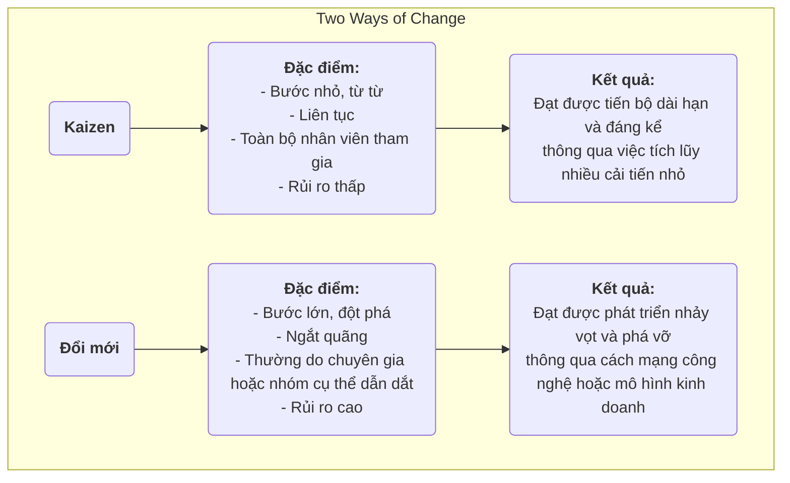

# Kaizen

Trong nhiều tổ chức, "cải tiến" thường được nhìn nhận như một dự án lớn đòi hỏi đầu tư đáng kể, do các chuyên gia dẫn dắt và được triển khai theo chiều hướng từ trên xuống. Tuy nhiên, có một triết lý quản lý tin rằng sự tiến bộ thực sự, mạnh mẽ và lâu dài lại đến từ những cải tiến nhỏ bé và liên tục dường như không đáng kể được thực hiện mỗi ngày bởi tất cả nhân viên. Đây chính là bản chất của **Kaizen**. Kaizen là một từ tiếng Nhật có nghĩa là "thay đổi để tốt hơn", và đây vừa là một triết lý văn hóa hướng tới sự hoàn hảo, vừa là một phương pháp thực tiễn khuyến khích sự tham gia toàn diện và cải tiến liên tục từ dưới lên.

Ý tưởng cốt lõi của Kaizen là **không tìm kiếm những bước đột phá cách mạng trong một đêm, mà là theo đuổi sự tối ưu hóa dần dần không hồi kết**. Nó tin rằng những nhân viên trực tiếp làm việc là những người hiểu rõ nhất tình hình thực tế tại vị trí của họ, và họ sở hữu trí tuệ và sự sáng tạo vô tận. Bằng cách xây dựng một văn hóa khuyến khích giải quyết vấn đề, khen thưởng những cải tiến nhỏ và khoan dung với thất bại, các tổ chức có thể khai thác sức mạnh của từng cá nhân, tạo thành một đà phát triển không thể cản phá và liên tục đi lên. Đây không phải là một công cụ quản lý phức tạp, mà là một cách làm việc và tư duy đơn giản, mộc mạc nhưng vô cùng hiệu quả.

## Nguyên tắc cốt lõi của Kaizen

*   **Liên tục**: Kaizen không phải là hoạt động một lần, mà là một quá trình không ngừng và tích lũy.
*   **Mọi người**: Từ giám đốc điều hành đến nhân viên vệ sinh, tất cả mọi người trong tổ chức đều được khuyến khích và kỳ vọng tham gia vào các hoạt động cải tiến.
*   **Chi phí thấp, trí tuệ cao**: Kaizen không dựa vào đầu tư vốn lớn mà nhấn mạnh việc sử dụng trí tuệ và sự sáng tạo của nhân viên để giải quyết vấn đề và loại bỏ lãng phí với chi phí thấp.
*   **Tập trung vào quy trình**: Trọng tâm của Kaizen là tối ưu hóa các quy trình làm việc, chứ không phải đổ lỗi cho cá nhân.
*   **Quản lý trực quan**: Nhấn mạnh việc làm cho các vấn đề, tiêu chuẩn và quy trình trở nên "trực quan" để các bất thường có thể được nhận biết ngay lập tức.
*   **"Đi đến Gemba"**: Các nhà quản lý phải đến trực tiếp nơi làm việc thực tế (Gemba) để quan sát tình hình thực tế và trò chuyện với nhân viên, thay vì tưởng tượng từ văn phòng.

### Kaizen và Đổi mới

*   **Mối quan hệ**: Kaizen và đổi mới không loại trừ nhau; ngược lại, chúng là hai năng lực mà một tổ chức xuất sắc phải đồng thời sở hữu. Kaizen chịu trách nhiệm liên tục tối ưu hóa và củng cố hệ thống hiện có, trong khi đổi mới chịu trách nhiệm tạo ra các hệ thống hoàn toàn mới.

## Cách thực hành Kaizen trong tổ chức

Chìa khóa để thực hành Kaizen là xây dựng một văn hóa và cơ chế khuyến khích cải tiến liên tục.

1.  **Thiết lập hệ thống đề xuất Kaizen**
    Thiết lập một kênh đơn giản, thuận tiện (ví dụ: hộp góp ý, biểu mẫu trực tuyến) để bất kỳ nhân viên nào cũng có thể gửi các vấn đề hoặc đề xuất cải tiến bất kỳ lúc nào. Điều quan trọng là phản hồi và theo dõi mọi đề xuất, đồng thời khen thưởng kịp thời và công khai những đề xuất xuất sắc được áp dụng (phần thưởng không nhất thiết phải là vật chất; lời khen công khai, giấy chứng nhận... thường là động lực tinh thần hiệu quả hơn).

2.  **Tổ chức "Tuần Kaizen" hoặc "Cao điểm Kaizen"**
    Định kỳ tổ chức các nhóm liên phòng ban tập trung vào một quy trình hoặc khu vực làm việc cụ thể trong một khoảng thời gian ngắn (thường là 3-5 ngày), sử dụng các công cụ lean và chất lượng (ví dụ: vẽ sơ đồ dòng giá trị, 5S) để thực hiện một đợt cải tiến cường độ cao và triển khai ngay các giải pháp.

3.  **Thúc đẩy chu trình PDCA như công cụ tư duy**
    Làm cho **chu trình PDCA (Plan-Do-Check-Act)** trở thành khuôn khổ tư duy chuẩn cho tất cả nhân viên khi giải quyết vấn đề. Khuyến khích nhân viên tuân theo chu trình khoa học này:
    *   **P**lan (Lập kế hoạch): Xác định vấn đề, phân tích nguyên nhân và xây dựng kế hoạch cải tiến nhỏ.
    *   **D**o (Thực hiện): Thử nghiệm thực hiện kế hoạch.
    *   **C**heck (Kiểm tra): Xác minh xem kết quả thí nghiệm có đạt kỳ vọng không.
    *   **A**ct (Xử lý): Nếu thành công, chuẩn hóa thành quy trình mới; nếu không, học hỏi và bắt đầu một chu trình PDCA mới.

4.  **Thay đổi vai trò của nhà quản lý**
    Trong văn hóa Kaizen, vai trò của nhà quản lý chuyển từ "chỉ huy" và "giám sát" sang vai trò "**huấn luyện viên**" và "**người hỗ trợ**". Nhiệm vụ chính của họ là: khơi dậy và khuyến khích nhân viên nhận diện vấn đề, cung cấp nguồn lực và hỗ trợ cho các hoạt động cải tiến của nhân viên, và giúp họ gỡ bỏ các trở ngại.

## Các trường hợp áp dụng

**Ví dụ 1: "Cải tiến một centimet" của Toyota**

*   **Tình huống**: Trên dây chuyền sản xuất của Toyota, Kaizen là một phần trong bản chất của công ty.
*   **Áp dụng**: Một công nhân trên dây chuyền nhận thấy mỗi lần anh ta lấy ốc vít từ hộp linh kiện, cổ tay anh ta phải xoay một chút theo một cách không tự nhiên. Anh ta đề xuất nghiêng hộp linh kiện đi 15 độ. Cải tiến dường như không đáng kể này giúp anh ta tiết kiệm vài giây mỗi ngày và giảm nguy cơ chấn thương cổ tay. Khi cải tiến "một centimet" này được nhân rộng ra hàng ngàn trạm làm việc trong toàn công ty, lượng thời gian tiết kiệm được và sự cải thiện về an toàn thật đáng kinh ngạc.

**Ví dụ 2: Quầy điều dưỡng của một bệnh viện**

*   **Vấn đề**: Các y tá phàn nàn rằng họ mất nhiều thời gian mỗi ngày để tìm kiếm các vật tư y tế thường dùng (ví dụ: băng gạc, băng dính).
*   **Áp dụng Kaizen**: Điều dưỡng trưởng tổ chức một hoạt động Kaizen nhỏ. Các thành viên trong nhóm sử dụng phương pháp **5S** để **Sắp xếp lại** (loại bỏ các vật dụng không cần thiết), **Sắp xếp theo thứ tự** (đặt các vật dụng thường dùng ở vị trí dễ tiếp cận và dán nhãn rõ ràng), **Làm sạch**, **Chuẩn hóa**, và **Duy trì** các tủ ở quầy điều dưỡng. Hoạt động này chỉ mất một buổi chiều nhưng đã giảm đáng kể thời gian tìm kiếm của các y tá, giúp họ dành nhiều thời gian hơn cho việc chăm sóc bệnh nhân trực tiếp.

**Ví dụ 3: Áp dụng trong cuộc sống cá nhân**

*   **Vấn đề**: Một người luôn quên mang theo chìa khóa khi ra khỏi nhà.
*   **Áp dụng Kaizen**: Thay vì đổ lỗi cho bản thân vì "trí nhớ kém", anh ta suy nghĩ về cách **cải tiến quy trình**. Anh ta quyết định đặt tất cả các vật dụng cần mang theo vào ngày hôm sau (chìa khóa, ví, thẻ công ty) lên kệ giày bên cạnh cửa ra vào vào buổi tối hôm trước. Thói quen nhỏ này là một ví dụ điển hình về Kaizen cá nhân, giải quyết vấn đề một cách căn bản thông qua việc tối ưu hóa quy trình.

## Ưu điểm và thách thức của Kaizen

**Ưu điểm cốt lõi**

*   **Chi phí thấp, rủi ro thấp**: Phần lớn các cải tiến đến từ trí tuệ của nhân viên trực tiếp làm việc, hầu như không đòi hỏi đầu tư bổ sung, và chi phí thử sai cực kỳ thấp.
*   **Tăng cường sự gắn kết và归属感 của nhân viên**: Khi các đề xuất của nhân viên được lắng nghe và áp dụng, họ cảm thấy được tôn trọng và chuyển từ vai trò "người thực thi thụ động" sang "người suy nghĩ chủ động".
*   **Thúc đẩy làm việc nhóm**: Nhiều hoạt động Kaizen đòi hỏi sự hợp tác liên phòng ban và liên chức năng, giúp phá vỡ các bức tường ngăn cách giữa các bộ phận.
*   **Tạo ra quán tính văn hóa mạnh mẽ**: Khi một văn hóa cải tiến liên tục được thiết lập, tổ chức sẽ có được một động lực nội tại mạnh mẽ để tự hoàn thiện và phát triển không ngừng.

**Thách thức tiềm ẩn**

*   **Hiệu quả chậm, khó nhận thấy**: So với những "đổi mới" đột phá, hiệu quả của Kaizen thường từ từ và tích lũy, có thể không rõ ràng trong ngắn hạn, đòi hỏi các nhà quản lý phải có đủ sự kiên nhẫn và tầm nhìn dài hạn.
*   **Yêu cầu sự tham gia thực sự của tất cả mọi người**: Nếu chỉ dừng lại ở khẩu hiệu, hoặc chỉ một vài người tham gia, các hoạt động Kaizen sẽ không thể duy trì.
*   **Có thể rơi vào "tối ưu cục bộ"**: Tập trung quá mức vào các cải tiến nhỏ trong các quy trình hiện có đôi khi có thể bỏ lỡ các cơ hội lớn hơn cho đổi mới phá vỡ và cách mạng.

## Mở rộng và liên kết

*   **Vận hành tinh gọn (Lean Operations)**: Kaizen là một trong những trụ cột cốt lõi của tư duy tinh gọn và là cách thực hiện cơ bản để đạt được nguyên tắc "theo đuổi sự hoàn hảo".
*   **Quản lý chất lượng toàn diện (TQM)**: Kaizen là sự thể hiện trực tiếp và sinh động nhất của nguyên tắc "cải tiến liên tục" trong TQM.
*   **Chu trình PDCA**: Đây là khuôn khổ tư duy và hành động khoa học cơ bản và được sử dụng phổ biến nhất khi thực hành Kaizen.

---
*Tham khảo: Kaizen, với tư cách là một triết lý quản lý, có gốc rễ sâu trong văn hóa và cách quản lý Nhật Bản, đặc biệt phổ biến trong Hệ thống Sản xuất Toyota (TPS). Cuốn sách "Kaizen: Chìa khóa tạo nên thành công cạnh tranh của Nhật Bản" của Masaaki Imai là tác phẩm đầu tiên giới thiệu một cách hệ thống khái niệm này đến thế giới phương Tây, gây ảnh hưởng sâu rộng.*