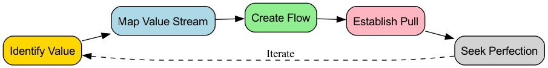

# Vận Hành Tinh Gọn

Hãy tưởng tượng một con sông chảy êm đềm, không bị cản trở, vận chuyển nguồn giá trị một cách dễ dàng trực tiếp đến khách hàng với mức tiêu hao tối thiểu và tốc độ tối đa. Đây chính là trạng thái lý tưởng mà **Vận hành Tinh gọn (Lean Operations)** hướng đến. Lean Operations, thường được gọi là **Sản xuất Tinh gọn (Lean Production)** hoặc **Tư duy Tinh gọn (Lean Thinking)**, vừa là một phương pháp mạnh mẽ trong quản lý vận hành, vừa là một nền văn hóa tổ chức và triết lý quản lý sâu sắc. Mục tiêu cốt lõi của nó là tối đa hóa giá trị dành cho khách hàng và đạt được hiệu quả vận hành chất lượng cao, chi phí thấp và tốc độ nhanh bằng cách **hệ thống hóa việc nhận diện và loại bỏ tất cả các hoạt động không tạo ra giá trị (tức là "sự lãng phí", Muda) trong quy trình vận hành**.

Tư duy tinh gọn bắt nguồn từ "Hệ thống Sản xuất Toyota (Toyota Production System - TPS)" của Công ty Toyota Motor, đã hoàn toàn cách mạng hóa mô hình sản xuất truyền thống quy mô lớn, theo kiểu "đẩy". Vận hành Tinh gọn cho rằng bất kỳ hoạt động nào tiêu tốn nguồn lực nhưng không tạo ra giá trị mà khách hàng cuối cùng sẵn sàng trả tiền cho nó đều là lãng phí. Bằng cách liên tục kiểm tra luồng giá trị và loại bỏ sự lãng phí, các tổ chức có thể tạo ra sản phẩm và dịch vụ chất lượng cao hơn với ít nguồn lực hơn và trong thời gian ngắn hơn, từ đó giành được lợi thế căn bản trong cạnh tranh khốc liệt trên thị trường.

## Năm Nguyên Tắc Cốt Lõi của Tư Duy Tinh Gọn

Việc áp dụng tư duy tinh gọn xoay quanh năm nguyên tắc cốt lõi gắn kết chặt chẽ và mang tính chu kỳ.

1.  **Xác định Giá trị**: Điểm khởi đầu của mọi hoạt động phải là việc xác định chính xác giá trị từ góc nhìn của **khách hàng cuối cùng**. Không phải là điều chúng ta nghĩ là có giá trị, mà là điều khách hàng cho là có giá trị.
2.  **Vẽ Luồng Giá Trị**: Đối với mỗi sản phẩm hoặc dịch vụ, hãy vẽ **bản đồ quy trình từ đầu đến cuối** của nó, từ ý tưởng đến khi giao đến tay khách hàng (tức là "luồng giá trị"). Trong quá trình này, hãy xác định rõ những bước nào thực sự tạo ra giá trị, những bước nào không tạo ra giá trị nhưng hiện tại chưa thể tránh khỏi, và những bước nào thuần túy là lãng phí cần được loại bỏ.
3.  **Tạo Dòng Chảy**: Phá vỡ các ngăn cách giữa các phòng ban và mô hình sản xuất theo lô biệt lập, tái tổ chức quy trình sao cho sản phẩm hoặc dịch vụ có thể "chảy" qua luồng giá trị một cách mượt mà, không bị gián đoạn và không phải chờ đợi.
4.  **Thiết lập Cơ Chế Kéo (Pull)**: Khác với mô hình sản xuất truyền thống theo kiểu "đẩy" (tức là sản xuất theo kế hoạch bất kể nhu cầu phía sau), Lean hướng đến hệ thống **"kéo"**. Tức là các quy trình phía trước chỉ bắt đầu sản xuất hoặc cung cấp dịch vụ khi khách hàng (hoặc quy trình phía sau) gửi tín hiệu nhu cầu rõ ràng. Điều này cơ bản loại bỏ tình trạng sản xuất dư thừa và tồn kho không cần thiết.
5.  **Hướng Đến Sự Hoàn Hảo**: Lean là một quá trình cải tiến liên tục không có hồi kết. Bằng cách lặp đi lặp lại bốn bước trên, các tổ chức có thể liên tục phát hiện và loại bỏ các tầng lãng phí sâu hơn, tiến gần vô hạn đến trạng thái lý tưởng là "không có lãng phí".

## Tám Loại Lãng Phí Trong Lean (DOWNTIME)

Tư duy Lean phân loại hệ thống các lãng phí trong quy trình thành tám loại, thường được nhớ bằng cụm từ viết tắt **DOWNTIME**.

## Cách Triển Khai Vận Hành Tinh Gọn

Chuyển đổi Lean là một thay đổi văn hóa và vận hành sâu sắc, dựa vào một loạt công cụ và phương pháp mạnh mẽ.

1.  **Bản đồ Luồng Giá Trị (VSM)**: Đây là điểm khởi đầu để triển khai Lean. Bằng cách vẽ bản đồ luồng giá trị hiện trạng, hãy xác định thời gian chu kỳ, thời gian tạo ra giá trị và lãng phí ở từng giai đoạn. Sau đó, thiết kế một bản đồ luồng giá trị trong tương lai lý tưởng làm mục tiêu cải tiến.

2.  **Phương pháp 5S**: Dùng để xây dựng một môi trường làm việc sạch sẽ, gọn gàng và hiệu quả. Bao gồm năm bước: Seiri (Sàng lọc), Seiton (Sắp xếp), Seiso (Sạch sẽ), Seiketsu (Tiêu chuẩn hóa), và Shitsuke (Duy trì).

3.  **Kanban**: Một công cụ quản lý trực quan mạnh mẽ dùng để triển khai sản xuất theo cơ chế "kéo". Tín hiệu nhu cầu được truyền đạt qua các thẻ Kanban, từ đó kiểm soát chính xác lượng công việc đang thực hiện và ngăn ngừa sản xuất dư thừa.

4.  **Kaizen**: Có nghĩa là "cải tiến liên tục". Các tổ chức cần xây dựng một văn hóa khuyến khích tất cả nhân viên hàng ngày suy ngẫm về quy trình làm việc của họ và đề xuất các ý tưởng cải tiến nhỏ nhưng liên tục.

5.  **Phân tích Nguyên nhân Gốc rễ**: Khi gặp vấn đề, sử dụng các công cụ như **5 Tại sao** hoặc **Sơ đồ Xương cá** để đào sâu vào nguyên nhân gốc rễ của vấn đề, đảm bảo vấn đề được giải quyết triệt để, chứ không chỉ chữa triệu chứng bề mặt.

## Các Trường Hợp Ứng Dụng

**Ví dụ 1: "Cải tiến Một Centimet" của Toyota**

*   **Tình huống**: Trên dây chuyền sản xuất của Toyota, Kaizen là một phần trong bản chất của công ty.
*   **Ứng dụng**: Một công nhân trên dây chuyền sản xuất nhận thấy mỗi lần anh ta lấy ốc vít từ hộp phụ tùng, cổ tay anh ta phải vặn một chút nhưng không tự nhiên. Anh ta đề xuất nghiêng hộp phụ tùng đi 15 độ. Cải tiến tưởng chừng nhỏ nhặt này giúp anh ta tiết kiệm vài giây mỗi ngày và giảm nguy cơ chấn thương cổ tay. Khi cải tiến "một centimet" này được nhân rộng ra hàng ngàn trạm làm việc trong toàn công ty, lượng thời gian tiết kiệm được và sự cải thiện về an toàn thật sự đáng kinh ngạc.

**Ví dụ 2: Trạm Điều Dưỡng của Một Bệnh Viện**

*   **Vấn đề**: Điều dưỡng viên phàn nàn rằng họ phải dành nhiều thời gian mỗi ngày để tìm kiếm các vật tư y tế thường dùng (ví dụ như băng gạc, băng keo).
*   **Ứng dụng Lean**: Điều dưỡng trưởng tổ chức một hoạt động Kaizen nhỏ. Các thành viên trong nhóm sử dụng **phương pháp 5S** để **Sàng lọc** (loại bỏ các vật dụng không cần thiết), **Sắp xếp** (đặt các vật dụng thường dùng ở vị trí dễ tiếp cận và dán nhãn rõ ràng), **Làm sạch**, **Tiêu chuẩn hóa**, và **Duy trì** các tủ đựng đồ tại trạm điều dưỡng. Hoạt động này chỉ mất một buổi chiều nhưng đã giảm đáng kể thời gian tìm kiếm của điều dưỡng viên, giúp họ dành nhiều thời gian hơn cho việc chăm sóc bệnh nhân trực tiếp.

**Ví dụ 3: Phương pháp Agile và Kanban trong Phát triển Phần Mềm**

*   **Tình huống**: Các mô hình phát triển phần mềm theo kiểu thác nước (waterfall) truyền thống có chu kỳ dài và nhiều lãng phí.
*   **Ứng dụng Lean**: Phát triển Agile và phương pháp Kanban phần lớn là việc áp dụng tư duy Lean vào công việc tri thức.
    *   **Loại bỏ lãng phí**: Thông qua việc làm theo lô nhỏ và lặp lại với tần suất cao, lượng "công việc đang thực hiện" (mã chưa hoàn thành) được giảm. Thông qua tích hợp liên tục, thời gian chờ đợi và lỗi lãng phí cũng được giảm.
    *   **Hệ thống kéo**: Các nhóm phát triển "kéo" các công việc từ danh sách "backlog" để thực hiện dựa trên thứ tự ưu tiên trên bảng Kanban, thay vì việc quản lý dự án "đẩy" công việc xuống.
    *   **Cải tiến liên tục**: Các cuộc họp "tổng kết" (retrospective meetings) được định chế hóa thành các hoạt động "Kaizen".

## Ưu Điểm và Thách Thức của Vận Hành Tinh Gọn

**Ưu điểm cốt lõi**

*   **Hiệu quả được cải thiện rõ rệt và giảm chi phí**: Bằng cách loại bỏ lãng phí, hiệu suất sản xuất được cải thiện trực tiếp, và chi phí vận hành được giảm.
*   **Chất lượng và sự hài lòng của khách hàng cao hơn**: Tập trung vào giá trị và quy trình đảm bảo chất lượng vốn có của sản phẩm và dịch vụ.
*   **Tính linh hoạt và phản ứng nhanh hơn**: Mô hình sản xuất theo lô nhỏ và theo cơ chế kéo giúp tổ chức phản ứng nhanh hơn với những thay đổi trong nhu cầu khách hàng.
*   **Trao quyền cho nhân viên và nâng cao tinh thần**: Tôn trọng và dựa vào trí tuệ và sáng tạo của nhân viên tuyến đầu để thúc đẩy cải tiến liên tục.

**Thách thức tiềm ẩn**

*   **Yêu cầu cao đối với chuỗi cung ứng**: Just-in-Time (JIT) đòi hỏi các nhà cung cấp phải giao hàng đúng giờ và chất lượng cao, đặt ra yêu cầu rất cao về độ ổn định của chuỗi cung ứng.
*   **Không phù hợp với mọi môi trường**: Trong các ngành có nhu cầu cực kỳ bất ổn và biến động, việc triển khai hệ thống thuần túy theo cơ chế kéo có thể rất khó khăn.
*   **Kháng cự từ thay đổi văn hóa**: Chuyển đổi Lean đòi hỏi một sự thay đổi sâu sắc về tư duy, điều này có thể gặp phải sự phản đối từ nhân viên và quản lý quen với phương pháp làm việc truyền thống.

## Mở Rộng và Liên Kết

*   **Six Sigma**: Lean tập trung vào **tốc độ và hiệu quả (loại bỏ lãng phí)**, trong khi Six Sigma tập trung vào **chất lượng và tính nhất quán (giảm biến động)**. Trong thực tiễn, hai phương pháp này thường kết hợp thành **Lean Six Sigma**, tạo thành một phương pháp cải tiến vận hành toàn diện hơn, vừa loại bỏ lãng phí vừa giảm biến động.
*   **Quản lý Chất lượng Toàn diện (TQM)**: Rất nhất quán với Lean về các khía cạnh triết học như tập trung vào khách hàng, sự tham gia toàn diện, cải tiến liên tục. Lean cung cấp góc nhìn và bộ công cụ riêng biệt tập trung nhiều hơn vào "loại bỏ lãng phí".
*   **Lý thuyết Ràng Buộc (TOC)**: Tập trung vào việc nhận diện và quản lý các "điểm nghẽn" trong hệ thống để cải thiện đầu ra toàn hệ thống. Có thể kết hợp với các phương pháp Lean để định hướng trọng tâm của các hoạt động cải tiến.

---
*Tham khảo nguồn: Nền tảng của tư duy Lean nằm trong Hệ thống Sản xuất Toyota (TPS) của Công ty Toyota Motor, với Taiichi Ohno là nhân vật chủ chốt. Cuốn sách "Lean Thinking" của James P. Womack và Daniel T. Jones lần đầu tiên hệ thống hóa các thực hành của Toyota thành năm nguyên tắc mà các nhà quản lý phương Tây có thể hiểu, góp phần lớn thúc đẩy sự lan tỏa của Lean trên toàn thế giới.*