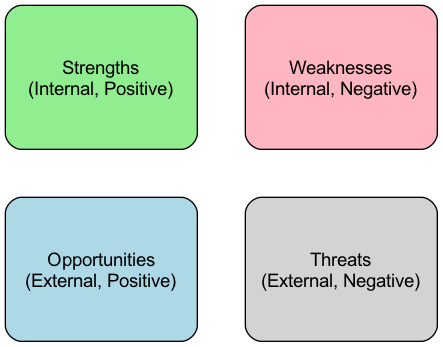

# Phân tích SWOT

Phân tích SWOT là một khuôn khổ lập kế hoạch chiến lược cổ điển và mạnh mẽ được thiết kế để giúp một tổ chức, dự án hoặc thậm chí là cá nhân xem xét một cách hệ thống các **Điểm mạnh (S)** và **Điểm yếu (W)** nội tại, đồng thời đánh giá các **Cơ hội (O)** và **Thách thức (T)** ngoại lai. Giá trị cốt lõi của nó nằm ở việc cung cấp một nền tảng vững chắc để xây dựng các chiến lược tương lai chính xác và khả thi bằng cách trình bày rõ ràng bốn khía cạnh này, trả lời hai câu hỏi cơ bản: "Chúng ta đang ở đâu?" và "Chúng ta sẽ đi đâu trong tương lai?"

## Hiểu rõ bốn khía cạnh của SWOT

Bản chất của phân tích SWOT nằm ở ma trận bốn chiều gọn gàng nhưng sâu sắc của nó, chia rõ tất cả các yếu tố ảnh hưởng đến mục tiêu thành hai nhóm chính: nội bộ và ngoại lai.

*   **Yếu tố nội bộ**: Đây là những nguồn lực và năng lực mà tổ chức có thể kiểm soát hoặc thay đổi. Chúng là tấm gương để tự soi xét.
    *   **Điểm mạnh (S)**: Là những năng lực độc đáo hoặc nguồn lực quý giá giúp tổ chức nổi bật trong cạnh tranh. Có thể là bằng sáng chế công nghệ tiên tiến, cơ sở khách hàng trung thành, quy trình vận hành hiệu quả hoặc danh tiếng thương hiệu mạnh. Việc xác định điểm mạnh là để suy nghĩ cách tối đa hóa việc sử dụng chúng.
    *   **Điểm yếu (W)**: Là những thiếu sót nội tại hoặc mặt hạn chế cản trở sự phát triển của tổ chức. Có thể bao gồm thiếu hụt tài chính, công nghệ lỗi thời, chuỗi cung ứng bất ổn hoặc thiếu nhân tài chủ chốt. Việc thừa nhận điểm yếu là để suy nghĩ cách bù đắp hoặc tránh tác động tiêu cực của chúng.

*   **Yếu tố ngoại lai**: Đây là những lực lượng môi trường bên ngoài tổ chức thường không thể kiểm soát trực tiếp, nhưng phải chủ động thích nghi hoặc tận dụng. Chúng là cửa sổ để nhìn ra thế giới.
    *   **Cơ hội (O)**: Là những xu hướng thuận lợi trong môi trường bên ngoài có thể mang lại sự phát triển cho tổ chức. Ví dụ như sự trỗi dậy của một thị trường mới, một chính sách mới của chính phủ, sự thay đổi tích cực trong hành vi người tiêu dùng hoặc sai lầm chiến lược của đối thủ cạnh tranh.
    *   **Thách thức (T)**: Là những xu hướng bất lợi trong môi trường bên ngoài có thể gây hại hoặc tạo ra thách thức cho tổ chức. Có thể bao gồm sự xuất hiện của các đối thủ mới, sự phát triển của công nghệ đột phá, quy định ngành nghiêm ngặt hơn hoặc suy thoái kinh tế vĩ mô.

### Mẫu ma trận phân tích SWOT

Để thuận tiện cho việc phân tích trực quan hơn, chúng ta thường sử dụng một ma trận 2x2 để tổ chức các ý tưởng này.

## Cách thực hiện phân tích SWOT

Một phân tích SWOT hiệu quả không chỉ đơn thuần là liệt kê các mục; đó là một quá trình hoàn chỉnh để khám phá các nhận định và cuối cùng định hướng hành động.

1.  **Xác định mục tiêu phân tích**
    Trước khi bắt đầu, phải xác định rõ ràng đối tượng phân tích. Chúng ta đang xây dựng chiến lược năm năm cho toàn bộ công ty, hay đang đánh giá khả năng tiếp cận thị trường của một sản phẩm mới, hoặc lập kế hoạch phát triển sự nghiệp cá nhân? Một mục tiêu rõ ràng là điều kiện tiên quyết để đảm bảo phân tích không đi chệch hướng.

2.  **Thu thập thông tin và thảo luận nhóm**
    Tập hợp một nhóm đa chức năng để cùng thảo luận mở về bốn khía cạnh của SWOT. Giai đoạn này tập trung vào sự đa dạng chứ không đi sâu; khuyến khích tất cả các thành viên liệt kê càng nhiều yếu tố liên quan càng tốt từ góc nhìn của họ.

3.  **Đánh giá và xác định các yếu tố then chốt**
    Thảo luận nhóm sẽ tạo ra một lượng lớn thông tin. Bước tiếp theo là nhóm cùng đánh giá và lọc tất cả các yếu tố, xác định ra một vài yếu tố then chốt nhất có tác động sâu sắc nhất đến mục tiêu. Ví dụ, trong nhiều điểm mạnh, đâu là "năng lực cốt lõi" thực sự?

4.  **Xây dựng chiến lược bằng Ma trận TOWS**
    Đây là bước có giá trị nhất trong phân tích SWOT, nơi các nhận định được chuyển hóa thành chiến lược thông qua phân tích chéo. Bước này thường được gọi là **Phân tích Ma trận TOWS**, cung cấp bốn hướng tư duy chiến lược cốt lõi:
    *   **SO - Chiến lược tăng trưởng (Maxi-Maxi)**: Suy nghĩ cách tận dụng các điểm mạnh cốt lõi để nắm bắt tối đa các cơ hội ngoại lai. Đây là chiến lược tấn công lý tưởng nhất.
    *   **WO - Chiến lược xoay chuyển (Mini-Maxi)**: Suy nghĩ cách sử dụng các cơ hội ngoại lai để bù đắp hoặc vượt qua các điểm yếu nội tại. Ví dụ, thông qua hợp tác với một công ty dẫn đầu về công nghệ (cơ hội) để bù đắp năng lực R&D yếu kém (điểm yếu).
    *   **ST - Chiến lược phòng thủ (Maxi-Mini)**: Suy nghĩ cách sử dụng các điểm mạnh để tối đa hóa việc tránh hoặc giảm thiểu các thách thức ngoại lai. Ví dụ, sử dụng lòng trung thành thương hiệu mạnh (điểm mạnh) để chống lại cuộc chiến giá cả từ các đối thủ mới (thách thức).
    *   **WT - Chiến lược thu hẹp hoặc đa dạng hóa (Mini-Mini)**: Khi các điểm yếu nội tại va chạm với các thách thức ngoại lai, cần xây dựng các chiến lược phòng thủ nhằm giảm thiểu tổn thất tối đa. Điều này có thể có nghĩa là thu hẹp quy mô hoạt động, tìm kiếm sáp nhập hoặc thực hiện một cuộc chuyển đổi hoàn toàn.

## Các trường hợp ứng dụng

**Trường hợp 1: Một quán cà phê nhỏ địa phương muốn mở rộng**

*   **Bối cảnh**: Quán cà phê này được biết đến tại địa phương nhờ kỹ thuật pha cà phê độc đáo và không khí cộng đồng thoải mái (điểm mạnh), nhưng không gian nhỏ và gần như không có hoạt động tiếp thị trực tuyến (điểm yếu). Gần đây, sự xuất hiện của một công viên công nghệ lớn gần đó đã mang lại một lượng lớn khách hàng tiềm năng (cơ hội), nhưng một thương hiệu cà phê chuỗi nổi tiếng cũng chuẩn bị mở cửa gần đó (thách thức).
*   **Chiến lược SO**: Tận dụng lợi thế về kỹ thuật pha cà phê để triển khai dịch vụ "giao cà phê độc đáo và đăng ký hàng tháng" cho công viên công nghệ, thu hút luồng khách hàng mới (cơ hội).
*   **Chiến lược WO**: Chủ động hợp tác với các nền tảng giao đồ ăn trực tuyến (cơ hội) để bù đắp cho điểm yếu về tiếp thị và giao hàng (điểm yếu).
*   **Chiến lược ST**: Tăng cường kết nối cảm xúc với khách hàng cũ bằng cách tổ chức thêm các buổi salon văn hóa cộng đồng và sự kiện dành cho thành viên (điểm mạnh), xây dựng "hào thành" để chống lại tác động từ thương hiệu chuỗi (thách thức).

**Trường hợp 2: Một công ty phần mềm truyền thống đối mặt với thách thức thời đại điện toán đám mây**

*   **Bối cảnh**: Công ty có một cơ sở khách hàng doanh nghiệp lớn và ổn định (điểm mạnh), nhưng các sản phẩm cốt lõi của nó dựa trên kiến trúc máy tính để bàn lỗi thời, và đội ngũ R&D thiếu kỹ năng thành thạo về công nghệ đám mây (điểm yếu). Xu hướng thị trường là tất cả các dịch vụ đang chuyển dịch lên đám mây (cơ hội), đồng thời, một vài công ty khởi nghiệp SaaS thuần đám mây linh hoạt đang xâm thực thị phần của công ty (thách thức).
*   **Chiến lược WT**: Do năng lực R&D yếu (điểm yếu) và đối mặt với sự xáo trộn thị trường mạnh mẽ (thách thức), công ty quyết định thoái vốn khỏi các mảng phần mềm máy tính để bàn không cốt lõi, tập trung nguồn lực, đồng thời khởi động kế hoạch mua lại, tìm kiếm một công ty khởi nghiệp có công nghệ đám mây trưởng thành để thực hiện chuyển đổi toàn diện.

**Trường hợp 3: Kế hoạch chuyển đổi nghề nghiệp của một quản lý tiếp thị cấp cao**

*   **Bối cảnh**: Người quản lý này có kinh nghiệm phong phú trong quảng bá thương hiệu và mạng lưới quan hệ rộng (điểm mạnh), nhưng không quen thuộc với các công nghệ phân tích dữ liệu và thuật toán đề xuất mới nổi (điểm yếu). Hiện tại, lĩnh vực tiếp thị số đang có nhu cầu tăng mạnh về nhân tài đa năng hiểu cả về thương hiệu lẫn dữ liệu (cơ hội), trong khi nhiều ứng viên trẻ tuy có kỹ năng công nghệ mới nhưng thiếu tầm nhìn chiến lược (thách thức).
*   **Chiến lược WO**: Đăng ký một khóa học khoa học dữ liệu hệ thống (cơ hội) để bù đắp điểm yếu về phân tích dữ liệu (điểm yếu), từ đó trở thành nhân tài đa năng cao cấp hiếm có trên thị trường.

## Giá trị và hạn chế của phân tích SWOT

**Giá trị cốt lõi**

*   **Tư duy có cấu trúc**: Nó cung cấp một khuôn khổ đơn giản nhưng mạnh mẽ, buộc chúng ta phải tổ chức và suy nghĩ toàn diện.
*   **Thúc đẩy đồng thuận**: Là một công cụ nhóm, nó có thể hiệu quả trong việc thúc đẩy giao tiếp giữa các thành viên và xây dựng đồng thuận xung quanh các vấn đề then chốt.
*   **Ứng dụng linh hoạt**: Các tình huống áp dụng của nó cực kỳ đa dạng; có thể tự do sử dụng từ các chiến lược quốc gia đến các lựa chọn cá nhân.

**Hạn chế tiềm ẩn**

*   **Bức tranh tĩnh**: Kết quả phân tích SWOT về bản chất là tĩnh; nó phản ánh tình hình tại một thời điểm cụ thể. Trong một môi trường thay đổi nhanh chóng, kết quả phân tích có thể nhanh chóng lỗi thời.
*   **Xu hướng đơn giản hóa**: Đôi khi, để đưa các vấn đề phức tạp vào ma trận, có thể tồn tại nguy cơ đơn giản hóa quá mức, bỏ qua các mối quan hệ động giữa các yếu tố.
*   **Thiếu hướng dẫn hành động**: Nếu chỉ dừng lại ở việc liệt kê S, W, O, T, mà không có phân tích chiến lược TOWS sau đó, thì SWOT chỉ là một danh sách kiểm tra và không tự động tạo ra giải pháp.

## Mở rộng và kết nối

Để thực hiện phân tích sâu hơn, SWOT thường được kết hợp với các công cụ khác:

*   **Phân tích PESTEL**: Có thể cung cấp một góc nhìn hệ thống và vĩ mô hơn cho phần "Cơ hội" và "Thách thức" của SWOT, phân tích sâu các yếu tố ngoại lai như Chính trị (P), Kinh tế (E), Xã hội (S), Công nghệ (T), Môi trường (E), và Pháp lý (L).
*   **Mô hình Năm lực lượng cạnh tranh của Porter**: Khi "thách thức" chủ yếu đến từ cạnh tranh ngành, mô hình này có thể cung cấp một khuôn khổ phân tích tinh vi hơn.
*   **Phân tích chuỗi giá trị**: Sau phân tích SWOT, phân tích chuỗi giá trị có thể giúp xem xét một cách hệ thống các hoạt động của tổ chức để xác định chính xác hơn các "điểm mạnh" và "điểm yếu" cốt lõi.

---
*Tham khảo: Bài báo kinh điển của Heinz Weihrich "The TOWS Matrix—A Tool for Situational Analysis" (1982) lần đầu tiên kết hợp một cách hệ thống ma trận SWOT với việc xây dựng chiến lược.*