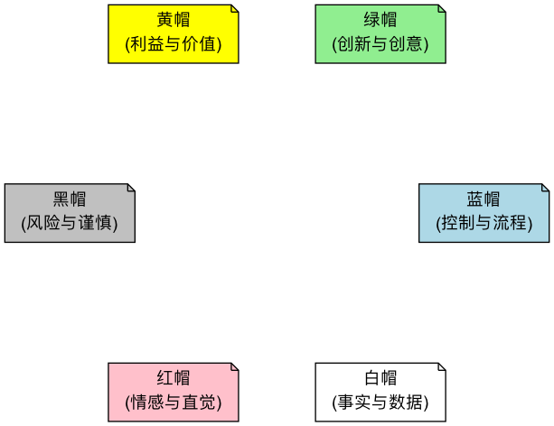

# 六顶思考帽

在团队讨论或个人思考时，我们的大脑常常陷入混乱：一方面要处理信息，一方面要产生创意，同时还要进行批判性思考，并被各种情绪所影响。这种“大杂烩”式的思考方式，效率低下且极易引发对立和冲突。**六顶思考帽（Six Thinking Hats）** 是由“创新思维之父”爱德华·德·博诺（Edward de Bono）博士设计的、一个旨在解决这一困境的、极其强大的**平行思维（Parallel Thinking）**工具。它的核心在于，将思考过程刻意地分解为六个不同的、相互独立的“频道”，每一个频道由一顶特定颜色的虚拟“帽子”来代表。

平行思维的精髓在于，它要求所有参与者在同一时间，都“戴上”同一顶帽子，朝着同一个方向进行思考。这彻底改变了传统会议中那种“我反对你的观点”的对抗模式，转变为“让我们一起来看看这个问题的风险（黑帽）”的协作模式。它将复杂的思考过程变得有序、高效，并为团队提供了一种安全的、结构化的方式，来全面地、无遗漏地探索一个问题的方方面面。

!!! abstract "要点速览"

    - **白帽**看事实，**红帽**说感受，**黑帽**找风险，**黄帽**找价值，**绿帽**想新点子，**蓝帽**管流程。
    - **核心规则**：同一时间，所有人戴同一顶帽子。不是给每个人分配一种颜色。
    - **蓝帽**由主持人掌握，在开头定目标和顺序，在结尾做总结和决策。
    - **帽子顺序没有标准答案**，要根据讨论目的来定，下文给出了几种常用顺序。
    - **最常见的失败**：变成角色扮演游戏，或者黑帽阶段变成对人的批评。

## 为什么需要六顶思考帽

传统讨论中，人们常常同时进行多种模式的思考：一边听信息，一边产生情绪，一边在心里挑毛病。结果往往是：

*   **讨论变成辩论**：一个人提出想法，另一个人立刻指出问题，双方开始捍卫各自的立场，而不是一起探索问题。
*   **信息被情绪淹没**：还没把事实摆清楚，就已经有人表达了强烈的喜好或反感，后面的讨论都绕着情绪转。
*   **好点子过早夭折**：新想法刚冒头就被“这不现实”否掉，没人愿意再提不成熟的想法。
*   **负面意见难以出口**：下属不好意思反驳上级，担心被看作“唱反调”。

六顶思考帽的做法是把这些思考模式**拆开、排序、轮流进行**。“我不是在否定你，我现在戴着黑帽”，这句话为表达不同意见提供了一个安全的方式。

## 六顶思考帽的功能详解

每一顶帽子都代表了一种独特、清晰的思维模式。

| 帽子 | 代表 | 核心问题 | 常用时机 |
| --- | --- | --- | --- |
| ⚪ 白帽 | 事实与信息 | 我们知道什么？还需要知道什么？ | 讨论开始时建立共同的信息基础 |
| 🔴 红帽 | 情绪与直觉 | 我对此的感觉是什么？ | 快速摸底，或在决策前收集直觉 |
| ⚫ 黑帽 | 风险与谨慎 | 哪里可能出问题？为什么可能行不通？ | 评估方案时 |
| 🟡 黄帽 | 价值与利益 | 好处是什么？如何让它成立？ | 评估方案时，通常放在黑帽之前 |
| 🟢 绿帽 | 创意与可能 | 还有什么其他办法？ | 需要新方案、或要解决黑帽提出的问题时 |
| 🔵 蓝帽 | 控制与组织 | 目标是什么？下一步用哪顶帽子？ | 开头、结尾，以及讨论跑偏时 |

1.  **⚪ 白帽 (White Hat) - 中立与客观**

    *   **思维模式**：像一张白纸一样，纯粹地关注**信息、事实和数据**。
    *   **核心问题**：“我们目前掌握了哪些事实？”“我们需要获取哪些信息？”“这些信息是可验证的吗？”
    *   **戴上白帽时**：你只陈述客观事实，不发表任何个人观点或进行解释。它帮助团队建立一个共同的信息基础。

2.  **🔴 红帽 (Red Hat) - 情感与直觉**

    *   **思维模式**：代表了**情绪、直觉、预感和“第六感”**。它是感性的、非理性的。
    *   **核心问题**：“对于这个想法，我的直觉是什么？”“我对此感觉如何（兴奋、担忧、怀疑）？”
    *   **戴上红帽时**：你只需表达你的感觉，**完全不需要为你的感觉提供任何理由或辩护**。这为那些难以言说的、重要的直觉感受，提供了一个合法的表达出口。红帽阶段要短，每人一两句话即可。

3.  **⚫ 黑帽 (Black Hat) - 谨慎与风险**

    *   **思维模式**：这是“风险评估”之帽，代表了**谨慎、批判和逻辑性的否定**。
    *   **核心问题**：“这个计划的潜在风险和弱点是什么？”“最坏的情况可能是什么？”“为什么这个想法可能行不通？”
    *   **戴上黑帽时**：你的任务是找出潜在的困难、障碍和负面后果。它帮助我们保持清醒，避免盲目乐观。黑帽思考必须基于逻辑，而非纯粹的负面情绪。

4.  **🟡 黄帽 (Yellow Hat) - 阳光与价值**

    *   **思维模式**：与黑帽相反，它代表了**乐观、积极和建设性**。它专注于寻找**价值、利益和可行性**。
    *   **核心问题**：“这个想法的好处和价值是什么？”“我们如何才能让它变为现实？”“最好的情况会是怎样？”
    *   **戴上黄帽时**：你需要有理有据地去发掘一个想法的闪光点。它帮助我们看到机会，并建立行动的信心。

5.  **🟢 绿帽 (Green Hat) - 创意与生长**

    *   **思维模式**：像生机勃勃的植物一样，代表了**创造力、新的可能性和替代方案**。
    *   **核心问题**：“我们还有没有其他选择？”“有没有一种全新的、与众不同的方式？”“如果我们打破常规会怎么样？”
    *   **戴上绿帽时**：这是[头脑风暴](Brainstorming-Tutorial-zh.md)的时刻，鼓励各种新奇、甚至看似不切实际的想法。它的任务是播种，而非评判。

6.  **🔵 蓝帽 (Blue Hat) - 控制与组织**

    *   **思维模式**：像天空一样，总览全局。它代表了对**思考过程本身的思考（元认知）**，是思考的“指挥官”和“主持人”。
    *   **核心问题**：“我们这次讨论的目标是什么？”“我们应该按什么样的顺序使用这些帽子？”“现在我们需要哪种思考？”“让我们来总结一下目前的成果。”
    *   **戴上蓝帽时**：你不参与具体内容的讨论，而是负责管理整个思考流程，确保会议高效、有序地进行。蓝帽通常在会议的开始和结束时使用，也可以在过程中用于切换方向。

## 如何组织一次六顶思考帽会议

1.  **开始（蓝帽）**：会议主持人戴上蓝帽，向所有参与者清晰地说明本次会议要解决的问题、预期的目标，并宣布接下来将要使用的帽子顺序。例如，“我们今天的目标是评估‘新产品A’的上市计划。我建议的顺序是：白、绿、黄、黑、红、蓝。”

2.  **信息共享（白帽）**：所有参与者一起戴上白帽，分享关于“新产品A”的所有已知事实和数据，例如市场调研报告、研发成本、竞品情况等，建立一个共同的信息平台。

3.  **创意生成（绿帽）**：所有参与者戴上绿帽，针对“我们如何能让上市活动更有创意？”进行创意发散，提出尽可能多的想法。

4.  **价值发现（黄帽）**：针对绿帽阶段产生的几个核心创意，所有人戴上黄帽，逐一发掘每个创意可能带来的好处和价值。

5.  **风险评估（黑帽）**：接着，所有人戴上黑帽，对这几个创意进行谨慎的风险评估，找出它们各自的潜在弱点和执行障碍。

6.  **直觉表达（红帽）**：让每位参与者有机会戴上红帽，快速地表达对某个方案的最终直觉（“我就是感觉这个方案更令人兴奋！”）。

7.  **总结决策（蓝帽）**：最后，主持人再次戴上蓝帽，对整个讨论过程进行总结，梳理出最终的结论，并引导团队制定出下一步的行动计划。

**时间建议**：每顶帽子通常 3~10 分钟，红帽最短（1~2 分钟）。主持人要严格控时，时间到了就切换，避免某一阶段无限延长。

### 不同场景的常用帽子顺序

帽子的顺序应该服务于讨论目标。下面是几种经过实践检验的顺序，可以直接参考：

| 讨论目的 | 推荐顺序 | 说明 |
| --- | --- | --- |
| 评估一个已有方案 | 蓝 → 白 → 黄 → 黑 → 绿 → 红 → 蓝 | 先看价值再看风险，绿帽用来改进黑帽发现的问题 |
| 寻找新方案 | 蓝 → 白 → 绿 → 黄 → 黑 → 红 → 蓝 | 先充分发散，再评估 |
| 快速做决定 | 蓝 → 红 → 黑 → 黄 → 蓝 | 先摸清直觉和顾虑，适合时间紧的场合 |
| 项目复盘 | 蓝 → 白 → 红 → 黄 → 黑 → 绿 → 蓝 | 先还原事实和感受，再总结得失和改进点 |
| 解决冲突 | 蓝 → 红 → 白 → 绿 → 黄 → 蓝 | 先让情绪有出口，再回到事实和解决方案 |

## 应用案例

**案例一：评估一个收购提议**

*   **蓝帽**：设定议程，评估是否应该收购B公司。
*   **白帽**：B公司的财务报表、市场份额、客户数据、收购报价等事实信息。
*   **黄帽**：收购能带来技术互补、市场渠道扩张、消除一个竞争对手等好处。
*   **黑帽**：收购可能带来巨大的财务风险、两家公司的企业文化可能难以融合、其核心技术可能被高估。
*   **绿帽**：除了完全收购，我们是否可以考虑战略投资、成立合资公司等其他合作方式？
*   **红帽**：我对此感到很兴奋，这是一个千载难逢的机会！/ 我的直觉告诉我这里面有坑，我感到不安。
*   **蓝帽**：总结各方观点，决定需要进行更深入的尽职调查，并委派一个小组探索绿帽提出的替代方案。

**案例二：决定是否开发一款新App**

*   **蓝帽**：会议目标是决定是否投入资源开发一款名为“TaskMaster”的任务管理App。顺序为：白、绿、黄、黑、红、蓝。
*   **白帽**：市场上有哪些竞品？目标用户规模多大？开发需要哪些技术和资源？
*   **绿帽**：可以加入哪些独特功能？例如 AI 智能排序、游戏化激励机制等。
*   **黄帽**：这款App能解决用户的痛点，有机会获得大量用户，并带来订阅收入。
*   **黑帽**：市场竞争激烈，用户获取成本高，可能无法盈利；部分功能的技术实现有难度。
*   **红帽**：我觉得这个主意很酷，很兴奋！/ 我有点担心，感觉市场已经饱和了。
*   **蓝帽**：虽然有风险，但机会也很大。下一步：用一周时间做一个[最小可行产品（MVP）](../testing_and_validation/MVP-Tutorial-zh.md)原型，找种子用户测试后再决定是否全面投入。

**案例三：解决一个棘手的客户投诉**

*   **蓝帽**：目标是找到一个既能安抚客户，又能避免未来类似问题发生的解决方案。
*   **白帽**：客户投诉的具体内容是什么？订单号、时间线、涉及的员工是谁？
*   **红帽**：我感到很抱歉和沮丧，客户的愤怒是可以理解的。
*   **黑帽**：如果我们全额退款，可能会开创一个不好的先例，导致成本失控。
*   **黄帽**：这是一个挽回客户忠诚度的绝佳机会，处理得好，他可能会成为我们的“铁粉”。
*   **绿帽**：我们除了退款，是否可以赠送一张大额优惠券？是否可以邀请他参与我们下一代产品的内测？如何从流程上彻底杜绝这类问题？
*   **蓝帽**：决定立即向客户道歉并提供“退款+优惠券”的补偿方案，并成立一个由绿帽想法驱动的流程改进项目组。

**案例四：个人职业生涯规划**

*   你可以自己跟自己进行六顶思考帽的对话。
*   **白帽**：我目前的技能、收入、行业趋势是什么？
*   **黄帽**：如果我去读一个在职研究生，能给我带来哪些知识、人脉和机会？
*   **黑帽**：这需要花费大量的金钱和业余时间，可能会影响我的家庭生活和当前工作。
*   **红帽**：我对现在的工作感到厌倦，一想到能去学习新东西就感到兴奋！
*   **绿帽**：除了读研，我是否可以考虑参加一些线上的认证课程？或者申请内部转岗？
*   **蓝帽**：好了，我现在的任务是，先去调研一下绿帽提出的几个替代方案的具体信息（回到白帽）。

## 常见误区

1.  **给每个人分配一种颜色**。这是最常见的误用。如果张三固定戴黑帽、李四固定戴黄帽，会议就又变回了对立的辩论。六顶思考帽的核心是**所有人同时戴同一顶帽子**。
2.  **黑帽变成了对人的批评**。黑帽讨论的是方案的风险，不是提出方案的人。主持人要及时把“你这想法太幼稚”拉回到“这个方案在哪个环节可能失败”。
3.  **跳过红帽**。很多理性的团队觉得说感受没有意义，但被压下去的情绪会在其他阶段以“理性反对”的形式冒出来。花一两分钟让大家说出直觉，反而能节省时间。
4.  **黄帽变成了空洞的赞美**。“这个想法很好”不是黄帽思考。黄帽需要说清楚好在哪里、在什么条件下成立。
5.  **蓝帽缺位**。没有人控时、没有人在结尾总结，讨论就会在某一顶帽子上停留过久，最后不了了之。
6.  **为了用工具而用工具**。简单的问题不需要走完六顶帽子。只需要快速收集顾虑时，单用一次黑帽就够了。

## 六顶思考帽的优势与挑战

**核心优势**

*   **极大地提升会议效率**：平行思维避免了无休止的、破坏性的争论，让讨论聚焦而高效。
*   **促进全面、深度的思考**：确保了一个问题的各个方面都被系统性地考虑到，避免了片面和遗漏。
*   **提供“角色扮演”的安全性**：它允许人们（特别是团队中的下级）在一个安全的“角色”下，毫无顾忌地提出负面意见（黑帽）或疯狂创意（绿帽），而不用担心被视为“爱挑刺”或“不切实际”。

**潜在挑战**

*   **需要练习和引导**：对于习惯了传统对抗式讨论的团队，初次使用可能会感到不适应。一个好的蓝帽主持人至关重要。
*   **可能过于形式化**：如果不能理解每顶帽子背后的思维精髓，可能会变成一个僵化的、走过场的形式主义练习。

## 常见问题

??? question "六顶思考帽的顺序是固定的吗？"

    不是。德·博诺本人也强调顺序应根据讨论目标来定。唯一相对固定的是蓝帽通常在开头和结尾出现。上文的“不同场景的常用帽子顺序”可以作为起点。

??? question "每顶帽子一定都要用到吗？"

    不需要。可以只用其中几顶，甚至只用一顶。例如快速收集一个方案的风险，只用黑帽即可；需要新点子时，单独开一轮绿帽。

??? question "一个人也能用六顶思考帽吗？"

    可以。个人做决定、写方案、复盘时，按顺序轮流从六个角度想一遍，能有效避免只看到自己愿意看到的那一面。把每个阶段的想法写下来效果更好。

??? question "六顶思考帽和头脑风暴有什么区别？"

    头脑风暴专注于一件事：产生大量想法，对应的只是绿帽。六顶思考帽是一套完整的讨论流程，覆盖了事实、感受、风险、价值、创意和决策。可以把头脑风暴看作绿帽阶段的一种具体做法。

??? question "黑帽和红帽里的“担心”有什么区别？"

    红帽的担心是直觉，不需要理由：“我就是觉得不太对”。黑帽的担心必须有逻辑：“如果用户留存低于 20%，获客成本就收不回来”。红帽的直觉往往可以在黑帽阶段被展开成具体的风险。

## 延伸与关联

*   **[头脑风暴](Brainstorming-Tutorial-zh.md)**：绿帽思考，本质上就是一次聚焦于创意生成的迷你头脑风暴。
*   **[决策矩阵](../decision_making/Decision-Matrix-Tutorial-zh.md)**：在用六顶思考帽对一个复杂问题进行了全面的分析和讨论后，可以使用决策矩阵，对最终筛选出的几个备选方案，进行更量化的评估和排序。
*   **[ORID 聚焦式对话](../meeting_effectiveness/ORID-Focused-Conversation-Tutorial-zh.md)**：同样是结构化引导讨论的工具，ORID 按“事实—感受—意义—决定”推进，适合复盘和反思类会议。
*   **[设计思维](../product_development/Design-Thinking-Tutorial-zh.md)**：在设计思维的构思阶段，常用六顶思考帽来组织对多个概念方案的评估。

---
*来源参考：爱德华·德·博诺（Edward de Bono）博士的著作《六顶思考帽》（Six Thinking Hats）是该方法的权威来源，书中详细阐述了平行思维的哲学以及每顶帽子的应用技巧。该方法已被全球无数的顶尖企业和组织采纳为标准的会议和决策工具。*
