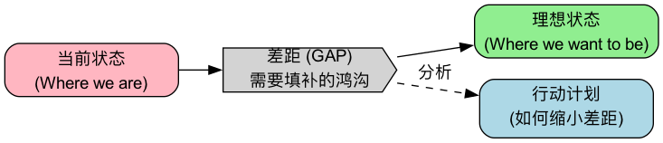

# 差距分析（Gap Analysis）

**差距分析（Gap Analysis）** 是一种战略管理工具，通过比较组织的**当前状态（Current State）**与**期望的未来状态（Desired Future State）**，来识别两者之间的“**差距（Gap）**”。

分析的核心目的不仅是找出差距本身，更是深入探究导致差距的原因，并据此制定出填补这一差距的策略和行动计划。它是一个连接“我们在哪里”和“我们想去哪里”的桥梁。这个方法简单到几乎人人都会，但做好的关键在于两点：**现状和目标都要量化**，以及**分析差距的原因，而不是只算出差距的大小**。

!!! abstract "要点速览"

    - **四个问题**：我们现在在哪里？想去哪里？差了多少、为什么？怎么补上？
    - **现状和目标必须可量化**，否则“差距”无法衡量，也无法检验行动是否有效。
    - **最关键的一步是找原因**：可以配合 [鱼骨图](../root_cause_analysis/Fishbone-Diagram-Tutorial-zh.md) 或 [五问法](../root_cause_analysis/5-Whys-Tutorial-zh.md)。
    - **常见类型**：业绩差距、能力/技能差距、产品与市场差距、合规差距。
    - **差距不必一次补完**：按影响和难度排优先级，先补最关键的那几个。

## 为什么使用差距分析？

- **明确方向**：帮助组织清晰地了解现状与目标之间的距离，为战略规划提供依据。
- **优化资源配置**：通过识别关键差距，可以更有效地分配人力、财力和物力资源，确保投入到最需要改进的领域。
- **绩效改进**：适用于评估业务流程、产品性能、团队技能等多个方面，并推动持续改进。
- **识别潜在机会**：在分析差距的过程中，可能会发现新的市场机会或未被满足的客户需求。

## 差距分析的常见类型

差距分析几乎可以用在任何“有目标”的地方。根据对比的对象不同，常见的有以下几类：

| 类型 | 对比什么 | 典型问题 | 常用数据来源 |
| --- | --- | --- | --- |
| **业绩差距** | 实际业绩 vs 目标或行业标杆 | 销售额为什么没达标？ | 财务数据、经营报表 |
| **能力 / 技能差距** | 团队现有能力 vs 岗位或战略要求 | 团队能不能支撑新业务？ | 技能评估、绩效考核、培训记录 |
| **产品与市场差距** | 产品现状 vs 用户需求或竞品 | 我们的产品缺什么？ | 用户调研、竞品分析、用户反馈 |
| **流程差距** | 现有流程 vs 最佳实践 | 交付为什么比同行慢？ | 流程耗时统计、现场观察 |
| **合规差距** | 现状 vs 法规或认证标准 | 我们离通过某项认证还差什么？ | 法规条文、审计清单 |

## 如何进行差距分析？（四步法）

### 步骤一：描述并量化当前状态（Where are we now?）

- **全面评估**：客观、真实地评估你所分析领域的当前表现。这一步需要基于数据和事实，而不是主观感觉。
- **具体指标**：使用可量化的指标来描述现状。例如：
  - *销售*：本季度实际销售额为80万元。
  - *生产*：产品A的合格率为95%。
  - *技能*：团队中只有20%的成员掌握了新的软件技能。

### 步骤二：定义并量化未来状态（Where do we want to be?）

- **设定目标**：清晰、具体地描述你希望达到的未来状态或目标。目标应该符合 [SMART 原则](../goal_management/SMART-Goals-Tutorial-zh.md)（具体的、可衡量的、可实现的、相关的、有时限的）。
- **具体指标**：同样使用可量化的指标。
  - *销售*：本季度的销售目标是100万元。
  - *生产*：产品A的合格率目标是99%。
  - *技能*：目标是团队中80%的成员掌握新的软件技能。
- **目标从哪里来**：战略规划、上级下达的指标、行业标杆、竞争对手的水平、客户的要求。来源不同，目标的合理性也不同，最好在分析中注明。

### 步骤三：识别并分析差距（Identify the Gap）

- **计算差距**：明确当前与未来状态之间的差异。
  - *销售差距*：20万元的销售缺口。
  - *生产差距*：4个百分点的合格率差距。
  - *技能差距*：60%的团队成员需要培训。
- **探究原因**：这是最关键的一步。分析导致这些差距的根本原因是什么？
  - *销售缺口原因*：可能是市场推广不足、销售人员激励不够、竞争对手降价等。
  - *合格率差距原因*：可能是设备老化、操作流程不规范、原材料质量问题等。
- **用工具找原因**：原因来自多个方面时，用鱼骨图把可能原因列全；原因链条比较清晰时，用五问法往下追问；需要把大差距拆小时，用[逻辑树](Logic-Tree-Tutorial-zh.md)按公式拆解（例如销售额 = 客户数 × 转化率 × 客单价）。

### 步骤四：制定并实施填补差距的行动计划（Bridge the Gap）

- **头脑风暴解决方案**：针对导致差距的根本原因，提出具体的解决方案和行动计划。
- **确定优先级和资源**：评估每个行动方案的成本、效益和可行性，确定实施的优先级，并分配必要的资源。差距很多时，可以用“影响大小 × 实施难度”做一个简单的四象限排序。
- **制定计划**：明确每个行动的负责人、时间表和预期的结果。
  - *行动计划示例*：
    1.  **行动**：启动新一轮的数字营销活动。**负责人**：市场部。**截止日期**：下月底。
    2.  **行动**：修订销售人员的佣金制度。**负责人**：人力资源部。**截止日期**：下季度初。
    3.  **行动**：对所有生产线员工进行操作流程再培训。**负责人**：生产部。**截止日期**：未来三周内。
- **定期复核**：按计划节点重新测量指标，看差距是否在缩小。没有缩小，说明原因没找对或行动不到位，需要回到第三步。

## 差距分析模板

| 领域 / 指标 | 当前状态 | 目标状态 | 差距 | 主要原因 | 填补措施 | 负责人 | 完成时间 | 优先级 |
| --- | --- | --- | --- | --- | --- | --- | --- | --- |
| 季度销售额 | 80 万元 | 100 万元 | −20 万元 | 新客户转化率低 | 优化销售话术与跟进流程 | 销售部 | 下季度初 | 高 |
| 产品合格率 | 95% | 99% | −4 个百分点 | 设备精度下降 | 设备检修 + 操作再培训 | 生产部 | 三周内 | 高 |
| …… | | | | | | | | |

**自检清单**

- [ ] 当前状态用数据描述，而不是“还不错”“比较差”
- [ ] 目标状态有明确的时间范围
- [ ] 每个差距都写出了原因，而不只是差距的大小
- [ ] 每条措施都有负责人和完成时间
- [ ] 约定了复核差距的时间点

## 实践案例

### 案例一：网站用户体验差距分析

- **当前状态**：
  - 用户满意度得分为 3.5/5.0。
  - 网站跳出率为 60%。
  - 移动端用户转化率为 1%。

- **未来状态**：
  - 用户满意度得分达到 4.5/5.0。
  - 网站跳出率降低到 40%。
  - 移动端用户转化率提升至 3%。

- **差距与原因分析**：
  - **满意度差距 (1.0分)**：原因可能是页面加载慢、导航混乱。
  - **跳出率差距 (20个百分点)**：原因可能是内容与用户期望不符、广告过多。
  - **转化率差距 (2个百分点)**：原因可能是移动端支付流程过于复杂。

- **行动计划**：
  1.  优化网站图片和代码，提升页面加载速度。
  2.  重新设计网站导航栏，使其更符合用户直觉。
  3.  简化移动端支付流程，减少操作步骤。
  4.  用 [A/B 测试](../testing_and_validation/AB-Testing-Tutorial-zh.md)比较不同的页面布局，以降低跳出率。

### 案例二：团队技能差距分析

一家公司计划明年把一部分业务迁移到数据驱动的决策方式，需要评估运营团队的能力是否跟得上。

- **第一步：定义目标能力**。根据新业务要求，列出运营岗位需要的四项能力：数据分析（会用 SQL 取数）、数据可视化、A/B 测试设计、业务指标拆解。每项按 1~4 级定义要求（1 = 了解，4 = 能指导他人），目标是每项至少达到 3 级。
- **第二步：评估现状**。通过技能自评加主管评估，得到 10 名运营人员的现状：

| 能力 | 目标等级 | 团队平均 | 达标人数 | 差距 |
| --- | --- | --- | --- | --- |
| SQL 取数 | 3 | 1.6 | 2 / 10 | 最大 |
| 数据可视化 | 3 | 2.4 | 4 / 10 | 中等 |
| A/B 测试设计 | 3 | 1.8 | 1 / 10 | 大 |
| 业务指标拆解 | 3 | 2.8 | 7 / 10 | 小 |

- **第三步：分析原因**。SQL 和 A/B 测试差距最大，原因是过去取数完全依赖数据团队，运营人员没有练习机会；指标拆解差距小，是因为日常复盘中已经在做。
- **第四步：行动计划**。为 SQL 安排为期六周的内部训练营，并开放只读数据库权限让大家边学边用；A/B 测试由数据团队带两个真实项目做示范；指标拆解维持现状。三个月后重新评估。

这类分析常用“技能矩阵”（人 × 能力 的评分表）来呈现，一张表就能看清团队的整体能力分布和薄弱环节。

## 常见误区

1.  **现状靠感觉，目标靠拍脑袋**。“我们的服务还可以”“目标是做到行业领先”，这样的描述无法计算差距，也无法检验后续行动是否有效。
2.  **只算差距，不找原因**。知道“差了 20 万”远远不够。不同的原因对应完全不同的行动，跳过原因分析，行动计划往往只是“加大力度”。
3.  **一次想补齐所有差距**。差距很多时平均用力，结果每个都补不上。按影响和难度排序，集中资源先解决最关键的少数。
4.  **把目标当成不可质疑的前提**。有时候差距大，是因为目标本身脱离实际。分析中发现目标不合理时，应该提出调整，而不是硬着头皮执行。
5.  **做完就束之高阁**。差距分析是一个循环，不是一份报告。没有复核节点，就无法知道行动是否起了作用。
6.  **只看内部，不看外部**。只和自己的历史比，可能会忽视整个行业都在进步的事实。条件允许时，用行业标杆或竞争对手作为参照。

## 常见问题

??? question "差距分析和 SWOT 分析有什么区别？"

    SWOT 盘点企业的优势、劣势、机会和威胁，回答“我们的处境如何”；差距分析对比现状与目标，回答“离目标还差什么、怎么补”。常见的做法是先用 SWOT 确定方向和目标，再用差距分析制定达成目标的具体计划。

??? question "差距分析适合个人使用吗？"

    很适合。比如职业规划：列出目标岗位要求的能力（目标状态），诚实评估自己现在的水平（当前状态），差距最大的那几项，就是接下来一年最值得投入学习的方向。

??? question "目标状态应该怎么定？"

    可以参考战略规划、行业标杆、竞争对手、客户要求或历史最好水平。目标要有挑战但可实现，并且有明确的时间范围。如果分析发现差距大到不可能在期限内补上，应该回头调整目标或期限。

??? question "差距分析多久做一次？"

    取决于对象。业绩差距可以每月或每季度做一次；能力差距一般半年到一年做一次；重大战略调整或新项目启动前，也应该专门做一次。

??? question "差距很大，不知道从哪里入手怎么办？"

    先用逻辑树把大差距拆成几个小差距，再分别找原因。然后按“影响大小 × 实施难度”排序，优先做影响大、难度小的事情，尽快看到效果，再逐步攻坚难度大的部分。

## 延伸与关联

*   **[SWOT分析](../strategic_analysis/SWOT-Analysis-Tutorial-zh.md)**：先用 SWOT 看清处境、确定方向，再用差距分析把方向落成可执行的计划。
*   **[SMART目标](../goal_management/SMART-Goals-Tutorial-zh.md)**：好的“目标状态”应该符合 SMART 原则，这是差距可以被衡量的前提。
*   **[OKR](../goal_management/OKR-Tutorial-zh.md)** 与 **[平衡计分卡](../strategic_execution/Balanced-Scorecard-Tutorial-zh.md)**：差距分析找到的关键差距，可以转化为下一周期的目标和关键结果。
*   **[鱼骨图](../root_cause_analysis/Fishbone-Diagram-Tutorial-zh.md)** 与 **[五问法](../root_cause_analysis/5-Whys-Tutorial-zh.md)**：分析差距原因时最常用的两个工具。
*   **[问题解决](Problem-Solving-zh.md)**：差距分析本质上是一种“定义问题”的方法，后续可以接上完整的问题解决流程。

---
*来源参考：差距分析是战略管理、质量管理和人力资源管理中广泛使用的基础方法，在 ISO 体系认证准备、组织能力规划和企业战略制定中都有成熟的应用。*
