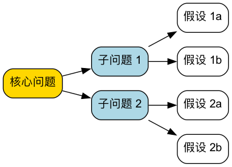

# 逻辑树（Logic Tree）分析法

面对“为什么利润下降了”“怎么把用户量翻一倍”这样的问题，很多人的第一反应是凭经验抛出几个原因或办法。问题在于，凭经验想到的往往只是自己熟悉的那几个方向，真正的原因或最好的办法可能恰好落在盲区里。**逻辑树（Logic Tree）** 是一种强大的、可视化的分析工具，用于将一个复杂的问题或议题系统性地分解为更小、更易于管理的部分，直到每一部分都可以被数据验证、或者可以被直接执行。

它的核心原则是 **MECE（Mutually Exclusive, Collectively Exhaustive）**，即“**相互独立，完全穷尽**”：拆出来的各个部分彼此不重叠，合起来又没有遗漏。逻辑树是麦肯锡等咨询公司的看家本领，也是产品经理、运营和管理者最实用的结构化思考工具之一。

!!! abstract "要点速览"

    - **三种常用的树**：问题树（为什么）、“如何”树（怎么做）、假设树（是不是这样）。
    - **MECE 原则**：每一层的分支不重叠、不遗漏。最简单的做法是用公式或流程来拆。
    - **拆到什么程度**：拆到每个末端节点都能用数据验证，或者能直接分配给某个人去做。
    - **拆完之后**：问题树要用数据剪枝，“如何”树要评估优先级，不要试图同时做所有分支。
    - **常见搭档**：拆解后用 [金字塔原理](../logical_thinking/Pyramid-Principle-Tutorial-zh.md) 把结论讲清楚。

<!-- mermaid 源文件：Logic-Tree-Tutorial-zh-mermaid-src-1.mmd -->

## 什么是 MECE 原则

MECE 是逻辑树的灵魂，也是最容易出错的地方。

*   **相互独立（Mutually Exclusive）**：同一层的分支之间没有交叉。任何一个具体原因，只能归到一个分支下面。
*   **完全穷尽（Collectively Exhaustive）**：同一层的分支加起来，覆盖了上一层问题的全部可能。

用“分析公司员工”来举例：

| 拆分方式 | 是否 MECE | 原因 |
| --- | --- | --- |
| 按年龄：30岁以下 / 30~45岁 / 45岁以上 | ✓ | 每个人只属于一组，且没有人被漏掉 |
| 按身份：管理者 / 技术人员 / 销售人员 | ✗ | 技术经理同时属于两组（不独立）；行政、财务被漏掉（不穷尽） |
| 按入职时间：1年以内 / 1~3年 / 3年以上 | ✓ | 不重叠、不遗漏 |
| 按状态：优秀员工 / 需要改进的员工 | ✗ | 中间大多数“表现正常”的人被漏掉 |

**一个实用的技巧**：拆分时如果拿不准，就加一个“其他”分支保证穷尽，再看“其他”里是不是装了太多东西。如果“其他”很大，说明拆分维度没选好。

## 逻辑树的三种类型

### 问题树（Problem Tree / 诊断树）

- **目的**：用于诊断和探究“**为什么**”一个问题会发生。
- **结构**：从一个核心问题（树根）出发，不断向下分解，寻找导致该问题的潜在原因。每一层分支都是对上一层问题的更深层次解答。
- **应用场景**：根本原因分析、绩效下降诊断、故障排查等。

### “如何”树（How Tree / 解决方案树）

- **目的**：用于构思和规划“**如何**”实现一个目标或解决一个问题。
- **结构**：从一个总体目标（树根）出发，将其分解为具体的、可执行的策略或行动方案。
- **应用场景**：战略规划、目标设定、项目计划、寻找解决方案等。

### 假设树（Hypothesis Tree）

- **目的**：在信息不足、时间有限时，先提出一个最可能的答案，再把它拆成需要被验证的子假设。
- **结构**：树根是一个结论性的假设（例如“利润下降主要是因为原材料涨价”），下面是“要让这个假设成立，必须满足哪些条件”。
- **应用场景**：咨询项目早期、快速决策、需要用最少的数据得出结论的场合。它的好处是**只收集能证明或推翻假设的数据**，效率很高；风险是如果初始假设偏得太远，需要果断推翻重来。

## 五种常用的拆解方法

不知道从哪个维度拆，是使用逻辑树最常见的卡点。下面五种方法能覆盖绝大多数场景：

| 拆解方法 | 思路 | 例子 |
| --- | --- | --- |
| **公式拆解** | 用数学关系拆，天然 MECE | 利润 = 收入 − 成本；收入 = 客流量 × 转化率 × 客单价 |
| **流程拆解** | 按事情发生的先后顺序拆 | 用户转化 = 曝光 → 点击 → 注册 → 激活 → 付费 |
| **对象拆解** | 按涉及的对象或群体拆 | 用户 = 新用户 + 老用户；渠道 = 线上 + 线下 |
| **二分法** | 拆成“A”和“非A” | 内部原因 / 外部原因；可控因素 / 不可控因素 |
| **借用成熟框架** | 用现成的分析框架作为第一层 | 营销问题用 4P；行业分析用[五力模型](../strategic_analysis/Porters-Five-Forces-Tutorial-zh.md)；宏观环境用 [PESTEL](../strategic_analysis/PESTEL-Analysis-Tutorial-zh.md) |

**优先用公式拆解**。公式天然满足 MECE，而且每个分支都能直接对应到数据，是最不容易出错的方法。

## 如何构建逻辑树

### 步骤一：明确定义核心问题或目标

- **问题树**：清晰地陈述要分析的“问题”。例如：“为什么我们的网站用户流失率在上升？”
- **“如何”树**：清晰地定义要达成的“目标”。例如：“我们如何将网站的月活跃用户数提升20%？”
- 将这个问题或目标作为逻辑树的起点（树根）。问题要具体：“业绩不好”不是一个好的树根，“华东区第三季度销售额同比下降 15%”才是。

### 步骤二：进行第一层分解（应用MECE原则）

- **选择拆解维度**：参考上面的五种方法，优先尝试公式拆解。
- **检查 MECE**：确保第一层的分支是相互独立的（没有重叠），并且完全穷尽了（没有遗漏任何重要方面）。
  - **例（问题树）**：用户流失率上升可以分解为：“新用户流失”和“老用户流失”。
  - **例（“如何”树）**：提升月活跃用户数可以分解为：“吸引新用户”、“提升现有用户活跃度”和“召回流失用户”。

### 步骤三：逐层向下分解

- **持续提问**：对每一个分支，继续提问“为什么会这样？”（问题树）或“具体如何做？”（“如何”树），进行更深层次的分解。
- **每一层可以换维度**：第一层按公式拆，第二层可以按对象或流程拆，但同一层内必须用同一个维度。
- **拆到可以行动为止**：继续分解，直到每个末端节点都能被数据验证，或者能直接交给某个人去执行。一般 3~4 层就够了。

### 步骤四：验证假设并确定优先级

- **数据验证（剪枝）**：对于问题树，收集数据来验证哪些分支是真正的原因，把被数据否定的分支剪掉。
- **评估方案**：对于“如何”树，评估每个行动方案的可行性、成本和预期效果。
- **确定关键路径**：找出对解决问题或实现目标影响最大的关键原因或关键行动，并确定优先级。

## 实践案例

### 案例一：问题树——“为什么餐厅利润下降了？”

用公式拆解作为第一层，每一层都能对应到具体数据：

*   **利润下降**
    *   **收入减少**
        *   **顾客数量减少**
            *   新顾客减少（大众点评曝光下降？周边新开了竞争对手？）
            *   回头客减少（菜品口味变化？服务变差？）
        *   **客单价下降**
            *   点菜数量减少（菜单结构问题？）
            *   高价菜品销量下降（招牌菜品质下降？）
    *   **成本上升**
        *   **食材成本上升**
            *   采购价格上涨
            *   损耗率上升（备货过多？储存不当？）
        *   **人工成本上升**
        *   **房租及其他固定成本上升**

**分析**：拿到上月数据后，管理者发现顾客数量基本持平、成本也变化不大，但**客单价下降了 18%**，进一步看是招牌菜销量明显下滑。于是把“收入减少—客单价下降—高价菜品销量下降”这条分支作为重点，其余分支直接剪掉。追查后发现，换了一位厨师后招牌菜口味发生了变化，顾客评价中“不如以前”的比例明显上升。

### 案例二：“如何”树——“如何提升个人工作效率？”

*   **提升个人工作效率**
    *   **做对的事（选择）**
        *   每天开始前列出任务清单，并用[艾森豪威尔矩阵](../time_management/Eisenhower-Matrix-Tutorial-zh.md)区分轻重缓急
        *   每周回顾一次目标，删掉不再重要的任务
    *   **把事做快（执行）**
        *   用[番茄工作法](../time_management/Pomodoro-Technique-Tutorial-zh.md)保持专注
        *   把重复性工作做成模板或自动化
    *   **减少浪费（干扰）**
        *   关闭不必要的消息通知
        *   每天设置固定的“免打扰”工作时段
        *   合并处理邮件和消息，而不是随时回复

**分析**：第一层按“选择—执行—干扰”三个环节拆分，基本覆盖了效率问题的来源。拆完之后不必全部同时做，先选一两个投入小、见效快的动作（比如关闭通知、固定免打扰时段）开始。

### 案例三：“如何”树——“如何把 App 月活跃用户提升 20%？”

*   **月活跃用户 = 新增活跃用户 + 留存的老用户 + 召回的流失用户**
    *   **增加新用户**：拓展投放渠道、优化应用商店页面、老带新奖励
    *   **提高留存**：改进新手引导、增加每周使用的理由（内容更新、提醒）
    *   **召回流失用户**：按流失原因分组推送、针对性的回归礼包

**分析**：用公式拆解后，团队先查数据：新增用户其实在增长，但次月留存率只有 25%，大量新用户来了就走。于是把资源集中到“提高留存—改进新手引导”这个分支上，而不是继续加大投放。

## 逻辑树模板

| 层级 | 内容 | 拆解维度 | 是否 MECE | 验证方式 / 负责人 |
| --- | --- | --- | --- | --- |
| 树根 | 具体、可衡量的问题或目标 | — | — | — |
| 第一层 | 分支 A / 分支 B / 分支 C | 公式 / 流程 / 对象 / 二分 / 框架 | ✓ / ✗ | |
| 第二层 | A1 / A2 …… | | | |
| 第三层 | 能直接验证或执行的末端节点 | | | 需要的数据 / 执行人 |

**自检清单**

- [ ] 树根是具体、可衡量的问题，不是一个模糊的感受
- [ ] 每一层只用了一个拆解维度
- [ ] 每一层都检查过“有没有重叠、有没有遗漏”
- [ ] 每个末端节点都能被数据验证，或能被直接执行
- [ ] 已经根据数据或优先级剪掉了不重要的分支

## 常见误区

1.  **同一层混用多个维度**。“收入减少、新顾客减少、服务变差”放在同一层，就是把公式、对象和原因混在了一起，必然产生重叠。
2.  **为了 MECE 而 MECE**。拆得很整齐，却和要解决的问题关系不大。拆解维度要服务于问题，能指向数据或行动才有意义。
3.  **拆得太深**。拆到第六、七层，树会变得极其庞大，失去焦点。3~4 层通常就够了，重要的分支再单独展开。
4.  **只拆不验证**。问题树拆出来的每个分支都只是“可能”。没有用数据剪枝就去解决所有分支，资源会被摊薄。
5.  **末端节点不可行动**。“提高团队积极性”这样的末端节点无法执行，需要继续拆到具体的动作。
6.  **把逻辑树当成思维导图**。思维导图允许自由联想、分支之间可以重叠；逻辑树要求严格的 MECE 和层级逻辑。两者用途不同。

## 逻辑树、鱼骨图和思维导图的区别

| | 逻辑树 | [鱼骨图](../root_cause_analysis/Fishbone-Diagram-Tutorial-zh.md) | [思维导图](../ideation/Mind-Mapping-Tutorial-zh.md) |
| --- | --- | --- | --- |
| 核心用途 | 拆解问题或目标 | 找出问题的可能原因 | 发散联想、整理思路 |
| 结构要求 | 严格层级，每层 MECE | 按原因类别分组 | 自由，可以重叠 |
| 方向 | 可以找原因，也可以找方案 | 只找原因 | 不限 |
| 适合场景 | 分析报告、方案规划、咨询项目 | 质量问题、故障分析 | 头脑风暴、读书笔记、知识梳理 |

## 常见问题

??? question "逻辑树和 MECE 是什么关系？"

    MECE 是构建逻辑树必须遵守的原则：每一层的分支要相互独立、完全穷尽。逻辑树是工具，MECE 是检验这个工具是否用对的标准。

??? question "逻辑树应该拆几层？"

    没有固定要求，一般 3~4 层。判断标准是末端节点能否被数据验证或直接执行。到了这个程度就可以停止，继续往下拆只会增加复杂度。

??? question "用什么工具画逻辑树？"

    手绘或白板最灵活。电子工具可以用 XMind、幕布、ProcessOn、Miro 等思维导图类软件，或者直接用文档里的多级列表，本文的案例就是用列表写成的。

??? question "逻辑树和金字塔原理有什么区别？"

    两者结构相似，用途相反。逻辑树用于分析：从问题出发往下拆，找原因或找方案。金字塔原理用于表达：把分析得到的结论放在最上面，用论据向下支撑，让别人更容易接受你的观点。

??? question "怎么判断自己的拆分是不是 MECE？"

    两个问题：任意拿一个具体情况，它是否只能归到一个分支下（独立）？所有情况是否都能找到一个分支归属（穷尽）？如果需要加一个很大的“其他”分支才能穷尽，说明维度没选好。

## 延伸与关联

*   **[金字塔原理](../logical_thinking/Pyramid-Principle-Tutorial-zh.md)**：逻辑树负责把问题想清楚，金字塔原理负责把结论讲清楚。
*   **[五问法](../root_cause_analysis/5-Whys-Tutorial-zh.md)**：问题树的某一个分支，可以用五问法纵向深挖到根本原因。
*   **[鱼骨图](../root_cause_analysis/Fishbone-Diagram-Tutorial-zh.md)**：同样用于找原因，按类别发散，适合团队讨论。
*   **[问题解决](Problem-Solving-zh.md)**：逻辑树是结构化问题解决流程中“拆解问题”这一步的核心工具。
*   **[思维导图](../ideation/Mind-Mapping-Tutorial-zh.md)**：先用思维导图自由发散，再整理成符合 MECE 的逻辑树，是很常见的工作方式。

---
*来源参考：逻辑树与 MECE 原则在麦肯锡咨询公司得到系统化应用和推广，芭芭拉·明托（Barbara Minto）在《金字塔原理》中对 MECE 原则做了经典阐述。如今它已成为管理咨询、产品和运营领域的通用分析方法。*
