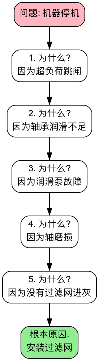

# 5 Whys (五问法)

在处理日常问题时，我们常常会陷入一个“治标不治本”的怪圈：我们修复了一个问题，但没过多久，同样的问题又以同样或类似的方式再次出现。这通常是因为，我们只是处理了问题的**表面症状**，而没有触及导致它发生的**根本原因**。**5 Whys（五问法）**，是一种极其简单、但又异常深刻的**根本原因分析（Root Cause Analysis, RCA）**技术。它由丰田汽车公司的创始人丰田佐吉提出，是丰田生产系统（TPS）中解决问题的核心工具。

五问法的核心思想在于，通过对一个已发生的问题，进行连续、迭代地追问“**为什么？**”，层层深入，像剥洋葱一样，直到找到那个如果被解决，就能彻底防止问题再次发生的、最底层的根本原因。它并非严格地要求必须问满五次，有时可能三次就能找到根源，有时可能需要更多次。其精髓在于这种**刨根问底、不满足于表面答案的追问精神**。它是一个将团队的焦点从“谁的错？”转向“为什么会发生？”，从“救火”转向“防火”的强大思维工具。

!!! abstract "要点速览"

    - **用途**：从一个已经发生的问题出发，沿因果链往下追问，找到能防止问题再次发生的根本原因。
    - **做法**：写清问题 → 连续问“为什么” → 每个回答都要有事实依据 → 停在一个可以改变的流程或制度上 → 制定对策。
    - **“五”不是硬性规定**：问到能落地改进的那一层就停，可能是三次，也可能是七次。
    - **最常见的错误**：停在“某人犯了错”这一层，或者用猜测代替事实。
    - **搭配使用**：原因来自多个方面时，先用 [鱼骨图](Fishbone-Diagram-Tutorial-zh.md) 列全原因，再对关键原因逐个用五问法深挖。

## 五问法的逻辑链条

五问法的过程，是构建一个清晰的、从症状到根源的因果关系链条。每一个“为什么”的回答，都构成了下一个“为什么”的主体。

检验一条因果链是否成立，有一个简单的办法：**从最后一个答案开始，用“所以”倒着读回去**。如果每一步“所以”都说得通，链条就是严密的；如果某一步读起来很牵强，说明中间跳过了环节，或者把相关性当成了因果。

## 如何进行一次五问法分析

1.  **第一步：组建团队，明确问题**

    *   召集所有与问题相关的、了解实际情况的一线人员组成一个小组。
    *   用清晰、客观的语言，共同写下一个准确的**问题陈述**。例如，“2023年10月26日上午10点，客户订单系统的服务器崩溃了。”
    *   问题陈述只描述**发生了什么**，不写原因，也不写“谁”。

2.  **第二步：开始连续追问“为什么？”**

    *   **第一个“为什么？”**：针对问题陈述，提出第一个“为什么？”
        *   *问*：“为什么客户订单系统的服务器会崩溃？”
        *   *答*：“因为服务器的CPU使用率达到了100%。”

    *   **第二个“为什么？”**：将上一个回答作为新的问题主体，继续追问。
        *   *问*：“为什么服务器的CPU使用率会达到100%？”
        *   *答*：“因为数据库中的一个SQL查询任务，进入了无限循环。”

    *   **第三个“为什么？”**
        *   *问*：“为什么这个SQL查询会进入无限循环？”
        *   *答*：“因为该查询在处理一种特殊的用户数据类型时，存在一个逻辑缺陷。”

    *   **第四个“为什么？”**
        *   *问*：“为什么这个存在逻辑缺陷的代码，会被发布到生产环境？”
        *   *答*：“因为我们的代码审查（Code Review）流程，没有覆盖到这种特殊的测试用例。”

    *   **第五个“为什么？”**
        *   *问*：“为什么我们的代码审查流程会存在这样的疏漏？”
        *   *答*：“因为我们还没有建立起一个标准化的、包含所有必要检查项的**代码审查清单（Checklist）**。”

3.  **第三步：识别根本原因并制定对策**

    *   **识别根本原因**：在上述例子中，根本原因被识别为“**缺乏标准化的代码审查清单**”。这是一个**流程层面**的问题。如果我们只修复了那个SQL的逻辑缺陷（第三个“为什么”的答案），那么未来很可能还会出现其他类似的、未被充分测试的代码问题。
    *   **制定对策**：针对根本原因，制定一个具体的、可执行的纠正措施。例如，“由技术负责人牵头，在本周内，创建一份包含数据库性能、安全性和边界条件测试等内容的标准代码审查清单，并要求所有团队在未来都必须遵循。”
    *   **同时处理表层问题**：找到根本原因不代表可以忽略眼前的问题。修复那个SQL缺陷（临时对策）和建立审查清单（根本对策）应该同时进行。

## 什么时候该停止追问

“问五次”只是经验值。判断是否已经到达根本原因，可以看下面几条：

*   **答案落到了一个流程、标准、制度或资源配置上**，而且团队有能力改变它。
*   **如果把这个原因消除，同类问题就不会再发生**，而不仅仅是这一次不会发生。
*   **再往下问，答案就超出了团队能控制的范围**，比如“因为市场环境变化”“因为人性就是这样”。这说明你已经问过头了，应该退回上一层。

反过来，如果最后一个答案是“某某没注意”“某某操作失误”，那几乎可以肯定还没问到底：要继续问“为什么这个失误没有被流程拦住”。

## 五问法模板

| 层级 | 为什么？ | 回答（原因） | 依据（数据 / 现场观察 / 记录） |
| --- | --- | --- | --- |
| 问题 | — | 写清发生了什么、何时、影响多大 | 问题发生的记录 |
| 1 | 为什么会发生这个问题？ | …… | …… |
| 2 | 为什么会出现第 1 层的情况？ | …… | …… |
| 3 | 为什么会出现第 2 层的情况？ | …… | …… |
| 4 | …… | …… | …… |
| 5 | …… | …… | …… |
| 根本原因 | — | 一个可以改变的流程 / 标准 / 制度 | |
| 对策 | — | 临时对策 + 根本对策，各写负责人和期限 | |

填写时，**“依据”一栏不能空着**。写不出依据的那一层，就是下一步要去现场核实的地方。

## 应用案例

**案例一：华盛顿杰斐逊纪念堂的石墙腐蚀问题**

这是管理学教材中流传最广的五问法故事，细节在流传中有所简化，但很好地展示了“问到底”的价值：

*   **问题**：纪念堂的石墙受到了严重的腐蚀。
*   **为什么？(1)** 因为清洁工人过于频繁地使用高强度的清洁剂来冲洗墙壁。
*   **为什么？(2)** 因为墙壁上有大量鸟粪，不得不频繁清洗。
*   **为什么？(3)** 因为纪念堂周围聚集了大量的鸟，它们在这里捕食蜘蛛。
*   **为什么？(4)** 因为这里有大量蜘蛛，它们以聚集在纪念堂的蠓虫为食。
*   **为什么？(5)** 因为纪念堂的照明在黄昏前就提前开启，灯光吸引了大量蠓虫。
*   **根本原因**：照明系统的开启时间设置不当。
*   **解决方案**：将纪念堂的灯光开启时间推迟到日落之后。这个简单的流程调整，从根本上减少了清洗次数，也就减轻了对石墙的腐蚀。

**案例二：生产车间地面上有一滩油**

*   **问题**：车间地面上有一滩油。
*   **为什么？(1)** 因为一台机器的油管接头在漏油。
*   **为什么？(2)** 因为那个油管接头的密封垫圈老化、开裂了。
*   **为什么？(3)** 因为公司采购了一批质量不佳的廉价密封垫圈。
*   **为什么？(4)** 因为公司的采购政策，唯一的要求就是“最低价格中标”。
*   **为什么？(5)** 因为采购部门的绩效，只与他们为公司“节省”了多少采购成本挂钩，而与备件的质量和使用寿命无关。
*   **根本原因**：不合理的采购部门绩效考核制度。
*   **解决方案**：修订采购政策和绩效制度，将供应商的质量、可靠性和长期成本，都纳入到评估体系中。

**案例三：新产品发布推迟了两周**

*   **问题**：新产品的正式发布比计划推迟了两周。
*   **为什么？(1)** 因为最终的质量保证（QA）测试没有通过。
*   **为什么？(2)** 因为一个核心功能模块存在严重缺陷。
*   **为什么？(3)** 因为两个子团队的代码在集成时产生了冲突。
*   **为什么？(4)** 因为负责这两个模块的工程师在开发前没有对齐接口设计。
*   **为什么？(5)** 因为项目流程里没有跨模块的技术方案评审节点，接口设计全靠个人自觉沟通。
*   **根本原因**：项目管理流程缺少跨模块的沟通机制。
*   **解决方案**：在开发启动前增加“跨模块技术方案评审会”，凡是涉及多个模块的功能，必须先评审接口设计再开工。

这个案例里，如果在第 4 层就停下（“工程师没沟通”），对策很可能变成“提醒大家多沟通”，而这种对策几乎不会改变任何事情。

**案例四：一个学生在期末考试中不及格**

*   **问题**：小明在数学期末考试中不及格。
*   **为什么？(1)** 因为他在考前的最后一周才开始复习，时间根本不够。
*   **为什么？(2)** 因为他平时上课的内容就没怎么听懂。
*   **为什么？(3)** 因为他上课时总是忍不住玩手机，注意力不集中。
*   **为什么？(4)** 因为他对数学这门课从根本上就感到很厌烦，提不起兴趣。
*   **为什么？(5)** 因为他在初中时，曾因一次数学考试失败而被老师严厉批评，从此对数学产生了畏惧感。
*   **根本原因**：早期的负面学习体验，导致了心理上的障碍。
*   **解决方案**：可能需要心理上的疏导和建立自信，并从更基础、更能让他产生成功体验的知识点开始，重新建立他对数学的兴趣。

这个案例也说明了五问法的边界：越接近个人心理和动机，答案就越难用事实验证。用于个人反思时，要把每一层答案当作“值得验证的假设”，而不是定论。

## 常见误区

1.  **把根本原因停在“人”身上**。“操作员粗心”“员工没按规定做”不是根本原因。好的追问方向是：为什么流程允许这个失误发生，又为什么没有被及时发现？五问法要对事不对人。
2.  **用猜测代替事实**。每一层回答都应该能被数据、记录或现场观察证实。会议室里凭经验“推”出来的因果链，常常在第二、三层就偏离了事实。条件允许时，到问题发生的现场去看（参见[现场观察](../problem_solving/Gemba-Walk-Tutorial-zh.md)）。
3.  **逻辑链条跳跃**。从“服务器崩溃”直接跳到“团队人手不足”，中间缺了好几个环节。用“所以”倒着读一遍，读不通的地方就是跳跃的地方。
4.  **只追一条线**。复杂问题往往有多个原因同时起作用。某一层出现两个都成立的答案时，应该分叉成两条链分别追问，而不是只挑一个自己熟悉的方向。
5.  **机械地问满五次**。问到第三次就已经找到可改变的流程，就没必要硬凑；反之，五次之后答案仍是“某人失误”，就应该继续问。
6.  **找到原因却没有跟进**。分析会开完、对策写好，却没有指定负责人和期限，也没有检查对策是否真的生效。根本对策落地后，要观察一段时间，确认问题不再复发。

## 五问法和鱼骨图怎么选

| | 五问法 | 鱼骨图 |
| --- | --- | --- |
| 思考方向 | 纵向深挖一条因果链 | 横向列出所有可能的原因 |
| 适合的问题 | 因果关系相对单一、清晰 | 原因来自多个方面、比较复杂 |
| 参与人数 | 2~5 人的小组即可 | 适合跨职能的多人讨论 |
| 产出 | 一个（或少数几个）根本原因和对策 | 一张可疑原因的全景图 |
| 主要风险 | 漏掉其他方向的原因 | 停留在表面、缺少深度 |

两者并不冲突：先用鱼骨图把可疑原因列全，再用[帕累托分析](../decision_making/Pareto-Analysis-Tutorial-zh.md)选出影响最大的几个，最后对它们逐个用五问法追问到底。

## 五问法的优势与挑战

**核心优势**

*   **简单易用**：不需要复杂的统计工具或专业知识，任何团队都可以快速上手。
*   **直达根本**：能够帮助团队穿透问题的表面症状，找到可以从根本上解决问题的、高杠杆的解决方案。
*   **促进理解，而非指责**：将焦点从“谁犯了错”，转移到“为什么流程会允许错误发生”，有助于建立一个更健康的、对事不对人的解决问题文化。

**潜在挑战**

*   **可能存在多个根本原因**：对于复杂问题，其根本原因可能不是单一的，而是一个相互关联的系统。在这种情况下，五问法可能会过于简化问题。
*   **依赖于参与者的知识**：分析的深度，高度依赖于参与团队对实际流程和情况的了解程度。
*   **可能在中途停止**：团队可能会在找到一个看似合理的、但并非最根本的原因时，就停止了追问。
*   **结果难以复现**：不同的人对同一个问题做五问法，可能得到不同的因果链。这也是为什么每一层都需要事实依据。

## 常见问题

??? question "五问法一定要问五次吗？"

    不用。“五”是丰田在实践中总结的经验值，大多数问题问到第三到第五层就能落到可改变的流程上。判断标准是答案是否可以行动、消除它能否防止问题再发生，而不是次数。

??? question "根本原因不止一个怎么办？"

    某一层出现两个都成立的答案时，就分成两条链分别追问。如果一开始就能看出原因来自多个方面，建议先画[鱼骨图](Fishbone-Diagram-Tutorial-zh.md)，再对关键原因分别做五问法。

??? question "五问法可以一个人用吗？"

    可以，比如复盘一次拖延、一次失误。但一个人做时更容易“自圆其说”，建议把每一层答案都当作需要验证的假设，必要时找了解情况的人一起核对。

??? question "五问法适合什么类型的问题？"

    最适合已经发生的、具体的、可以追溯过程的问题，比如质量缺陷、系统故障、交付延期、流程差错。对于“明年该进入哪个市场”这类面向未来的决策问题，它并不合适。

??? question "五问法和根本原因分析（RCA）是什么关系？"

    根本原因分析是一类方法的统称，目标是找到问题的根源而不是处理症状。五问法是其中最简单、最常用的一种；鱼骨图、故障树分析、帕累托分析也都属于常用的 RCA 工具。

## 延伸与关联

*   **[鱼骨图（石川图）](Fishbone-Diagram-Tutorial-zh.md)**：当一个问题可能由多个不同领域的、并行的原因共同导致时，可以先用鱼骨图来系统性地发散和梳理所有可能的潜在原因，然后再对其中几个最可疑的原因，分别进行五问法的深度挖掘。
*   **[冰山模型](../systems_thinking/Iceberg-Model-Tutorial-zh.md)**：五问法往下挖的过程，本质上是从“事件”走向“结构”。冰山模型提供了理解这一过程的系统视角。
*   **[精益运营](../quality_and_operations/Lean-Operations-Tutorial-zh.md)** 与 **[六西格玛](../quality_and_operations/Six-Sigma-Tutorial-zh.md)**：五问法是这两种质量和运营改进方法论中，进行根本原因分析时最常用、最基础的工具之一。
*   **[改善（Kaizen）](../quality_and_operations/Kaizen-Tutorial-zh.md)**：五问法找到的根本对策，往往就是一次持续改善的起点。

---
*来源参考：五问法作为丰田生产系统（TPS）的基石之一，其理念由丰田佐吉提出，并由大野耐一（Taiichi Ohno）在其工作中发扬光大。它是精益思想中解决问题和持续改进文化的核心体现。*
