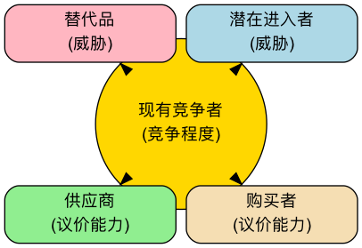

# 波特五力模型

在激烈的商业竞争中，一个行业的吸引力和长期盈利能力，并非由单一的竞争对手决定，而是由一个更广泛的竞争生态系统所塑造。**波特五力模型（Porter's Five Forces）** 是由哈佛商学院的战略管理大师迈克尔·波特（Michael E. Porter）提出的一个革命性框架。它提供了一个强有力的透镜，帮助我们系统性地分析任何一个行业的竞争结构，并理解决定该行业平均利润水平的五种基本竞争力量。

这个模型的核心思想是，企业的战略制定者必须超越眼前的直接竞争对手，去审视更广阔的竞争舞台。这五种力量共同作用，决定了行业内的竞争强度，以及价值在产业链中是如何被创造和分配的。通过理解每一种力量的强弱，企业可以找到自己在行业中的最佳定位，制定出能够规避风险、利用优势并最终获得可持续竞争优势的战略。

!!! abstract "要点速览"

    - **五种力量**：现有竞争者的竞争、新进入者的威胁、替代品的威胁、供应商的议价能力、购买者的议价能力。
    - **分析对象是行业，不是某家公司**：它回答“这个行业整体赚不赚钱、为什么”。
    - **结论看最强的那一两种力量**：它们决定了行业利润的上限，也是战略要着力改变的地方。
    - **步骤**：定义行业边界 → 识别各力量的参与者 → 评估强弱 → 得出行业结论 → 制定定位战略。
    - **常配合使用**：用 [PESTEL](PESTEL-Analysis-Tutorial-zh.md) 看宏观环境，用 [SWOT](SWOT-Analysis-Tutorial-zh.md) 落到企业自身。

## 解析五种竞争力

波特五力模型将行业竞争分解为五个清晰的维度，它们共同决定了行业的“游戏规则”。

1.  **行业内现有竞争者的竞争（Rivalry Among Existing Competitors）**

    这是五力模型的核心，指行业内现有企业之间的直接对抗和竞争激烈程度。当行业内竞争激烈时，企业往往会陷入价格战、广告战和产品创新竞赛，从而拉低整个行业的利润水平。
    - **竞争激烈的迹象**：行业内有众多实力相当的竞争者；行业增长缓慢，形成“零和博弈”；产品同质化严重，缺乏差异；固定成本高、产能过剩；高昂的退出壁垒导致亏损企业也难以离开。

2.  **新进入者的威胁（Threat of New Entrants）**

    指新的竞争者进入一个行业的可能性。如果一个行业利润丰厚且进入门槛低，就会像磁石一样吸引新的参与者，他们会带来新的产能，并渴望瓜分市场份额，从而加剧竞争。
    - **进入壁垒（Barriers to Entry）** 的高低决定了这种威胁的强度。常见的进入壁垒包括：规模经济、强大的品牌忠诚度、高昂的客户转换成本、巨额的资本投入、对分销渠道的控制、政府的政策法规限制、网络效应以及核心技术专利。

3.  **替代品的威胁（Threat of Substitute Products or Services）**

    指来自**不同行业**的、但能满足相同客户需求的替代产品或服务的威胁。替代品的存在，为行业的整体定价设定了一个“天花板”。
    - **重要区分**：对于航空公司来说，另一家航空公司是**竞争对手**，而高铁、视频会议则是**替代品**。替代品的性价比越高，客户转向它的成本越低，其威胁就越大。

4.  **供应商的议价能力（Bargaining Power of Suppliers）**

    指供应商（如原材料、零部件、劳动力或服务的提供方）将其成本压力转移给行业内企业的能力。强大的供应商可以提高价格、降低质量或限制供应，从而侵蚀行业的利润。
    - **供应商议价能力强的迹象**：供应商行业高度集中，由少数几家巨头控制；供应商的产品具有独特性或差异化，难以替代；更换供应商的转换成本极高；对于供应商来说，你所在的行业并非其主要客户；供应商有能力“前向一体化”，自己进入你的行业。

5.  **购买者的议价能力（Bargaining Power of Buyers）**

    指客户（购买者）压低价格、要求更高质量或更多服务的能力。强大的购买者能迫使行业内的企业相互竞争，从而将价值从生产者手中转移到自己手中。
    - **购买者议价能力强的迹象**：购买者是集中的大宗采购方；行业产品是标准化的，无差异；购买者更换供应商的成本很低；购买者对价格敏感；购买者可以进行“后向一体化”（即自己生产所需的产品）。

## 如何应用五力模型

1.  **明确定义行业边界**

    首先要清晰地界定你所要分析的行业是什么。行业的定义不宜过宽或过窄：“饮料行业”太宽，“无糖气泡水行业”可能太窄。一个实用的判断方法是看**客户在做选择时会把哪些产品放在一起比较**。

2.  **识别五种力量中的关键参与者**

    具体识别出在每个力量维度下，主要的参与者都是谁。例如，主要的供应商、购买者、竞争对手、潜在进入者和替代品分别是什么？

3.  **评估每种力量的潜在强度**

    分析并判断在每个维度下，导致力量增强或减弱的根本原因是什么。最终，对每一种力量的强度给出一个综合性的评估（如：强、中、弱）。评估要有依据，最好能用行业集中度、毛利率、转换成本等数据来支撑。

4.  **综合分析行业结构**

    综合五种力量的评估结果，判断该行业的整体竞争格局和长期盈利潜力。哪一种或哪几种力量是决定该行业盈利能力的关键？

5.  **制定战略以改善定位**

    基于分析，思考企业可以采取哪些战略行动来“改善”自己的行业地位。例如，是否可以通过建立品牌来降低购买者的议价能力？是否可以通过技术创新来构建进入壁垒？是否可以通过锁定供应商来降低其议价能力？

## 五力分析模板

把下面的表格复制到文档或表格软件中，逐项填写。评分用 1~5 分（1 = 很弱，5 = 很强），**分数越高，说明这种力量对行业利润的压力越大**。

| 力量 | 关键判断因素 | 评分（1~5） | 依据 / 数据 | 对行业利润的影响 |
| --- | --- | --- | --- | --- |
| 现有竞争者的竞争 | 竞争者数量与实力、行业增速、产品差异、退出壁垒 | | | |
| 新进入者的威胁 | 资本门槛、规模经济、品牌、渠道、政策、技术专利 | | | |
| 替代品的威胁 | 替代品的性价比、客户转换成本 | | | |
| 供应商的议价能力 | 供应商集中度、投入品的独特性、转换成本 | | | |
| 购买者的议价能力 | 购买者集中度、价格敏感度、产品标准化程度 | | | |
| **行业结论** | 最强的一两种力量是什么？行业整体吸引力如何？ | | | |
| **战略启示** | 我们可以如何削弱对自己不利的力量？ | | | |

## 应用案例

**案例一：全球软饮料行业（以可口可乐和百事可乐为例）**

- **行业内竞争**：**激烈**。两大巨头之间的竞争体现在品牌、分销和广告等多个方面，但它们巧妙地避免了毁灭性的价格战。
- **新进入者威胁**：**弱**。极高的品牌忠诚度、庞大的全球分销网络和巨大的广告投入，构成了后来者难以逾越的壁垒。
- **替代品威胁**：**中等偏强**。水、果汁、茶、咖啡等都是替代品，消费者选择众多。
- **供应商议价能力**：**弱**。糖、水、包装罐等原材料都是大宗商品，供应商分散且无议价能力。
- **购买者议价能力**：**中等**。对于最终消费者个体，议价能力为零。但对于大型零售商（如沃尔玛、家乐福）和餐饮渠道，它们拥有较强的议价能力。
- **结论**：该行业的结构非常有吸引力，两大巨头通过构建强大的品牌和分销壁垒，有效地抵御了新进入者和供应商的压力，从而获得了持续的高额利润。

**案例二：个人电脑（PC）行业**

- **行业内竞争**：**极其激烈**。众多品牌（联想、惠普、戴尔等）的产品高度同质化，导致持续的价格战。
- **新进入者威胁**：**中等**。虽然品牌和渠道需要积累，但核心部件可以采购，进入门槛并非不可逾越。
- **替代品威胁**：**强**。智能手机、平板电脑正在替代PC的许多功能。
- **供应商议价能力**：**强**。核心部件（如CPU和操作系统）高度集中在英特尔和微软等少数几家公司手中，它们掌握了PC行业的大部分利润。
- **购买者议价能力**：**强**。无论是个人消费者还是企业客户，都因为产品标准化而拥有众多选择，对价格敏感。
- **结论**：PC行业的五种力量几乎都对行业内的制造商不利，导致该行业长期处于低利润状态。这也解释了为什么 PC 产业链的利润长期集中在上游的芯片和操作系统厂商手中。

**案例三：中国的新能源汽车整车行业**

- **行业内竞争**：**极其激烈**。传统车企、新势力和跨界科技公司同时在场，车型迭代快，价格战频繁。
- **新进入者威胁**：**中等**。资本投入、制造能力和资质要求构成了很高的门槛，但仍不断有资金雄厚的跨界者进入；与此同时，也有不少新势力在竞争中出局。
- **替代品威胁**：**中等**。燃油车、混合动力车和公共交通仍是可选项，但政策和使用成本让替代品的吸引力在下降。
- **供应商议价能力**：**强**。动力电池等核心部件的供应集中在少数头部厂商，占整车成本的比例高。
- **购买者议价能力**：**强**。车型选择极多、信息高度透明，消费者对价格非常敏感。
- **结论**：行业规模增长快，但多数整车企业利润承压。领先者的应对思路正是五力模型给出的方向：通过自研电池、芯片等方式进行**垂直整合**来削弱供应商的议价能力，通过品牌和智能化体验来降低购买者的价格敏感度。

**案例四：中国的高端餐饮行业**

- **行业内竞争**：**激烈**。餐厅数量众多，模仿和跟风现象严重。
- **新进入者威胁**：**强**。进入门槛相对较低，任何有资金和厨师的个人都可以开一家餐厅。
- **替代品威胁**：**强**。中端餐饮、外卖、私厨等都是替代选择。
- **供应商议价能力**：**中等**。对于普通食材，供应商众多。但对于稀有、高品质的特色食材，少数供应商可能拥有较强议价能力。
- **购买者议价能力**：**强**。消费者选择极多，且转换成本为零。
- **结论**：高端餐饮行业竞争结构恶劣，盈利非常困难。成功的关键在于通过打造独特的品牌、菜品和体验来降低购买者的议价能力和行业内竞争。

## 常见误区

1.  **把五力模型用来分析一家公司**。五力模型分析的是**行业结构**。“我们公司的供应商议价能力强”这种说法没有意义，应该说“这个行业的供应商议价能力强”。要分析企业自身的优劣势，请用[SWOT分析](SWOT-Analysis-Tutorial-zh.md)或[价值链分析](Value-Chain-Analysis-Tutorial-zh.md)。
2.  **行业边界定义错误**。边界画得太宽，五种力量会混成一团；画得太窄，又会把真正的替代品误当作“其他行业”而忽略掉。
3.  **混淆竞争对手和替代品**。同类产品的其他品牌是竞争对手；用不同方式满足同一需求的产品才是替代品。
4.  **只罗列，不评估**。把每种力量下的参与者列出来，却不判断强弱、不得出结论，这样的分析对决策毫无帮助。最后一定要回答：这个行业有没有吸引力？最关键的力量是哪一个？
5.  **把分析结果当成永久不变的结论**。技术变革、政策调整、商业模式创新都会重塑行业结构。五力分析需要定期更新，尤其要关注哪种力量正在变强。
6.  **忽视互补品**。很多行业的利润还取决于互补品（如游戏主机与游戏、电动车与充电网络）。必要时把互补品作为“第六种力量”一起考虑。

## 五力模型、SWOT 和 PESTEL 的区别

| | 波特五力模型 | SWOT 分析 | PESTEL 分析 |
| --- | --- | --- | --- |
| 分析对象 | 一个行业 | 一家企业或一个项目 | 宏观环境 |
| 核心问题 | 这个行业赚钱吗？利润被谁拿走了？ | 我们的优势、劣势、机会、威胁是什么？ | 哪些外部大趋势会影响我们？ |
| 视角 | 外部、中观 | 内部 + 外部 | 外部、宏观 |
| 典型用途 | 判断是否进入某行业、找到行业中的有利位置 | 制定企业战略、评估项目 | 识别长期趋势与风险 |

三者常按“由外到内”的顺序配合使用：**PESTEL 看大环境 → 五力看行业 → SWOT 落到企业自身**。

## 五力模型的价值与局限

**核心价值**

- **超越直接竞争**：提供了一个更广阔的视角来理解竞争，而不仅仅是盯着对手。
- **揭示盈利驱动因素**：帮助识别出决定一个行业长期盈利能力的关键结构性因素。
- **指导战略定位**：为企业寻找有利的战略位置、塑造对自己有利的行业结构提供了清晰的路线图。

**潜在局限**

- **静态视角**：模型本身是静态的，可能无法完全捕捉到行业结构的动态演变（例如，由技术颠覆引发的结构变化）。
- **忽略了“第六种力量”**：一些学者认为，模型忽略了**互补品（Complements）**的作用。例如，软件和硬件就是互补品，它们共同创造价值。
- **行业边界模糊**：在当今融合的商业生态中，清晰地定义一个行业的边界变得越来越困难。
- **偏重竞争，忽视合作**：在平台和生态型行业中，企业之间往往既竞争又合作，单纯的“力量对抗”视角不足以解释全部现象。

## 常见问题

??? question "五力模型能用来分析一家具体的公司吗？"

    不能直接用。五力模型的对象是行业整体，用来判断一个行业的平均盈利能力和竞争结构。分析具体公司时，可以先用五力模型了解它所在的行业，再用 SWOT 或价值链分析评估这家公司在行业中的位置。

??? question "五力模型和 SWOT 有什么区别？"

    五力模型只看行业的外部竞争结构；SWOT 同时看企业内部的优势劣势和外部的机会威胁。五力分析的结论，常常可以作为 SWOT 中“机会”和“威胁”的输入。

??? question "五力模型过时了吗？"

    没有过时，但需要灵活使用。数字经济中，网络效应、平台生态、数据积累成为新的进入壁垒，互补品的作用也越来越大。把这些新因素放进五种力量的评估中，框架本身依然有效。

??? question "“第六种力量”指的是什么？"

    通常指互补品（Complements），也有人把政府或监管看作第六种力量。波特本人认为政府和互补品是影响五种力量的因素，而不是独立的第六种力量。

??? question "五种力量的评估一定要打分吗？"

    不一定，但建议打分。打分迫使分析者给出明确判断并写出依据，也便于团队讨论分歧，以及在不同时间点对比行业结构的变化。

## 延伸与关联

- **[PESTEL分析](PESTEL-Analysis-Tutorial-zh.md)**：可以用来分析影响五种力量变化的更宏观的背景因素。
- **[价值链分析](Value-Chain-Analysis-Tutorial-zh.md)**：在五力模型分析了行业“蛋糕”如何被瓜分之后，价值链分析则帮助企业思考如何在自己的活动中创造出更多的“蛋糕”。
- **[SWOT分析](SWOT-Analysis-Tutorial-zh.md)**：把五力分析得到的行业机会与威胁，与企业自身的优势和劣势结合起来，形成具体的战略选择。
- **[蓝海战略](../strategic_execution/Blue-Ocean-Strategy-Tutorial-zh.md)**：五力模型帮助企业在现有的行业结构中找到最佳位置；蓝海战略则尝试跳出现有结构，开创没有竞争的新市场。
- **战略集团分析（Strategic Group Analysis）**：在分析行业内竞争时，可以将行业内的企业按照战略的相似性划分为不同的战略集团，从而进行更精细的分析。

---

_来源参考：迈克尔·波特在其1979年发表于《哈佛商业评论》的经典文章《竞争力量如何塑造战略》（How Competitive Forces Shape Strategy）以及其后的著作《竞争战略》（Competitive Strategy）中，系统地阐述了五力模型。2008年，他又在《哈佛商业评论》发表《塑造战略的五种竞争力量》（The Five Competitive Forces That Shape Strategy）对模型进行了更新。该模型至今仍是战略管理领域不可动摇的基石。_
