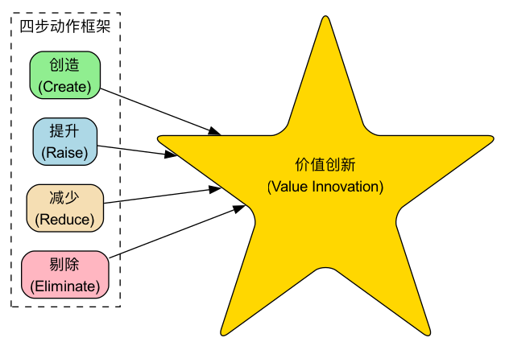

# 蓝海战略

在商业世界中，绝大多数企业都在一片“**红海**”中厮杀。红海代表了所有当前已知的市场空间，在这里，行业边界清晰，游戏规则明确，企业试图通过击败对手来抢夺更多有限的市场份额。随着竞争者越来越多，市场变得异常拥挤，利润和增长的空间日益萎缩，这片海洋也因激烈的竞争而被“染成”红色。**蓝海战略（Blue Ocean Strategy）** 则提供了一条截然不同的路径，它不主张与对手在红海中进行血腥的正面竞争，而是致力于**开创全新的、无人竞争的“蓝海”市场空间，从而将竞争变得无关紧要**。

蓝海战略的核心，并非技术创新本身，而是一种名为**价值创新（Value Innovation）**的战略逻辑。价值创新是企业在**追求差异化**和**追求低成本**这两个看似矛盾的目标上，实现“鱼与熊掌兼得”的交集点。它不是在现有的价值与成本之间做权衡取舍，而是通过打破这种权衡，同时为客户和企业自身创造价值的飞跃。通过重构行业元素，蓝海战略旨在为客户提供一种全新的、与众不同的价值，从而开启一个前所未有的广阔市场。

!!! abstract "要点速览"

    - **核心逻辑是价值创新**：同时追求差异化和低成本，而不是二选一。
    - **两个核心工具**：战略布局图（看清行业在比拼什么）+ 四步动作框架（剔除、减少、增加、创造）。
    - **到哪里找蓝海**：六条路径（跨行业、跨战略集团、跨买方链等）和三类非顾客。
    - **好战略的三个特征**：聚焦、差异、有一句让人记住的口号。
    - **提醒**：蓝海会被模仿而变红，价值创新需要持续进行。

## 红海战略与蓝海战略的区别

| 红海战略 | 蓝海战略 |
| --- | --- |
| 在已有的市场空间中竞争 | 开创无人争抢的市场空间 |
| 打败竞争对手 | 让竞争变得无关紧要 |
| 争夺现有需求 | 创造和获取新需求 |
| 在价值与成本之间做取舍 | 打破价值与成本之间的取舍 |
| 选择差异化**或**低成本，整个公司围绕这一选择运转 | 同时追求差异化**和**低成本，整个公司围绕这一目标运转 |

## 蓝海战略的核心分析工具

蓝海战略提供了一套系统性的分析工具，帮助企业系统性地思考如何摆脱红海，开创蓝海。

1.  **战略布局图（Strategy Canvas）**

    这是一个强大的诊断和行动框架。它通过一张图，直观地描绘出在一个已知市场空间内，所有竞争者都在哪些竞争要素上进行投入，以及客户从中获得了什么。横轴列出行业内竞争和投资的关键要素，纵轴则反映了在各个要素上，企业给予客户的水平高低。通过绘制竞争对手和自己的“价值曲线”，企业可以清晰地看到行业的竞争格局以及自己的战略轮廓。如果你的价值曲线和对手几乎重合，说明你正身处红海。

2.  **四步动作框架（The Four Actions Framework）**

    这是打破“差异化-成本”权衡、重构价值曲线的核心思考工具。它通过提出四个关键问题，来挑战一个行业长期以来根深蒂固的战略逻辑和商业模式：

    *   **剔除（Eliminate）**：行业中哪些被认为理所当然的要素应该被剔除？
    *   **减少（Reduce）**：哪些要素应该被减少到行业标准以下？
    *   **增加（Raise）**：哪些要素应该被增加到行业标准以上？
    *   **创造（Create）**：哪些行业从未提供过的要素应该被创造出来？

    其中，“剔除”和“减少”帮助企业降低成本结构；“增加”和“创造”则旨在提升客户价值，创造新的需求。

    

3.  **六条路径框架（Six Paths Framework）**

    蓝海很少凭空出现，它往往藏在行业习以为常的边界之外。六条路径给出了系统寻找蓝海的六个方向：

    *   **跨越替代性行业**：看看客户在别的行业里是如何满足同一需求的。
    *   **跨越行业内的战略集团**：看看高端和低端两个阵营各自有哪些让客户愿意买单的东西。
    *   **跨越买方链**：把目标从“付钱的人”转向“使用的人”或“影响决策的人”。
    *   **跨越互补性产品和服务**：看看客户在使用产品前后还需要什么。
    *   **跨越功能导向与情感导向**：功能导向的行业可以加入情感价值，反之亦然。
    *   **跨越时间**：看看正在发生的长期趋势，会如何改变客户价值。

4.  **三类非顾客（Three Tiers of Noncustomers）**

    红海企业盯着现有顾客，蓝海企业关注“非顾客”：

    *   **第一类：准非顾客**，就在市场边缘，勉强在用、随时准备离开。
    *   **第二类：拒绝型非顾客**，考虑过你的行业，但有意识地选择了不用。
    *   **第三类：未探索型非顾客**，从来没有被这个行业当作潜在顾客考虑过。

    找出三类非顾客的共同点，往往就能发现一个规模远大于现有市场的新需求。

## 如何开创一片蓝海

1.  **审视当前竞争格局**

    绘制出你所在行业的战略布局图。清晰地列出当前行业竞争的主要元素，并客观地评估主要竞争对手和你自己在这些元素上的投入水平，形成各自的价值曲线。

2.  **运用四步动作框架挑战现状**

    系统性地运用“剔除-减少-增加-创造”框架，对行业现有的竞争要素和客户价值进行解构和重构。在这一步，关键在于要敢于挑战行业内那些“不言而喻”的规则和假设。可以结合六条路径和三类非顾客寻找灵感。

3.  **构建新的价值曲线**

    基于四步动作框架的洞察，构建一条全新的、与众不同的价值曲线。一条有效的蓝海战略价值曲线通常具有三个鲜明特征：
    - **聚焦（Focus）**：战略清晰地聚焦于少数几个核心要素。
    - **差异（Divergence）**：价值曲线的形态与行业内的其他竞争者截然不同。
    - **清晰的宣传口号（Compelling Tagline）**：能够用简单、有力的语言向市场传递其独特的价值主张。

4.  **将蓝海创意商业化**

    确保你的蓝海创意能够转化为一个可行的、盈利的商业模式。按书中建议的顺序检验：**买方效用**（客户是否真的觉得有价值）→ **价格**（大众买得起吗）→ **成本**（在这个价格下能盈利吗）→ **推广**（内外部的阻力能否克服）。

## 蓝海战略模板

**一、战略布局图数据表**

先列出行业竞争的关键要素，再给自己和主要竞争对手在每个要素上打分（1~5 分），把每一行连成线，就是各自的价值曲线。

| 竞争要素 | 竞争对手 A | 竞争对手 B | 我们（现状） | 我们（蓝海方案） |
| --- | --- | --- | --- | --- |
| 价格 | | | | |
| 要素 2 | | | | |
| 要素 3 | | | | |
| …… | | | | |
| 新创造的要素 | 0 | 0 | 0 | |

**二、ERRC 方格（剔除-减少-增加-创造）**

| 剔除（Eliminate） | 增加（Raise） |
| --- | --- |
| 行业里有哪些要素，客户其实并不在乎？ | 哪些要素是客户真正在意、但行业做得不够的？ |
| | |
| **减少（Reduce）** | **创造（Create）** |
| 哪些要素被行业过度投入了？ | 有哪些客户需要、但行业从未提供过的东西？ |
| | |

填完后检查：“剔除”和“减少”省下的成本，是否足以支撑“增加”和“创造”带来的投入？如果四个格子里只有右边有内容，那只是差异化，不是价值创新。

## 经典应用案例

**案例一：太阳马戏团（Cirque du Soleil）**

- **背景**：传统马戏团行业（红海）面临着观众老化、动物保护主义兴起、娱乐方式多样化等多重压力，日益衰落。
- **蓝海战略**：太阳马戏团没有在传统马戏的框架内竞争，而是通过价值创新开创了全新的市场。
  - **剔除**：动物表演、明星表演者、三环马戏棚等高成本元素。
  - **减少**：过道小贩的叫卖和一些低俗的幽默。
  - **增加**：单一主题的独特性、场地的舒适度和艺术感。
  - **创造**：融合了戏剧、舞蹈、音乐和马戏艺术的全新叙事性表演形式。
- **结果**：太阳马戏团创造了一个全新的市场，吸引了那些通常会去欣赏歌剧、芭蕾舞的成年观众。剔除动物和明星大幅降低了成本，新的艺术体验又支撑起远高于传统马戏的票价，实现了差异化和低成本的统一。

**案例二：任天堂Wii游戏机**

- **背景**：在21世纪初的游戏机市场，索尼（PlayStation）和微软（Xbox）在图形处理能力、运算速度和游戏复杂性上进行着激烈的“军备竞赛”。
- **蓝海战略**：任天堂没有加入这场红海竞争，而是另辟蹊径。
  - **剔除/减少**：对顶级高清画质和运算速度的追求，以及复杂的手柄设计。
  - **增加/创造**：创造了全新的、基于体感和动作捕捉的直观游戏方式，以及简单、易于上手的控制器。它强调的是家庭同乐、全身运动的社交乐趣。
- **结果**：Wii吸引了大量此前从不玩游戏的“第三类非顾客”，包括儿童、女性和老年人，成为当时销量最高的家用游戏机之一。

**案例三：Yellow Tail（黄尾袋鼠）葡萄酒**

- **背景**：美国葡萄酒市场被两大阵营瓜分：一端是廉价的佐餐酒，品质不高；另一端是昂贵、复杂的精品葡萄酒，其复杂的术语和品鉴规则让普通消费者望而生畏。
- **蓝海战略**：黄尾袋鼠的目标是创造一款让普通人也能轻松享受的、有趣、不复杂的葡萄酒。
  - **剔除/减少**：复杂的酿酒术语、陈年潜力、橡木桶风味等让人生畏的传统葡萄酒营销元素。
  - **增加/创造**：创造了简单易饮的果味口感、易于识别的包装（袋鼠标志）、以及在普通超市就能轻松购买的便利性。
- **结果**：黄尾袋鼠迅速成为美国最畅销的进口葡萄酒品牌之一，它吸引的是那些通常喝啤酒或鸡尾酒的消费者，成功地将“非葡萄酒消费者”转化为了自己的顾客。

**案例四：经济型连锁酒店**

- **背景**：过去国内住宿市场两极分化：一边是价格高、设施全的星级酒店，一边是价格低但卫生和安全难以保证的招待所、小旅馆。大量出差和出游人群夹在中间。
- **蓝海战略**：
  - **剔除**：豪华大堂、康体娱乐设施、宴会和多餐厅配置。
  - **减少**：客房面积、前台以外的人工服务、装修的奢华程度。
  - **增加**：床品和卫生间的标准化品质、交通便利的选址、连锁带来的品质一致性。
  - **创造**：会员体系与统一的线上预订渠道，让住客在任何城市都能预期到同样的体验。
- **结果**：经济型连锁酒店用远低于星级酒店的价格，提供了住客最在乎的“干净、安全、睡得好”，迅速扩张为一个规模庞大的新品类。随后大量模仿者进入，这片蓝海也逐渐变红，品牌又开始向中端酒店寻找新的价值曲线。

## 常见误区

1.  **把蓝海等同于技术创新**。很多蓝海并不依赖新技术，太阳马戏团和黄尾袋鼠都是如此。关键是重新定义客户价值，而不是做出更先进的产品。
2.  **只做加法**。只想着“增加”和“创造”，成本会一路上升，最后得到的是一个更贵的差异化产品，而不是价值创新。真正的蓝海一定有大胆的“剔除”和“减少”。
3.  **把细分市场当成蓝海**。在现有市场里切出一块更细的人群继续竞争，仍然是红海思维。蓝海战略更关心的是把非顾客变成顾客，扩大市场边界。
4.  **只盯着现有顾客做调研**。现有顾客往往只会要求“同样的东西再好一点、便宜一点”。新需求更可能藏在三类非顾客身上。
5.  **画完图就结束**。战略布局图和 ERRC 方格只是思考工具。没有经过买方效用、价格、成本、推广的商业化检验，蓝海创意很可能停留在纸面上。
6.  **以为蓝海会永远是蓝的**。成功的蓝海一定会吸引模仿者。企业需要持续监测自己的价值曲线是否正在与模仿者趋同。

## 蓝海战略的价值与挑战

**核心价值**

- **摆脱零和博弈**：通过创造新需求，企业可以获得一段时期内没有直接竞争的快速增长。
- **重塑行业边界**：成功的蓝海战略能够改变一个行业的竞争规则，甚至创造一个全新的行业。
- **建立强大品牌**：作为新市场的开创者，容易建立起强大的品牌认知和客户忠诚度。

**潜在挑战**

- **执行难度高**：需要深刻的洞察力、非凡的创造力和敢于挑战行业传统的勇气。
- **组织层面的阻力**：实施蓝海战略往往需要对公司现有的运营、文化和思维模式进行重大调整，可能会遇到内部阻力。
- **蓝海可能变红**：任何成功的蓝海，最终都会吸引模仿者和追随者，导致蓝海逐渐变红。因此，企业需要有持续进行价值创新的能力。
- **事后解释容易，事前判断难**：很多案例是在成功之后才被归纳为蓝海战略，事前很难确定某个方向一定是蓝海。

## 常见问题

??? question "蓝海战略和差异化战略有什么区别？"

    差异化战略接受“更高价值必然意味着更高成本”，选择用溢价覆盖成本。蓝海战略试图打破这个取舍，通过剔除和减少行业里过度投入的要素来降低成本，同时在客户真正在意的地方做加法，实现差异化和低成本兼得。

??? question "中小企业适合用蓝海战略吗？"

    适合，而且往往更需要。中小企业很难在资源上与大企业正面竞争，重新定义客户价值是少有的能以小博大的方式。四步动作框架和非顾客分析几乎不需要额外成本。

??? question "蓝海战略和颠覆性创新是一回事吗？"

    不是。颠覆性创新通常从低端市场或新的立足点切入，用更简单、更便宜的方案逐步取代领先者。蓝海战略不局限于低端，可以发生在任何价格层面，重点是通过价值创新开创新需求。

??? question "怎么判断自己是不是身处红海？"

    画出战略布局图：如果你和主要竞争对手的价值曲线几乎重合，大家都在同样的要素上比拼投入多少，而价格成为主要竞争手段，那基本就是红海。

??? question "蓝海战略和波特五力模型矛盾吗？"

    不矛盾，视角不同。五力模型帮助企业理解现有行业结构、在其中找到有利位置；蓝海战略则尝试改变行业边界本身。实践中常先用五力模型看清红海，再用蓝海工具寻找出路。

## 延伸与关联

- **[商业模式画布](../business_model/Business-Model-Canvas-Tutorial-zh.md)**：是设计和规划如何将蓝海战略创意转化为一个可行的、盈利的商业模式的绝佳工具。
- **[精益画布](../business_model/Lean-Canvas-Tutorial-zh.md)**：适合在不确定性很高的阶段，快速记录和验证一个蓝海创意的关键假设。
- **[波特五力模型](../strategic_analysis/Porters-Five-Forces-Tutorial-zh.md)**：用来分析你正身处的红海有多“红”，以及利润被哪些力量拿走了。
- **[设计思维](../product_development/Design-Thinking-Tutorial-zh.md)**：深入理解非顾客的需求，是发现蓝海的起点；设计思维提供了一套以人为中心的探索方法。
- **颠覆性创新（Disruptive Innovation）**：与蓝海战略相关但有所不同。颠覆性创新通常指通过提供更简单、更便宜的方案，从市场的低端或新的立足点切入，并最终颠覆现有市场领导者。而蓝海战略则不局限于此，它可以发生在任何市场层面。

---

_来源参考：W. 钱·金（W. Chan Kim）和勒妮·莫博涅（Renée Mauborgne）的开创性著作《蓝海战略：超越产业竞争，开创全新市场》（Blue Ocean Strategy）是该理论的奠基之作，书中包含了大量的案例和详细的分析框架。两位作者后续的《蓝海转型》（Blue Ocean Shift）则进一步给出了组织落地蓝海战略的步骤。_
